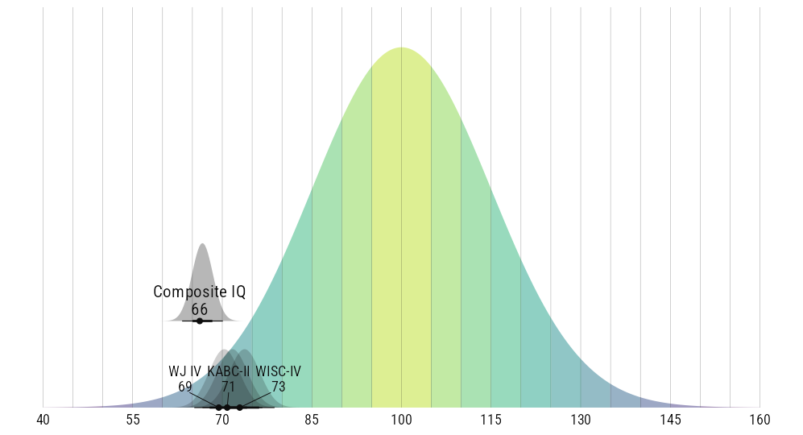

Announcing the arrival of the [Composite IQ Calculator](https://wjschne.github.io/compositeiq), a free, web app that calculates a composite IQ from multiple test administrations and evaluates whether any of the individual IQ results are outliers. Be patient! The app can take 10--30 seconds to load.^[The app does not load instantly because it is deployed with [shinylive](https://posit-dev.github.io/r-shinylive/), which allows for all computations and data entry to stay local on the user's machine. This feature makes the cost effectively zero and assures data privacy. The downside is that downloading and setting up a rich interface takes a little longer than we are used to for web apps.]

Cecil Reynolds, Kevin McGrew, Karen Salekin, and I recently published an article in which we explained why, how, and when to create a composite IQ from multiple IQ test administrations [@schneiderLifeanddeathPsychometricsGeneralizable2026]. In brief, when a person has been given more than one intelligence test, it is preferable to combine all valid and comparable scores into a single score with a single (and narrower) confidence interval. We argue that the best method of combining information is to create scores the same way we create an individual IQ (and almost every other psychological test score): A composite score. Other methods, such as taking the mean, median, or highest score, have known biases.

This procedure has a variety of applications but is particularly important for determining if a defendant meets criteria for intellectual disability and is therefore ineligible for capital punishment. As discussed in several U.S. Supreme Court cases (e.g., [*Hall v. Florida*, 572 U.S. 701 (2014)](https://supreme.justia.com/cases/federal/us/572/12-10882/case.pdf) and [*Hamm v. Smith*, 608 U.S. \_ (2026)](https://supreme.justia.com/cases/federal/us/608/24-872/case.pdf), aggregating IQ results can be complicated matter and therefore must be conducted with care and rigor.

Composite scores have a number of interesting and sometimes counterintuitive features. The *composite score extremity effect* [@schneiderWhyAreWJ2016] refers to the fact that composite scores are more extreme (i.e., further from the population mean) than the average of the scores summarized by the composite, as illustrated in @fig-ciq. The size of this effect increases when the number of scores is higher, the average correlation among the scores is lower, and the average of the scores is more extreme.

{#fig-ciq .preview-image}

To calculate a composite IQ and its confidence interval, one needs to know the means, standard deviations, reliability coefficients for each test and the intercorrelations among all tests. When direct evidence of any two tests' intercorrelation is unavailable, it can be approximated from an equation adapted from @breitStabilityCognitiveAbilities2024, which estimates stability coefficients based on the age of the first test, the length of the retest-interval, and whether the tests are the same or from different battery families.

# Data Privacy

Any data entered into the [Composite IQ Calculator](https://wjschne.github.io/compositeiq) app remains private. Privacy is assured because the app is deployed via [shinylive](https://posit-dev.github.io/r-shinylive/), meaning that once the app is downloaded, all computation is performed locally in the user's browser's code sandbox. That is, data never leaves the user's machine and is never accessible to any third party, not even to the app's developer.

# Web App Features

1.  Tests can be selected from a wide variety of batteries and editions. New tests can be added and updated by the user.
2.  Test scores can be corrected for norm obsolescence using default or custom rules.
3.  Outlier test scores can be identified with procedures developed by @schneiderDetectingUnusualScore2023.
4.  A report can be created in MS Word (.docx) format.
5.  Cases with custom edits can be exported as an Excel file, which can be imported again later.

# Previous Solutions

@schneiderLifeanddeathPsychometricsGeneralizable2026 refers to a [free Composite IQ spreadsheet calculator](https://github.com/wjschne/assessingpsyche_resources/raw/refs/heads/main/CompositeIQFlynn.xlsx), which works well and is still available. Unfortunately, this spreadsheet was hard to maintain, and the limitations of Excel put constraints on how it could be extended. The new [web app](https://wjschne.github.io/compositeiq) effectively replaces the spreadsheet. Built with R and shiny, the app is much easier to maintain and extend.
