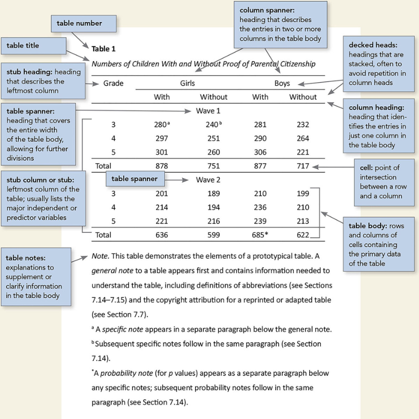

# Making tables in APA style (Part 1 of 24)

In this 24-part series, each of the tables in Chapter 7 of the *Publication Manual of the American Psychological Association* (7th Edition) is recreated with [apa7](https://wjschne.github.io/apa7/), [flextable](https://ardata-fr.github.io/flextable-book/), [easystats](https://easystats.github.io/easystats/), and [tidyverse](https://www.tidyverse.org/packages/) functions.


:::{.callout-note}
# Highlights

* Row titles and styling with [`apa_flextable`](https://wjschne.github.io/apa7/reference/apa_flextable.html)
* Conditional placement of cell borders with [`flextable::surround`](https://davidgohel.github.io/flextable/reference/surround.html)
* General notes with [`flextable::add_footer_lines`](https://davidgohel.github.io/flextable/reference/add_footer_lines.html) or `apa-note` chunk option
* Footnotes with [`flextable::footnote`](https://davidgohel.github.io/flextable/reference/footnote.html)
:::


When I write a research manuscript in APA style, I have twin goals that are sometimes at odds: 1) I want the document to be fully reproducible, including the tables. 2) I want the formatting to be not only correct but aesthetically pleasing.

The final frontier of reproducibility in APA style, for me, has been getting the tables right. At long last, I am getting close to where I want to be. My process usually goes like this:

1. Wrangle data with [tidyverse functions](https://www.tidyverse.org/).
2. Perform analyses, and format analysis tables with [easystats functions](https://easystats.github.io/easystats/).
3. Perform table-specific data shaping with [apa7 functions](https://wjschne.github.io/apa7/reference/index.html).
4. Create a table with [`apa7::apa_flextable`](https://wjschne.github.io/apa7/reference/apa_flextable.html).
5. Add specific formatting and finishing touches with [flextable functions](https://davidgohel.github.io/flextable/reference/index.html).

# Sample Tables from the APA Manual

As an exercise, I decided to reproduce the sample tables in Chapter 7 of the APA Manual, which covers the display of tables. There are a number of differences between the original tables and the recreated tables. 

* I stick with Times New Roman as my font. 
* I add little breaks between column spanners in multilevel headers.
* I align decimals where possible. 

Things I usually change, but I do not mess with here:

* I like column headings to have the same alignment as the body cells under them---if the cell is left justified, I want the header to be left justified. However, APA style usually has centered headings for everything.
* Hanging indents are useful sometimes, but I try to avoid them when they make the columns appear uneven. Some of the tables have hanging indents that could have been avoided, but I put them in anyway.

<hr>

@fig-71 is a complex table, meant to illustrate the primary components of a table such as stub headings, column spanners, decked heads, table spanners, and table notes.

{#fig-71}

To recreate the data for the table in @fig-71 requires a fair bit of work, most of which is not relevant to the display of the table. @tbl-71a displays the data in its raw form. I used flextable's `theme_apa` (via `set_flextable_defaults`) to get the basic formatting to be consistent with APA format.


::: {#tbl-71a .cell tbl-cap='Raw Table'}

```{.r .cell-code}
library(apa7)
library(flextable)
library(ftExtra)
library(tidyverse)
set_flextable_defaults(theme_fun = theme_apa,
                       font.family = "Times New Roman",
                       table_align = "left")


# Make and format data
d_citizenship <- crossing(
  Wave = 1:2,
  Citizenship = fct_inorder(c("With", "Without")),
  Gender = fct_inorder(c("Girls", "Boys")),
  Grade = 3:5
) |>  
  mutate(n = as.integer(
    c(111, 297, 301, 
      281, 290, 306, 
      240, 251, 260, 
      232, 264, 221,
      201, 214, 221,
      210, 236, 239,
      189, 194, 216, 
      199, 210, 213))) |> 
  arrange(Gender, Citizenship) |>
  unite(Gender_Citizenship, Gender, Citizenship) |>
  pivot_wider(names_from = Gender_Citizenship,
              values_from = n,
              names_vary = "slowest") |>
  mutate(Grade = factor(Grade)) %>%
  bind_rows(
    ., 
    summarise(
      ., 
      across(where(is.numeric), 
             .fns = sum), 
      .by = Wave) |> 
      mutate(Grade = factor("Total"))) |>
  arrange(Wave, Grade) 


flextable(d_citizenship)
```

::: {.cell-output-display}

```{=html}
<div class="tabwid tabwid_left"><style>.cl-01bc518c{}.cl-018ee5d0{font-family:'Times New Roman';font-size:11pt;font-weight:normal;font-style:normal;text-decoration:none;color:rgba(0, 0, 0, 1.00);background-color:transparent;}.cl-01b79c6e{margin:0;text-align:center;border-bottom: 0 solid rgba(0, 0, 0, 1.00);border-top: 0 solid rgba(0, 0, 0, 1.00);border-left: 0 solid rgba(0, 0, 0, 1.00);border-right: 0 solid rgba(0, 0, 0, 1.00);padding-bottom:5pt;padding-top:5pt;padding-left:5pt;padding-right:5pt;line-height: 2;background-color:transparent;}.cl-01b7ba1e{width:0.75in;background-color:transparent;vertical-align: middle;border-bottom: 0.75pt solid rgba(0, 0, 0, 1.00);border-top: 0.75pt solid rgba(0, 0, 0, 1.00);border-left: 0 solid rgba(255, 255, 255, 0.00);border-right: 0 solid rgba(255, 255, 255, 0.00);margin-bottom:0;margin-top:0;margin-left:0;margin-right:0;}.cl-01b7ba32{width:0.75in;background-color:transparent;vertical-align: middle;border-bottom: 0 solid rgba(255, 255, 255, 0.00);border-top: 0 solid rgba(255, 255, 255, 0.00);border-left: 0 solid rgba(255, 255, 255, 0.00);border-right: 0 solid rgba(255, 255, 255, 0.00);margin-bottom:0;margin-top:0;margin-left:0;margin-right:0;}.cl-01b7ba33{width:0.75in;background-color:transparent;vertical-align: middle;border-bottom: 0.75pt solid rgba(0, 0, 0, 1.00);border-top: 0 solid rgba(255, 255, 255, 0.00);border-left: 0 solid rgba(255, 255, 255, 0.00);border-right: 0 solid rgba(255, 255, 255, 0.00);margin-bottom:0;margin-top:0;margin-left:0;margin-right:0;}</style><table data-quarto-disable-processing='true' class='cl-01bc518c'><thead><tr style="overflow-wrap:break-word;"><th class="cl-01b7ba1e"><p class="cl-01b79c6e"><span class="cl-018ee5d0">Wave</span></p></th><th class="cl-01b7ba1e"><p class="cl-01b79c6e"><span class="cl-018ee5d0">Grade</span></p></th><th class="cl-01b7ba1e"><p class="cl-01b79c6e"><span class="cl-018ee5d0">Girls_With</span></p></th><th class="cl-01b7ba1e"><p class="cl-01b79c6e"><span class="cl-018ee5d0">Girls_Without</span></p></th><th class="cl-01b7ba1e"><p class="cl-01b79c6e"><span class="cl-018ee5d0">Boys_With</span></p></th><th class="cl-01b7ba1e"><p class="cl-01b79c6e"><span class="cl-018ee5d0">Boys_Without</span></p></th></tr></thead><tbody><tr style="overflow-wrap:break-word;"><td class="cl-01b7ba32"><p class="cl-01b79c6e"><span class="cl-018ee5d0">1</span></p></td><td class="cl-01b7ba32"><p class="cl-01b79c6e"><span class="cl-018ee5d0">3</span></p></td><td class="cl-01b7ba32"><p class="cl-01b79c6e"><span class="cl-018ee5d0">111</span></p></td><td class="cl-01b7ba32"><p class="cl-01b79c6e"><span class="cl-018ee5d0">240</span></p></td><td class="cl-01b7ba32"><p class="cl-01b79c6e"><span class="cl-018ee5d0">281</span></p></td><td class="cl-01b7ba32"><p class="cl-01b79c6e"><span class="cl-018ee5d0">232</span></p></td></tr><tr style="overflow-wrap:break-word;"><td class="cl-01b7ba32"><p class="cl-01b79c6e"><span class="cl-018ee5d0">1</span></p></td><td class="cl-01b7ba32"><p class="cl-01b79c6e"><span class="cl-018ee5d0">4</span></p></td><td class="cl-01b7ba32"><p class="cl-01b79c6e"><span class="cl-018ee5d0">297</span></p></td><td class="cl-01b7ba32"><p class="cl-01b79c6e"><span class="cl-018ee5d0">251</span></p></td><td class="cl-01b7ba32"><p class="cl-01b79c6e"><span class="cl-018ee5d0">290</span></p></td><td class="cl-01b7ba32"><p class="cl-01b79c6e"><span class="cl-018ee5d0">264</span></p></td></tr><tr style="overflow-wrap:break-word;"><td class="cl-01b7ba32"><p class="cl-01b79c6e"><span class="cl-018ee5d0">1</span></p></td><td class="cl-01b7ba32"><p class="cl-01b79c6e"><span class="cl-018ee5d0">5</span></p></td><td class="cl-01b7ba32"><p class="cl-01b79c6e"><span class="cl-018ee5d0">301</span></p></td><td class="cl-01b7ba32"><p class="cl-01b79c6e"><span class="cl-018ee5d0">260</span></p></td><td class="cl-01b7ba32"><p class="cl-01b79c6e"><span class="cl-018ee5d0">306</span></p></td><td class="cl-01b7ba32"><p class="cl-01b79c6e"><span class="cl-018ee5d0">221</span></p></td></tr><tr style="overflow-wrap:break-word;"><td class="cl-01b7ba32"><p class="cl-01b79c6e"><span class="cl-018ee5d0">1</span></p></td><td class="cl-01b7ba32"><p class="cl-01b79c6e"><span class="cl-018ee5d0">Total</span></p></td><td class="cl-01b7ba32"><p class="cl-01b79c6e"><span class="cl-018ee5d0">709</span></p></td><td class="cl-01b7ba32"><p class="cl-01b79c6e"><span class="cl-018ee5d0">751</span></p></td><td class="cl-01b7ba32"><p class="cl-01b79c6e"><span class="cl-018ee5d0">877</span></p></td><td class="cl-01b7ba32"><p class="cl-01b79c6e"><span class="cl-018ee5d0">717</span></p></td></tr><tr style="overflow-wrap:break-word;"><td class="cl-01b7ba32"><p class="cl-01b79c6e"><span class="cl-018ee5d0">2</span></p></td><td class="cl-01b7ba32"><p class="cl-01b79c6e"><span class="cl-018ee5d0">3</span></p></td><td class="cl-01b7ba32"><p class="cl-01b79c6e"><span class="cl-018ee5d0">201</span></p></td><td class="cl-01b7ba32"><p class="cl-01b79c6e"><span class="cl-018ee5d0">189</span></p></td><td class="cl-01b7ba32"><p class="cl-01b79c6e"><span class="cl-018ee5d0">210</span></p></td><td class="cl-01b7ba32"><p class="cl-01b79c6e"><span class="cl-018ee5d0">199</span></p></td></tr><tr style="overflow-wrap:break-word;"><td class="cl-01b7ba32"><p class="cl-01b79c6e"><span class="cl-018ee5d0">2</span></p></td><td class="cl-01b7ba32"><p class="cl-01b79c6e"><span class="cl-018ee5d0">4</span></p></td><td class="cl-01b7ba32"><p class="cl-01b79c6e"><span class="cl-018ee5d0">214</span></p></td><td class="cl-01b7ba32"><p class="cl-01b79c6e"><span class="cl-018ee5d0">194</span></p></td><td class="cl-01b7ba32"><p class="cl-01b79c6e"><span class="cl-018ee5d0">236</span></p></td><td class="cl-01b7ba32"><p class="cl-01b79c6e"><span class="cl-018ee5d0">210</span></p></td></tr><tr style="overflow-wrap:break-word;"><td class="cl-01b7ba32"><p class="cl-01b79c6e"><span class="cl-018ee5d0">2</span></p></td><td class="cl-01b7ba32"><p class="cl-01b79c6e"><span class="cl-018ee5d0">5</span></p></td><td class="cl-01b7ba32"><p class="cl-01b79c6e"><span class="cl-018ee5d0">221</span></p></td><td class="cl-01b7ba32"><p class="cl-01b79c6e"><span class="cl-018ee5d0">216</span></p></td><td class="cl-01b7ba32"><p class="cl-01b79c6e"><span class="cl-018ee5d0">239</span></p></td><td class="cl-01b7ba32"><p class="cl-01b79c6e"><span class="cl-018ee5d0">213</span></p></td></tr><tr style="overflow-wrap:break-word;"><td class="cl-01b7ba33"><p class="cl-01b79c6e"><span class="cl-018ee5d0">2</span></p></td><td class="cl-01b7ba33"><p class="cl-01b79c6e"><span class="cl-018ee5d0">Total</span></p></td><td class="cl-01b7ba33"><p class="cl-01b79c6e"><span class="cl-018ee5d0">636</span></p></td><td class="cl-01b7ba33"><p class="cl-01b79c6e"><span class="cl-018ee5d0">599</span></p></td><td class="cl-01b7ba33"><p class="cl-01b79c6e"><span class="cl-018ee5d0">685</span></p></td><td class="cl-01b7ba33"><p class="cl-01b79c6e"><span class="cl-018ee5d0">622</span></p></td></tr></tbody></table></div>
```

:::
:::


However, @tbl-71a requires additional formatting to become publication-worthy. The [`apa_flextable`](https://wjschne.github.io/apa7/reference/apa_flextable.html) function performs several layers of transformations before and after applying [`flextable`](https://davidgohel.github.io/flextable/reference/flextable.html), most of which can be turned off selectively.

The [`flextable::surround`](https://davidgohel.github.io/flextable/reference/surround.html) function can place cell borders selectively by row (or column). @tbl-preliminary71 is close to the final result, but additional notes are needed.


::: {#tbl-preliminary71 .cell tbl-cap='Initial Results'}

```{.r .cell-code}
ft_71 <- d_citizenship |>
  apa_flextable(row_title_column = Wave, 
                row_title_prefix = "Wave",
                row_title_align = "center",
                line_spacing = 1.5, 
                table_width = 1) |> 
  surround(i = ~ Grade == "Total",
           border.top = list(color = "gray", 
                             width = 1, 
                             style = "solid")) 
ft_71
```

::: {.cell-output-display}

```{=html}
<div class="tabwid tabwid_left"><style>.cl-0309c6e6{}.cl-03022eb8{font-family:'Times New Roman';font-size:12pt;font-weight:normal;font-style:normal;text-decoration:none;color:rgba(0, 0, 0, 1.00);background-color:transparent;}.cl-03022ec2{font-family:'Times New Roman';font-size:11pt;font-weight:normal;font-style:normal;text-decoration:none;color:rgba(0, 0, 0, 1.00);background-color:transparent;}.cl-030532f2{margin:0;text-align:center;border-bottom: 0 solid rgba(0, 0, 0, 1.00);border-top: 0 solid rgba(0, 0, 0, 1.00);border-left: 0 solid rgba(0, 0, 0, 1.00);border-right: 0 solid rgba(0, 0, 0, 1.00);padding-bottom:4pt;padding-top:4pt;padding-left:3pt;padding-right:3pt;line-height: 1;background-color:transparent;}.cl-030558f4{width:1.228in;background-color:transparent;vertical-align: top;border-bottom: 0.5pt solid rgba(0, 0, 0, 1.00);border-top: 0.5pt solid rgba(0, 0, 0, 1.00);border-left: 0 solid rgba(255, 255, 255, 0.00);border-right: 0 solid rgba(255, 255, 255, 0.00);margin-bottom:0;margin-top:0;margin-left:0;margin-right:0;}.cl-030558fe{width:1.053in;background-color:transparent;vertical-align: top;border-bottom: 0.5pt solid rgba(0, 0, 0, 1.00);border-top: 0.5pt solid rgba(0, 0, 0, 1.00);border-left: 0 solid rgba(255, 255, 255, 0.00);border-right: 0 solid rgba(255, 255, 255, 0.00);margin-bottom:0;margin-top:0;margin-left:0;margin-right:0;}.cl-03055908{width:1.558in;background-color:transparent;vertical-align: top;border-bottom: 0.5pt solid rgba(0, 0, 0, 1.00);border-top: 0.5pt solid rgba(0, 0, 0, 1.00);border-left: 0 solid rgba(255, 255, 255, 0.00);border-right: 0 solid rgba(255, 255, 255, 0.00);margin-bottom:0;margin-top:0;margin-left:0;margin-right:0;}.cl-03055909{width:0.05in;background-color:transparent;vertical-align: top;border-bottom: 0.5pt solid rgba(0, 0, 0, 1.00);border-top: 0.5pt solid rgba(0, 0, 0, 1.00);border-left: 0 solid rgba(255, 255, 255, 0.00);border-right: 0 solid rgba(255, 255, 255, 0.00);margin-bottom:0;margin-top:0;margin-left:0;margin-right:0;}.cl-03055912{width:1.228in;background-color:transparent;vertical-align: top;border-bottom: 0 solid rgba(255, 255, 255, 0.00);border-top: 0 solid rgba(255, 255, 255, 0.00);border-left: 0 solid rgba(255, 255, 255, 0.00);border-right: 0 solid rgba(255, 255, 255, 0.00);margin-bottom:0;margin-top:0;margin-left:0;margin-right:0;}.cl-03055913{width:1.053in;background-color:transparent;vertical-align: top;border-bottom: 0 solid rgba(255, 255, 255, 0.00);border-top: 0 solid rgba(255, 255, 255, 0.00);border-left: 0 solid rgba(255, 255, 255, 0.00);border-right: 0 solid rgba(255, 255, 255, 0.00);margin-bottom:0;margin-top:0;margin-left:0;margin-right:0;}.cl-03055914{width:1.558in;background-color:transparent;vertical-align: top;border-bottom: 0 solid rgba(255, 255, 255, 0.00);border-top: 0 solid rgba(255, 255, 255, 0.00);border-left: 0 solid rgba(255, 255, 255, 0.00);border-right: 0 solid rgba(255, 255, 255, 0.00);margin-bottom:0;margin-top:0;margin-left:0;margin-right:0;}.cl-03055915{width:0.05in;background-color:transparent;vertical-align: top;border-bottom: 0 solid rgba(102, 102, 102, 1.00);border-top: 0 solid rgba(102, 102, 102, 1.00);border-left: 0 solid rgba(255, 255, 255, 0.00);border-right: 0 solid rgba(255, 255, 255, 0.00);margin-bottom:0;margin-top:0;margin-left:0;margin-right:0;}.cl-0305591c{width:1.228in;background-color:transparent;vertical-align: top;border-bottom: 1pt solid rgba(190, 190, 190, 1.00);border-top: 0 solid rgba(255, 255, 255, 0.00);border-left: 0 solid rgba(255, 255, 255, 0.00);border-right: 0 solid rgba(255, 255, 255, 0.00);margin-bottom:0;margin-top:0;margin-left:0;margin-right:0;}.cl-0305591d{width:1.053in;background-color:transparent;vertical-align: top;border-bottom: 1pt solid rgba(190, 190, 190, 1.00);border-top: 0 solid rgba(255, 255, 255, 0.00);border-left: 0 solid rgba(255, 255, 255, 0.00);border-right: 0 solid rgba(255, 255, 255, 0.00);margin-bottom:0;margin-top:0;margin-left:0;margin-right:0;}.cl-0305591e{width:1.558in;background-color:transparent;vertical-align: top;border-bottom: 1pt solid rgba(190, 190, 190, 1.00);border-top: 0 solid rgba(255, 255, 255, 0.00);border-left: 0 solid rgba(255, 255, 255, 0.00);border-right: 0 solid rgba(255, 255, 255, 0.00);margin-bottom:0;margin-top:0;margin-left:0;margin-right:0;}.cl-0305591f{width:0.05in;background-color:transparent;vertical-align: top;border-bottom: 1pt solid rgba(190, 190, 190, 1.00);border-top: 0 solid rgba(102, 102, 102, 1.00);border-left: 0 solid rgba(255, 255, 255, 0.00);border-right: 0 solid rgba(255, 255, 255, 0.00);margin-bottom:0;margin-top:0;margin-left:0;margin-right:0;}.cl-03055926{width:1.228in;background-color:transparent;vertical-align: top;border-bottom: 1pt solid rgba(51, 51, 51, 1.00);border-top: 1pt solid rgba(190, 190, 190, 1.00);border-left: 0 solid rgba(255, 255, 255, 0.00);border-right: 0 solid rgba(255, 255, 255, 0.00);margin-bottom:0;margin-top:0;margin-left:0;margin-right:0;}.cl-03055927{width:1.053in;background-color:transparent;vertical-align: top;border-bottom: 1pt solid rgba(51, 51, 51, 1.00);border-top: 1pt solid rgba(190, 190, 190, 1.00);border-left: 0 solid rgba(255, 255, 255, 0.00);border-right: 0 solid rgba(255, 255, 255, 0.00);margin-bottom:0;margin-top:0;margin-left:0;margin-right:0;}.cl-03055928{width:1.558in;background-color:transparent;vertical-align: top;border-bottom: 1pt solid rgba(51, 51, 51, 1.00);border-top: 1pt solid rgba(190, 190, 190, 1.00);border-left: 0 solid rgba(255, 255, 255, 0.00);border-right: 0 solid rgba(255, 255, 255, 0.00);margin-bottom:0;margin-top:0;margin-left:0;margin-right:0;}.cl-03055930{width:0.05in;background-color:transparent;vertical-align: top;border-bottom: 0 solid rgba(102, 102, 102, 1.00);border-top: 1pt solid rgba(190, 190, 190, 1.00);border-left: 0 solid rgba(255, 255, 255, 0.00);border-right: 0 solid rgba(255, 255, 255, 0.00);margin-bottom:0;margin-top:0;margin-left:0;margin-right:0;}.cl-03055931{width:1.228in;background-color:transparent;vertical-align: top;border-bottom: 0 solid rgba(255, 255, 255, 0.00);border-top: 1pt solid rgba(51, 51, 51, 1.00);border-left: 0 solid rgba(255, 255, 255, 0.00);border-right: 0 solid rgba(255, 255, 255, 0.00);margin-bottom:0;margin-top:0;margin-left:0;margin-right:0;}.cl-03055932{width:1.053in;background-color:transparent;vertical-align: top;border-bottom: 0 solid rgba(255, 255, 255, 0.00);border-top: 1pt solid rgba(51, 51, 51, 1.00);border-left: 0 solid rgba(255, 255, 255, 0.00);border-right: 0 solid rgba(255, 255, 255, 0.00);margin-bottom:0;margin-top:0;margin-left:0;margin-right:0;}.cl-03055933{width:1.558in;background-color:transparent;vertical-align: top;border-bottom: 0 solid rgba(255, 255, 255, 0.00);border-top: 1pt solid rgba(51, 51, 51, 1.00);border-left: 0 solid rgba(255, 255, 255, 0.00);border-right: 0 solid rgba(255, 255, 255, 0.00);margin-bottom:0;margin-top:0;margin-left:0;margin-right:0;}.cl-0305593a{width:1.228in;background-color:transparent;vertical-align: top;border-bottom: 0.5pt solid rgba(0, 0, 0, 1.00);border-top: 1pt solid rgba(190, 190, 190, 1.00);border-left: 0 solid rgba(255, 255, 255, 0.00);border-right: 0 solid rgba(255, 255, 255, 0.00);margin-bottom:0;margin-top:0;margin-left:0;margin-right:0;}.cl-0305593b{width:1.053in;background-color:transparent;vertical-align: top;border-bottom: 0.5pt solid rgba(0, 0, 0, 1.00);border-top: 1pt solid rgba(190, 190, 190, 1.00);border-left: 0 solid rgba(255, 255, 255, 0.00);border-right: 0 solid rgba(255, 255, 255, 0.00);margin-bottom:0;margin-top:0;margin-left:0;margin-right:0;}.cl-03055944{width:1.558in;background-color:transparent;vertical-align: top;border-bottom: 0.5pt solid rgba(0, 0, 0, 1.00);border-top: 1pt solid rgba(190, 190, 190, 1.00);border-left: 0 solid rgba(255, 255, 255, 0.00);border-right: 0 solid rgba(255, 255, 255, 0.00);margin-bottom:0;margin-top:0;margin-left:0;margin-right:0;}.cl-03055945{width:0.05in;background-color:transparent;vertical-align: top;border-bottom: 0.5pt solid rgba(0, 0, 0, 1.00);border-top: 1pt solid rgba(190, 190, 190, 1.00);border-left: 0 solid rgba(255, 255, 255, 0.00);border-right: 0 solid rgba(255, 255, 255, 0.00);margin-bottom:0;margin-top:0;margin-left:0;margin-right:0;}</style><table data-quarto-disable-processing='true' class='cl-0309c6e6'><thead><tr style="overflow-wrap:break-word;"><th  rowspan="2"class="cl-030558f4"><p class="cl-030532f2"><span class="cl-03022eb8">Grade</span></p></th><th  colspan="2"class="cl-030558fe"><p class="cl-030532f2"><span class="cl-03022eb8">Girls</span></p></th><th  rowspan="2"class="cl-03055909"><p class="cl-030532f2"><span class="cl-03022ec2"></span></p></th><th  colspan="2"class="cl-030558fe"><p class="cl-030532f2"><span class="cl-03022eb8">Boys</span></p></th></tr><tr style="overflow-wrap:break-word;"><th class="cl-030558fe"><p class="cl-030532f2"><span class="cl-03022eb8">With</span></p></th><th class="cl-03055908"><p class="cl-030532f2"><span class="cl-03022eb8">Without</span></p></th><th class="cl-030558fe"><p class="cl-030532f2"><span class="cl-03022eb8">With</span></p></th><th class="cl-03055908"><p class="cl-030532f2"><span class="cl-03022eb8">Without</span></p></th></tr></thead><tbody><tr style="overflow-wrap:break-word;"><td  colspan="6"class="cl-03055912"><p class="cl-030532f2"><span class="cl-03022eb8">Wave</span><span class="cl-03022eb8"> </span><span class="cl-03022eb8">1</span></p></td></tr><tr style="overflow-wrap:break-word;"><td class="cl-03055912"><p class="cl-030532f2"><span class="cl-03022eb8">3</span></p></td><td class="cl-03055913"><p class="cl-030532f2"><span class="cl-03022eb8">111</span></p></td><td class="cl-03055914"><p class="cl-030532f2"><span class="cl-03022eb8">240</span></p></td><td class="cl-03055915"><p class="cl-030532f2"><span class="cl-03022ec2"></span></p></td><td class="cl-03055913"><p class="cl-030532f2"><span class="cl-03022eb8">281</span></p></td><td class="cl-03055914"><p class="cl-030532f2"><span class="cl-03022eb8">232</span></p></td></tr><tr style="overflow-wrap:break-word;"><td class="cl-03055912"><p class="cl-030532f2"><span class="cl-03022eb8">4</span></p></td><td class="cl-03055913"><p class="cl-030532f2"><span class="cl-03022eb8">297</span></p></td><td class="cl-03055914"><p class="cl-030532f2"><span class="cl-03022eb8">251</span></p></td><td class="cl-03055915"><p class="cl-030532f2"><span class="cl-03022ec2"></span></p></td><td class="cl-03055913"><p class="cl-030532f2"><span class="cl-03022eb8">290</span></p></td><td class="cl-03055914"><p class="cl-030532f2"><span class="cl-03022eb8">264</span></p></td></tr><tr style="overflow-wrap:break-word;"><td class="cl-0305591c"><p class="cl-030532f2"><span class="cl-03022eb8">5</span></p></td><td class="cl-0305591d"><p class="cl-030532f2"><span class="cl-03022eb8">301</span></p></td><td class="cl-0305591e"><p class="cl-030532f2"><span class="cl-03022eb8">260</span></p></td><td class="cl-0305591f"><p class="cl-030532f2"><span class="cl-03022ec2"></span></p></td><td class="cl-0305591d"><p class="cl-030532f2"><span class="cl-03022eb8">306</span></p></td><td class="cl-0305591e"><p class="cl-030532f2"><span class="cl-03022eb8">221</span></p></td></tr><tr style="overflow-wrap:break-word;"><td class="cl-03055926"><p class="cl-030532f2"><span class="cl-03022eb8">Total</span></p></td><td class="cl-03055927"><p class="cl-030532f2"><span class="cl-03022eb8">709</span></p></td><td class="cl-03055928"><p class="cl-030532f2"><span class="cl-03022eb8">751</span></p></td><td class="cl-03055930"><p class="cl-030532f2"><span class="cl-03022ec2"></span></p></td><td class="cl-03055927"><p class="cl-030532f2"><span class="cl-03022eb8">877</span></p></td><td class="cl-03055928"><p class="cl-030532f2"><span class="cl-03022eb8">717</span></p></td></tr><tr style="overflow-wrap:break-word;"><td  colspan="6"class="cl-03055931"><p class="cl-030532f2"><span class="cl-03022eb8">Wave</span><span class="cl-03022eb8"> </span><span class="cl-03022eb8">2</span></p></td></tr><tr style="overflow-wrap:break-word;"><td class="cl-03055912"><p class="cl-030532f2"><span class="cl-03022eb8">3</span></p></td><td class="cl-03055913"><p class="cl-030532f2"><span class="cl-03022eb8">201</span></p></td><td class="cl-03055914"><p class="cl-030532f2"><span class="cl-03022eb8">189</span></p></td><td class="cl-03055915"><p class="cl-030532f2"><span class="cl-03022ec2"></span></p></td><td class="cl-03055913"><p class="cl-030532f2"><span class="cl-03022eb8">210</span></p></td><td class="cl-03055914"><p class="cl-030532f2"><span class="cl-03022eb8">199</span></p></td></tr><tr style="overflow-wrap:break-word;"><td class="cl-03055912"><p class="cl-030532f2"><span class="cl-03022eb8">4</span></p></td><td class="cl-03055913"><p class="cl-030532f2"><span class="cl-03022eb8">214</span></p></td><td class="cl-03055914"><p class="cl-030532f2"><span class="cl-03022eb8">194</span></p></td><td class="cl-03055915"><p class="cl-030532f2"><span class="cl-03022ec2"></span></p></td><td class="cl-03055913"><p class="cl-030532f2"><span class="cl-03022eb8">236</span></p></td><td class="cl-03055914"><p class="cl-030532f2"><span class="cl-03022eb8">210</span></p></td></tr><tr style="overflow-wrap:break-word;"><td class="cl-0305591c"><p class="cl-030532f2"><span class="cl-03022eb8">5</span></p></td><td class="cl-0305591d"><p class="cl-030532f2"><span class="cl-03022eb8">221</span></p></td><td class="cl-0305591e"><p class="cl-030532f2"><span class="cl-03022eb8">216</span></p></td><td class="cl-0305591f"><p class="cl-030532f2"><span class="cl-03022ec2"></span></p></td><td class="cl-0305591d"><p class="cl-030532f2"><span class="cl-03022eb8">239</span></p></td><td class="cl-0305591e"><p class="cl-030532f2"><span class="cl-03022eb8">213</span></p></td></tr><tr style="overflow-wrap:break-word;"><td class="cl-0305593a"><p class="cl-030532f2"><span class="cl-03022eb8">Total</span></p></td><td class="cl-0305593b"><p class="cl-030532f2"><span class="cl-03022eb8">636</span></p></td><td class="cl-03055944"><p class="cl-030532f2"><span class="cl-03022eb8">599</span></p></td><td class="cl-03055945"><p class="cl-030532f2"><span class="cl-03022ec2"></span></p></td><td class="cl-0305593b"><p class="cl-030532f2"><span class="cl-03022eb8">685</span></p></td><td class="cl-03055944"><p class="cl-030532f2"><span class="cl-03022eb8">622</span></p></td></tr></tbody></table></div>
```

:::
:::


The [`apa_flextable`](https://wjschne.github.io/apa7/reference/apa_flextable.html) function does not delete the column specified in `row_title_column` (i.e., `Wave`), but it does remove it from display. An additional hidden column called `row_title` has data in the row titles but is `NA` in other rows. Both columns are available for programmatic formatting the row titles and row groupings. For example, here I bold the row titles and make all the Wave 3 text blue and with Arial font. In documents where deviations from strict APA style are allowed, such stylings can be useful to highlight a point.


::: {#tbl-preliminary72 .cell tbl-cap='Table with Conditional Formatting'}

```{.r .cell-code}
ft_71 |> 
  style(i = ~ Wave == 2,
                   pr_t = officer::fp_text(
                     color = "dodgerblue", 
                     font.family = "Arial")) |>
  bold(i = ~ !is.na(row_title))
```

::: {.cell-output-display}

```{=html}
<div class="tabwid tabwid_left"><style>.cl-0319f53e{}.cl-031240be{font-family:'Times New Roman';font-size:12pt;font-weight:normal;font-style:normal;text-decoration:none;color:rgba(0, 0, 0, 1.00);background-color:transparent;}.cl-031240d2{font-family:'Times New Roman';font-size:11pt;font-weight:normal;font-style:normal;text-decoration:none;color:rgba(0, 0, 0, 1.00);background-color:transparent;}.cl-031240d3{font-family:'Times New Roman';font-size:12pt;font-weight:bold;font-style:normal;text-decoration:none;color:rgba(0, 0, 0, 1.00);background-color:transparent;}.cl-031240dc{font-family:'Arial';font-size:10pt;font-weight:bold;font-style:normal;text-decoration:none;color:rgba(30, 144, 255, 1.00);background-color:transparent;}.cl-031240dd{font-family:'Arial';font-size:10pt;font-weight:normal;font-style:normal;text-decoration:none;color:rgba(30, 144, 255, 1.00);background-color:transparent;}.cl-03155ba0{margin:0;text-align:center;border-bottom: 0 solid rgba(0, 0, 0, 1.00);border-top: 0 solid rgba(0, 0, 0, 1.00);border-left: 0 solid rgba(0, 0, 0, 1.00);border-right: 0 solid rgba(0, 0, 0, 1.00);padding-bottom:4pt;padding-top:4pt;padding-left:3pt;padding-right:3pt;line-height: 1;background-color:transparent;}.cl-0315793c{width:1.228in;background-color:transparent;vertical-align: top;border-bottom: 0.5pt solid rgba(0, 0, 0, 1.00);border-top: 0.5pt solid rgba(0, 0, 0, 1.00);border-left: 0 solid rgba(255, 255, 255, 0.00);border-right: 0 solid rgba(255, 255, 255, 0.00);margin-bottom:0;margin-top:0;margin-left:0;margin-right:0;}.cl-03157946{width:1.053in;background-color:transparent;vertical-align: top;border-bottom: 0.5pt solid rgba(0, 0, 0, 1.00);border-top: 0.5pt solid rgba(0, 0, 0, 1.00);border-left: 0 solid rgba(255, 255, 255, 0.00);border-right: 0 solid rgba(255, 255, 255, 0.00);margin-bottom:0;margin-top:0;margin-left:0;margin-right:0;}.cl-03157947{width:1.558in;background-color:transparent;vertical-align: top;border-bottom: 0.5pt solid rgba(0, 0, 0, 1.00);border-top: 0.5pt solid rgba(0, 0, 0, 1.00);border-left: 0 solid rgba(255, 255, 255, 0.00);border-right: 0 solid rgba(255, 255, 255, 0.00);margin-bottom:0;margin-top:0;margin-left:0;margin-right:0;}.cl-03157950{width:0.05in;background-color:transparent;vertical-align: top;border-bottom: 0.5pt solid rgba(0, 0, 0, 1.00);border-top: 0.5pt solid rgba(0, 0, 0, 1.00);border-left: 0 solid rgba(255, 255, 255, 0.00);border-right: 0 solid rgba(255, 255, 255, 0.00);margin-bottom:0;margin-top:0;margin-left:0;margin-right:0;}.cl-03157951{width:1.228in;background-color:transparent;vertical-align: top;border-bottom: 0 solid rgba(255, 255, 255, 0.00);border-top: 0 solid rgba(255, 255, 255, 0.00);border-left: 0 solid rgba(255, 255, 255, 0.00);border-right: 0 solid rgba(255, 255, 255, 0.00);margin-bottom:0;margin-top:0;margin-left:0;margin-right:0;}.cl-03157952{width:1.053in;background-color:transparent;vertical-align: top;border-bottom: 0 solid rgba(255, 255, 255, 0.00);border-top: 0 solid rgba(255, 255, 255, 0.00);border-left: 0 solid rgba(255, 255, 255, 0.00);border-right: 0 solid rgba(255, 255, 255, 0.00);margin-bottom:0;margin-top:0;margin-left:0;margin-right:0;}.cl-03157953{width:1.558in;background-color:transparent;vertical-align: top;border-bottom: 0 solid rgba(255, 255, 255, 0.00);border-top: 0 solid rgba(255, 255, 255, 0.00);border-left: 0 solid rgba(255, 255, 255, 0.00);border-right: 0 solid rgba(255, 255, 255, 0.00);margin-bottom:0;margin-top:0;margin-left:0;margin-right:0;}.cl-0315795a{width:0.05in;background-color:transparent;vertical-align: top;border-bottom: 0 solid rgba(102, 102, 102, 1.00);border-top: 0 solid rgba(102, 102, 102, 1.00);border-left: 0 solid rgba(255, 255, 255, 0.00);border-right: 0 solid rgba(255, 255, 255, 0.00);margin-bottom:0;margin-top:0;margin-left:0;margin-right:0;}.cl-0315795b{width:1.228in;background-color:transparent;vertical-align: top;border-bottom: 1pt solid rgba(190, 190, 190, 1.00);border-top: 0 solid rgba(255, 255, 255, 0.00);border-left: 0 solid rgba(255, 255, 255, 0.00);border-right: 0 solid rgba(255, 255, 255, 0.00);margin-bottom:0;margin-top:0;margin-left:0;margin-right:0;}.cl-0315795c{width:1.053in;background-color:transparent;vertical-align: top;border-bottom: 1pt solid rgba(190, 190, 190, 1.00);border-top: 0 solid rgba(255, 255, 255, 0.00);border-left: 0 solid rgba(255, 255, 255, 0.00);border-right: 0 solid rgba(255, 255, 255, 0.00);margin-bottom:0;margin-top:0;margin-left:0;margin-right:0;}.cl-0315795d{width:1.558in;background-color:transparent;vertical-align: top;border-bottom: 1pt solid rgba(190, 190, 190, 1.00);border-top: 0 solid rgba(255, 255, 255, 0.00);border-left: 0 solid rgba(255, 255, 255, 0.00);border-right: 0 solid rgba(255, 255, 255, 0.00);margin-bottom:0;margin-top:0;margin-left:0;margin-right:0;}.cl-03157964{width:0.05in;background-color:transparent;vertical-align: top;border-bottom: 1pt solid rgba(190, 190, 190, 1.00);border-top: 0 solid rgba(102, 102, 102, 1.00);border-left: 0 solid rgba(255, 255, 255, 0.00);border-right: 0 solid rgba(255, 255, 255, 0.00);margin-bottom:0;margin-top:0;margin-left:0;margin-right:0;}.cl-03157965{width:1.228in;background-color:transparent;vertical-align: top;border-bottom: 1pt solid rgba(51, 51, 51, 1.00);border-top: 1pt solid rgba(190, 190, 190, 1.00);border-left: 0 solid rgba(255, 255, 255, 0.00);border-right: 0 solid rgba(255, 255, 255, 0.00);margin-bottom:0;margin-top:0;margin-left:0;margin-right:0;}.cl-03157966{width:1.053in;background-color:transparent;vertical-align: top;border-bottom: 1pt solid rgba(51, 51, 51, 1.00);border-top: 1pt solid rgba(190, 190, 190, 1.00);border-left: 0 solid rgba(255, 255, 255, 0.00);border-right: 0 solid rgba(255, 255, 255, 0.00);margin-bottom:0;margin-top:0;margin-left:0;margin-right:0;}.cl-03157967{width:1.558in;background-color:transparent;vertical-align: top;border-bottom: 1pt solid rgba(51, 51, 51, 1.00);border-top: 1pt solid rgba(190, 190, 190, 1.00);border-left: 0 solid rgba(255, 255, 255, 0.00);border-right: 0 solid rgba(255, 255, 255, 0.00);margin-bottom:0;margin-top:0;margin-left:0;margin-right:0;}.cl-0315796e{width:0.05in;background-color:transparent;vertical-align: top;border-bottom: 0 solid rgba(102, 102, 102, 1.00);border-top: 1pt solid rgba(190, 190, 190, 1.00);border-left: 0 solid rgba(255, 255, 255, 0.00);border-right: 0 solid rgba(255, 255, 255, 0.00);margin-bottom:0;margin-top:0;margin-left:0;margin-right:0;}.cl-0315796f{width:1.228in;background-color:transparent;vertical-align: top;border-bottom: 0 solid rgba(255, 255, 255, 0.00);border-top: 1pt solid rgba(51, 51, 51, 1.00);border-left: 0 solid rgba(255, 255, 255, 0.00);border-right: 0 solid rgba(255, 255, 255, 0.00);margin-bottom:0;margin-top:0;margin-left:0;margin-right:0;}.cl-03157970{width:1.053in;background-color:transparent;vertical-align: top;border-bottom: 0 solid rgba(255, 255, 255, 0.00);border-top: 1pt solid rgba(51, 51, 51, 1.00);border-left: 0 solid rgba(255, 255, 255, 0.00);border-right: 0 solid rgba(255, 255, 255, 0.00);margin-bottom:0;margin-top:0;margin-left:0;margin-right:0;}.cl-03157978{width:1.558in;background-color:transparent;vertical-align: top;border-bottom: 0 solid rgba(255, 255, 255, 0.00);border-top: 1pt solid rgba(51, 51, 51, 1.00);border-left: 0 solid rgba(255, 255, 255, 0.00);border-right: 0 solid rgba(255, 255, 255, 0.00);margin-bottom:0;margin-top:0;margin-left:0;margin-right:0;}.cl-03157979{width:1.228in;background-color:transparent;vertical-align: top;border-bottom: 0.5pt solid rgba(0, 0, 0, 1.00);border-top: 1pt solid rgba(190, 190, 190, 1.00);border-left: 0 solid rgba(255, 255, 255, 0.00);border-right: 0 solid rgba(255, 255, 255, 0.00);margin-bottom:0;margin-top:0;margin-left:0;margin-right:0;}.cl-0315797a{width:1.053in;background-color:transparent;vertical-align: top;border-bottom: 0.5pt solid rgba(0, 0, 0, 1.00);border-top: 1pt solid rgba(190, 190, 190, 1.00);border-left: 0 solid rgba(255, 255, 255, 0.00);border-right: 0 solid rgba(255, 255, 255, 0.00);margin-bottom:0;margin-top:0;margin-left:0;margin-right:0;}.cl-03157982{width:1.558in;background-color:transparent;vertical-align: top;border-bottom: 0.5pt solid rgba(0, 0, 0, 1.00);border-top: 1pt solid rgba(190, 190, 190, 1.00);border-left: 0 solid rgba(255, 255, 255, 0.00);border-right: 0 solid rgba(255, 255, 255, 0.00);margin-bottom:0;margin-top:0;margin-left:0;margin-right:0;}.cl-03157983{width:0.05in;background-color:transparent;vertical-align: top;border-bottom: 0.5pt solid rgba(0, 0, 0, 1.00);border-top: 1pt solid rgba(190, 190, 190, 1.00);border-left: 0 solid rgba(255, 255, 255, 0.00);border-right: 0 solid rgba(255, 255, 255, 0.00);margin-bottom:0;margin-top:0;margin-left:0;margin-right:0;}</style><table data-quarto-disable-processing='true' class='cl-0319f53e'><thead><tr style="overflow-wrap:break-word;"><th  rowspan="2"class="cl-0315793c"><p class="cl-03155ba0"><span class="cl-031240be">Grade</span></p></th><th  colspan="2"class="cl-03157946"><p class="cl-03155ba0"><span class="cl-031240be">Girls</span></p></th><th  rowspan="2"class="cl-03157950"><p class="cl-03155ba0"><span class="cl-031240d2"></span></p></th><th  colspan="2"class="cl-03157946"><p class="cl-03155ba0"><span class="cl-031240be">Boys</span></p></th></tr><tr style="overflow-wrap:break-word;"><th class="cl-03157946"><p class="cl-03155ba0"><span class="cl-031240be">With</span></p></th><th class="cl-03157947"><p class="cl-03155ba0"><span class="cl-031240be">Without</span></p></th><th class="cl-03157946"><p class="cl-03155ba0"><span class="cl-031240be">With</span></p></th><th class="cl-03157947"><p class="cl-03155ba0"><span class="cl-031240be">Without</span></p></th></tr></thead><tbody><tr style="overflow-wrap:break-word;"><td  colspan="6"class="cl-03157951"><p class="cl-03155ba0"><span class="cl-031240d3">Wave</span><span class="cl-031240d3"> </span><span class="cl-031240d3">1</span></p></td></tr><tr style="overflow-wrap:break-word;"><td class="cl-03157951"><p class="cl-03155ba0"><span class="cl-031240be">3</span></p></td><td class="cl-03157952"><p class="cl-03155ba0"><span class="cl-031240be">111</span></p></td><td class="cl-03157953"><p class="cl-03155ba0"><span class="cl-031240be">240</span></p></td><td class="cl-0315795a"><p class="cl-03155ba0"><span class="cl-031240d2"></span></p></td><td class="cl-03157952"><p class="cl-03155ba0"><span class="cl-031240be">281</span></p></td><td class="cl-03157953"><p class="cl-03155ba0"><span class="cl-031240be">232</span></p></td></tr><tr style="overflow-wrap:break-word;"><td class="cl-03157951"><p class="cl-03155ba0"><span class="cl-031240be">4</span></p></td><td class="cl-03157952"><p class="cl-03155ba0"><span class="cl-031240be">297</span></p></td><td class="cl-03157953"><p class="cl-03155ba0"><span class="cl-031240be">251</span></p></td><td class="cl-0315795a"><p class="cl-03155ba0"><span class="cl-031240d2"></span></p></td><td class="cl-03157952"><p class="cl-03155ba0"><span class="cl-031240be">290</span></p></td><td class="cl-03157953"><p class="cl-03155ba0"><span class="cl-031240be">264</span></p></td></tr><tr style="overflow-wrap:break-word;"><td class="cl-0315795b"><p class="cl-03155ba0"><span class="cl-031240be">5</span></p></td><td class="cl-0315795c"><p class="cl-03155ba0"><span class="cl-031240be">301</span></p></td><td class="cl-0315795d"><p class="cl-03155ba0"><span class="cl-031240be">260</span></p></td><td class="cl-03157964"><p class="cl-03155ba0"><span class="cl-031240d2"></span></p></td><td class="cl-0315795c"><p class="cl-03155ba0"><span class="cl-031240be">306</span></p></td><td class="cl-0315795d"><p class="cl-03155ba0"><span class="cl-031240be">221</span></p></td></tr><tr style="overflow-wrap:break-word;"><td class="cl-03157965"><p class="cl-03155ba0"><span class="cl-031240be">Total</span></p></td><td class="cl-03157966"><p class="cl-03155ba0"><span class="cl-031240be">709</span></p></td><td class="cl-03157967"><p class="cl-03155ba0"><span class="cl-031240be">751</span></p></td><td class="cl-0315796e"><p class="cl-03155ba0"><span class="cl-031240d2"></span></p></td><td class="cl-03157966"><p class="cl-03155ba0"><span class="cl-031240be">877</span></p></td><td class="cl-03157967"><p class="cl-03155ba0"><span class="cl-031240be">717</span></p></td></tr><tr style="overflow-wrap:break-word;"><td  colspan="6"class="cl-0315796f"><p class="cl-03155ba0"><span class="cl-031240dc">Wave</span><span class="cl-031240dc"> </span><span class="cl-031240dc">2</span></p></td></tr><tr style="overflow-wrap:break-word;"><td class="cl-03157951"><p class="cl-03155ba0"><span class="cl-031240dd">3</span></p></td><td class="cl-03157952"><p class="cl-03155ba0"><span class="cl-031240dd">201</span></p></td><td class="cl-03157953"><p class="cl-03155ba0"><span class="cl-031240dd">189</span></p></td><td class="cl-0315795a"><p class="cl-03155ba0"><span class="cl-031240d2"></span></p></td><td class="cl-03157952"><p class="cl-03155ba0"><span class="cl-031240dd">210</span></p></td><td class="cl-03157953"><p class="cl-03155ba0"><span class="cl-031240dd">199</span></p></td></tr><tr style="overflow-wrap:break-word;"><td class="cl-03157951"><p class="cl-03155ba0"><span class="cl-031240dd">4</span></p></td><td class="cl-03157952"><p class="cl-03155ba0"><span class="cl-031240dd">214</span></p></td><td class="cl-03157953"><p class="cl-03155ba0"><span class="cl-031240dd">194</span></p></td><td class="cl-0315795a"><p class="cl-03155ba0"><span class="cl-031240d2"></span></p></td><td class="cl-03157952"><p class="cl-03155ba0"><span class="cl-031240dd">236</span></p></td><td class="cl-03157953"><p class="cl-03155ba0"><span class="cl-031240dd">210</span></p></td></tr><tr style="overflow-wrap:break-word;"><td class="cl-0315795b"><p class="cl-03155ba0"><span class="cl-031240dd">5</span></p></td><td class="cl-0315795c"><p class="cl-03155ba0"><span class="cl-031240dd">221</span></p></td><td class="cl-0315795d"><p class="cl-03155ba0"><span class="cl-031240dd">216</span></p></td><td class="cl-03157964"><p class="cl-03155ba0"><span class="cl-031240d2"></span></p></td><td class="cl-0315795c"><p class="cl-03155ba0"><span class="cl-031240dd">239</span></p></td><td class="cl-0315795d"><p class="cl-03155ba0"><span class="cl-031240dd">213</span></p></td></tr><tr style="overflow-wrap:break-word;"><td class="cl-03157979"><p class="cl-03155ba0"><span class="cl-031240dd">Total</span></p></td><td class="cl-0315797a"><p class="cl-03155ba0"><span class="cl-031240dd">636</span></p></td><td class="cl-03157982"><p class="cl-03155ba0"><span class="cl-031240dd">599</span></p></td><td class="cl-03157983"><p class="cl-03155ba0"><span class="cl-031240d2"></span></p></td><td class="cl-0315797a"><p class="cl-03155ba0"><span class="cl-031240dd">685</span></p></td><td class="cl-03157982"><p class="cl-03155ba0"><span class="cl-031240dd">622</span></p></td></tr></tbody></table></div>
```

:::
:::


## Tables Notes

APA style distinguishes between three types of table notes, each of which need to be in separate paragraphs:

* *General Note.* Contains definitions, abbreviations, and other information needed to understand the table, as well as copyright information.
* *Specific Note.* These are notes about specific cells in the table, often in form of footnotes with lowercase letters as markers. Each footnote is in the same paragraph. The *APA Manual* recommends making the the footnote marker in superscript. The space that separates the marker from the the explanatory text should also be in superscript, hence the non-breaking space `^\u00A0^` at the beginning of th footnote text.
* *Probability Note.* This note explains the meanings of probability markers (e.g., \* *p* \< .05; \*\* *p* \< .001; \*\*\* *p* \< .001).

## Adding Table Notes with flextable

Adding footnotes with flextable functions might look like a lot of code in @tbl-71b, but it is mostly straightforward.

The general note can be created with the `footer_lines` function. The note itself can be written inside `flextable::as_paragraph` or `ftExtra::as_paragraph_md`. The `ftExtra::as_paragraph_md` function can make moderately complex formatting a little easier because it uses markdown syntax. If precise fine-tuning is needed, the flextable package has many formatting functions that can be used inside `flextable::as_paragraph`.

Getting everything to display in *perfect* APA style is not always possible with the `footnote` function. The footnotes are supposed to go in a single paragraph that is separate from the general note. We can make footnotes appear in their own paragraph by setting the `inline` argument in `footnote` to `TRUE`, but this makes the general note also in the same paragraph.

I did not use the `footnote` function to create the probability note because I did not want the asterisk to be in superscript. Instead the asterisk is placed in the table with the `append_chunk` function, and the probability note is added separately with the `footer_lines` function.


::: {#tbl-71b .cell tbl-cap='Numbers of Children With and Without Proof of Parental Citizenship'}

````{.cell-code}
```{{r}}
#| label: tbl-71b
#| tbl-cap: Numbers of Children With and Without Proof of Parental Citizenship

d_citizenship |>
  apa_flextable(row_title_column = Wave, 
                row_title_prefix = "Wave", 
                row_title_align = "center",
                line_spacing = 1.5) |>
  surround(i = ~ Grade == "Total",
                      border.top = list(color = "gray", 
                                        width = 1, 
                                        style = "solid")) |> 
  add_footer_lines(
  as_paragraph_md(
    "*Note*. This table demonstrates the elements of a
    prototypical table. A *general note* to a table appears
    first and contains information needed to understand the
    table, including definitions of abbreviations (see Sections
    7.14–7.15) and the copyright attribution for a reprinted or
    adapted table (see Section 7.7)."
  )
) |>
footnote(
  i = ~ Wave == 1 &
    Grade == 3,
  j = "Girls_With",
  value = as_paragraph_md(
    "^\u00A0^A *specific note* appears in a separate 
      paragraph below the general note. "),
  ref_symbols = "a"
) |>
  footnote(
  i = ~ Wave == 1 &
    Grade == 3,
  j = "Girls_Without",
  value = as_paragraph_md(
    "^\u00A0^Subsequent specific notes follow in the 
    same paragraph (see Section 7.14)."),
  ref_symbols = "b", 
  inline = TRUE, 
  sep = ""
) |>
add_footer_lines(
  values = as_paragraph_md(
    "\\* A *probability note* (for *p*-values) appears as a 
    separate paragraph below any specific notes; subsequent 
    probability notes follow in the same paragraph (see 
    Section 7.14)."
    )) |>
  append_chunks(
    i = ~ Wave == 2 & Grade == "Total",
    j = "Boys_With", 
    as_chunk("*")) |> 
  line_spacing(space = 1.5, part = "footer")
```
````

::: {.cell-output-display}

```{=html}
<div class="tabwid tabwid_left"><style>.cl-05bdd760{}.cl-05b541b8{font-family:'Times New Roman';font-size:12pt;font-weight:normal;font-style:normal;text-decoration:none;color:rgba(0, 0, 0, 1.00);background-color:transparent;}.cl-05b541c2{font-family:'Times New Roman';font-size:11pt;font-weight:normal;font-style:normal;text-decoration:none;color:rgba(0, 0, 0, 1.00);background-color:transparent;}.cl-05b541c3{font-family:'Times New Roman';font-size:7.2pt;font-weight:normal;font-style:normal;text-decoration:none;color:rgba(0, 0, 0, 1.00);background-color:transparent;position: relative;bottom:3.6pt;}.cl-05b541cc{font-family:'Times New Roman';font-size:11pt;font-weight:normal;font-style:italic;text-decoration:none;color:rgba(0, 0, 0, 1.00);background-color:transparent;}.cl-05b541cd{font-family:'Times New Roman';font-size:11pt;font-weight:normal;font-style:normal;text-decoration:none;color:rgba(0, 0, 0, 1.00);background-color:transparent;}.cl-05b541ce{font-family:'Times New Roman';font-size:6.6pt;font-weight:normal;font-style:normal;text-decoration:none;color:rgba(0, 0, 0, 1.00);background-color:transparent;position: relative;bottom:3.3pt;}.cl-05b917e8{margin:0;text-align:center;border-bottom: 0 solid rgba(0, 0, 0, 1.00);border-top: 0 solid rgba(0, 0, 0, 1.00);border-left: 0 solid rgba(0, 0, 0, 1.00);border-right: 0 solid rgba(0, 0, 0, 1.00);padding-bottom:4pt;padding-top:4pt;padding-left:3pt;padding-right:3pt;line-height: 1;background-color:transparent;}.cl-05b917f2{margin:0;text-align:left;border-bottom: 0 solid rgba(0, 0, 0, 1.00);border-top: 0 solid rgba(0, 0, 0, 1.00);border-left: 0 solid rgba(0, 0, 0, 1.00);border-right: 0 solid rgba(0, 0, 0, 1.00);padding-bottom:5pt;padding-top:5pt;padding-left:5pt;padding-right:5pt;line-height: 1.5;background-color:transparent;}.cl-05b9382c{width:1.228in;background-color:transparent;vertical-align: top;border-bottom: 0.5pt solid rgba(0, 0, 0, 1.00);border-top: 0.5pt solid rgba(0, 0, 0, 1.00);border-left: 0 solid rgba(255, 255, 255, 0.00);border-right: 0 solid rgba(255, 255, 255, 0.00);margin-bottom:0;margin-top:0;margin-left:0;margin-right:0;}.cl-05b93836{width:1.053in;background-color:transparent;vertical-align: top;border-bottom: 0.5pt solid rgba(0, 0, 0, 1.00);border-top: 0.5pt solid rgba(0, 0, 0, 1.00);border-left: 0 solid rgba(255, 255, 255, 0.00);border-right: 0 solid rgba(255, 255, 255, 0.00);margin-bottom:0;margin-top:0;margin-left:0;margin-right:0;}.cl-05b93837{width:1.558in;background-color:transparent;vertical-align: top;border-bottom: 0.5pt solid rgba(0, 0, 0, 1.00);border-top: 0.5pt solid rgba(0, 0, 0, 1.00);border-left: 0 solid rgba(255, 255, 255, 0.00);border-right: 0 solid rgba(255, 255, 255, 0.00);margin-bottom:0;margin-top:0;margin-left:0;margin-right:0;}.cl-05b93840{width:0.05in;background-color:transparent;vertical-align: top;border-bottom: 0.5pt solid rgba(0, 0, 0, 1.00);border-top: 0.5pt solid rgba(0, 0, 0, 1.00);border-left: 0 solid rgba(255, 255, 255, 0.00);border-right: 0 solid rgba(255, 255, 255, 0.00);margin-bottom:0;margin-top:0;margin-left:0;margin-right:0;}.cl-05b93841{width:1.228in;background-color:transparent;vertical-align: top;border-bottom: 0 solid rgba(255, 255, 255, 0.00);border-top: 0 solid rgba(255, 255, 255, 0.00);border-left: 0 solid rgba(255, 255, 255, 0.00);border-right: 0 solid rgba(255, 255, 255, 0.00);margin-bottom:0;margin-top:0;margin-left:0;margin-right:0;}.cl-05b9384a{width:1.053in;background-color:transparent;vertical-align: top;border-bottom: 0 solid rgba(255, 255, 255, 0.00);border-top: 0 solid rgba(255, 255, 255, 0.00);border-left: 0 solid rgba(255, 255, 255, 0.00);border-right: 0 solid rgba(255, 255, 255, 0.00);margin-bottom:0;margin-top:0;margin-left:0;margin-right:0;}.cl-05b9384b{width:1.558in;background-color:transparent;vertical-align: top;border-bottom: 0 solid rgba(255, 255, 255, 0.00);border-top: 0 solid rgba(255, 255, 255, 0.00);border-left: 0 solid rgba(255, 255, 255, 0.00);border-right: 0 solid rgba(255, 255, 255, 0.00);margin-bottom:0;margin-top:0;margin-left:0;margin-right:0;}.cl-05b9384c{width:0.05in;background-color:transparent;vertical-align: top;border-bottom: 0 solid rgba(102, 102, 102, 1.00);border-top: 0 solid rgba(102, 102, 102, 1.00);border-left: 0 solid rgba(255, 255, 255, 0.00);border-right: 0 solid rgba(255, 255, 255, 0.00);margin-bottom:0;margin-top:0;margin-left:0;margin-right:0;}.cl-05b93854{width:1.228in;background-color:transparent;vertical-align: top;border-bottom: 1pt solid rgba(190, 190, 190, 1.00);border-top: 0 solid rgba(255, 255, 255, 0.00);border-left: 0 solid rgba(255, 255, 255, 0.00);border-right: 0 solid rgba(255, 255, 255, 0.00);margin-bottom:0;margin-top:0;margin-left:0;margin-right:0;}.cl-05b93855{width:1.053in;background-color:transparent;vertical-align: top;border-bottom: 1pt solid rgba(190, 190, 190, 1.00);border-top: 0 solid rgba(255, 255, 255, 0.00);border-left: 0 solid rgba(255, 255, 255, 0.00);border-right: 0 solid rgba(255, 255, 255, 0.00);margin-bottom:0;margin-top:0;margin-left:0;margin-right:0;}.cl-05b9385e{width:1.558in;background-color:transparent;vertical-align: top;border-bottom: 1pt solid rgba(190, 190, 190, 1.00);border-top: 0 solid rgba(255, 255, 255, 0.00);border-left: 0 solid rgba(255, 255, 255, 0.00);border-right: 0 solid rgba(255, 255, 255, 0.00);margin-bottom:0;margin-top:0;margin-left:0;margin-right:0;}.cl-05b9385f{width:0.05in;background-color:transparent;vertical-align: top;border-bottom: 1pt solid rgba(190, 190, 190, 1.00);border-top: 0 solid rgba(102, 102, 102, 1.00);border-left: 0 solid rgba(255, 255, 255, 0.00);border-right: 0 solid rgba(255, 255, 255, 0.00);margin-bottom:0;margin-top:0;margin-left:0;margin-right:0;}.cl-05b93860{width:1.228in;background-color:transparent;vertical-align: top;border-bottom: 1pt solid rgba(51, 51, 51, 1.00);border-top: 1pt solid rgba(190, 190, 190, 1.00);border-left: 0 solid rgba(255, 255, 255, 0.00);border-right: 0 solid rgba(255, 255, 255, 0.00);margin-bottom:0;margin-top:0;margin-left:0;margin-right:0;}.cl-05b93861{width:1.053in;background-color:transparent;vertical-align: top;border-bottom: 1pt solid rgba(51, 51, 51, 1.00);border-top: 1pt solid rgba(190, 190, 190, 1.00);border-left: 0 solid rgba(255, 255, 255, 0.00);border-right: 0 solid rgba(255, 255, 255, 0.00);margin-bottom:0;margin-top:0;margin-left:0;margin-right:0;}.cl-05b93868{width:1.558in;background-color:transparent;vertical-align: top;border-bottom: 1pt solid rgba(51, 51, 51, 1.00);border-top: 1pt solid rgba(190, 190, 190, 1.00);border-left: 0 solid rgba(255, 255, 255, 0.00);border-right: 0 solid rgba(255, 255, 255, 0.00);margin-bottom:0;margin-top:0;margin-left:0;margin-right:0;}.cl-05b93869{width:0.05in;background-color:transparent;vertical-align: top;border-bottom: 0 solid rgba(102, 102, 102, 1.00);border-top: 1pt solid rgba(190, 190, 190, 1.00);border-left: 0 solid rgba(255, 255, 255, 0.00);border-right: 0 solid rgba(255, 255, 255, 0.00);margin-bottom:0;margin-top:0;margin-left:0;margin-right:0;}.cl-05b93872{width:1.228in;background-color:transparent;vertical-align: top;border-bottom: 0 solid rgba(255, 255, 255, 0.00);border-top: 1pt solid rgba(51, 51, 51, 1.00);border-left: 0 solid rgba(255, 255, 255, 0.00);border-right: 0 solid rgba(255, 255, 255, 0.00);margin-bottom:0;margin-top:0;margin-left:0;margin-right:0;}.cl-05b93873{width:1.053in;background-color:transparent;vertical-align: top;border-bottom: 0 solid rgba(255, 255, 255, 0.00);border-top: 1pt solid rgba(51, 51, 51, 1.00);border-left: 0 solid rgba(255, 255, 255, 0.00);border-right: 0 solid rgba(255, 255, 255, 0.00);margin-bottom:0;margin-top:0;margin-left:0;margin-right:0;}.cl-05b93874{width:1.558in;background-color:transparent;vertical-align: top;border-bottom: 0 solid rgba(255, 255, 255, 0.00);border-top: 1pt solid rgba(51, 51, 51, 1.00);border-left: 0 solid rgba(255, 255, 255, 0.00);border-right: 0 solid rgba(255, 255, 255, 0.00);margin-bottom:0;margin-top:0;margin-left:0;margin-right:0;}.cl-05b9387c{width:1.228in;background-color:transparent;vertical-align: top;border-bottom: 0.5pt solid rgba(0, 0, 0, 1.00);border-top: 1pt solid rgba(190, 190, 190, 1.00);border-left: 0 solid rgba(255, 255, 255, 0.00);border-right: 0 solid rgba(255, 255, 255, 0.00);margin-bottom:0;margin-top:0;margin-left:0;margin-right:0;}.cl-05b9387d{width:1.053in;background-color:transparent;vertical-align: top;border-bottom: 0.5pt solid rgba(0, 0, 0, 1.00);border-top: 1pt solid rgba(190, 190, 190, 1.00);border-left: 0 solid rgba(255, 255, 255, 0.00);border-right: 0 solid rgba(255, 255, 255, 0.00);margin-bottom:0;margin-top:0;margin-left:0;margin-right:0;}.cl-05b9387e{width:1.558in;background-color:transparent;vertical-align: top;border-bottom: 0.5pt solid rgba(0, 0, 0, 1.00);border-top: 1pt solid rgba(190, 190, 190, 1.00);border-left: 0 solid rgba(255, 255, 255, 0.00);border-right: 0 solid rgba(255, 255, 255, 0.00);margin-bottom:0;margin-top:0;margin-left:0;margin-right:0;}.cl-05b93886{width:0.05in;background-color:transparent;vertical-align: top;border-bottom: 0.5pt solid rgba(0, 0, 0, 1.00);border-top: 1pt solid rgba(190, 190, 190, 1.00);border-left: 0 solid rgba(255, 255, 255, 0.00);border-right: 0 solid rgba(255, 255, 255, 0.00);margin-bottom:0;margin-top:0;margin-left:0;margin-right:0;}.cl-05b93887{width:1.228in;background-color:transparent;vertical-align: middle;border-bottom: 0 solid rgba(255, 255, 255, 0.00);border-top: 0 solid rgba(255, 255, 255, 0.00);border-left: 0 solid rgba(255, 255, 255, 0.00);border-right: 0 solid rgba(255, 255, 255, 0.00);margin-bottom:0;margin-top:0;margin-left:0;margin-right:0;}.cl-05b93888{width:1.053in;background-color:transparent;vertical-align: middle;border-bottom: 0 solid rgba(255, 255, 255, 0.00);border-top: 0 solid rgba(255, 255, 255, 0.00);border-left: 0 solid rgba(255, 255, 255, 0.00);border-right: 0 solid rgba(255, 255, 255, 0.00);margin-bottom:0;margin-top:0;margin-left:0;margin-right:0;}.cl-05b93889{width:1.558in;background-color:transparent;vertical-align: middle;border-bottom: 0 solid rgba(255, 255, 255, 0.00);border-top: 0 solid rgba(255, 255, 255, 0.00);border-left: 0 solid rgba(255, 255, 255, 0.00);border-right: 0 solid rgba(255, 255, 255, 0.00);margin-bottom:0;margin-top:0;margin-left:0;margin-right:0;}.cl-05b93890{width:0.05in;background-color:transparent;vertical-align: middle;border-bottom: 0 solid rgba(255, 255, 255, 0.00);border-top: 0 solid rgba(255, 255, 255, 0.00);border-left: 0 solid rgba(255, 255, 255, 0.00);border-right: 0 solid rgba(255, 255, 255, 0.00);margin-bottom:0;margin-top:0;margin-left:0;margin-right:0;}</style><table data-quarto-disable-processing='true' class='cl-05bdd760'><thead><tr style="overflow-wrap:break-word;"><th  rowspan="2"class="cl-05b9382c"><p class="cl-05b917e8"><span class="cl-05b541b8">Grade</span></p></th><th  colspan="2"class="cl-05b93836"><p class="cl-05b917e8"><span class="cl-05b541b8">Girls</span></p></th><th  rowspan="2"class="cl-05b93840"><p class="cl-05b917e8"><span class="cl-05b541c2"></span></p></th><th  colspan="2"class="cl-05b93836"><p class="cl-05b917e8"><span class="cl-05b541b8">Boys</span></p></th></tr><tr style="overflow-wrap:break-word;"><th class="cl-05b93836"><p class="cl-05b917e8"><span class="cl-05b541b8">With</span></p></th><th class="cl-05b93837"><p class="cl-05b917e8"><span class="cl-05b541b8">Without</span></p></th><th class="cl-05b93836"><p class="cl-05b917e8"><span class="cl-05b541b8">With</span></p></th><th class="cl-05b93837"><p class="cl-05b917e8"><span class="cl-05b541b8">Without</span></p></th></tr></thead><tbody><tr style="overflow-wrap:break-word;"><td  colspan="6"class="cl-05b93841"><p class="cl-05b917e8"><span class="cl-05b541b8">Wave</span><span class="cl-05b541b8"> </span><span class="cl-05b541b8">1</span></p></td></tr><tr style="overflow-wrap:break-word;"><td class="cl-05b93841"><p class="cl-05b917e8"><span class="cl-05b541b8">3</span></p></td><td class="cl-05b9384a"><p class="cl-05b917e8"><span class="cl-05b541b8">111</span><span class="cl-05b541c3">a</span></p></td><td class="cl-05b9384b"><p class="cl-05b917e8"><span class="cl-05b541b8">240</span><span class="cl-05b541c3">b</span></p></td><td class="cl-05b9384c"><p class="cl-05b917e8"><span class="cl-05b541c2"></span></p></td><td class="cl-05b9384a"><p class="cl-05b917e8"><span class="cl-05b541b8">281</span></p></td><td class="cl-05b9384b"><p class="cl-05b917e8"><span class="cl-05b541b8">232</span></p></td></tr><tr style="overflow-wrap:break-word;"><td class="cl-05b93841"><p class="cl-05b917e8"><span class="cl-05b541b8">4</span></p></td><td class="cl-05b9384a"><p class="cl-05b917e8"><span class="cl-05b541b8">297</span></p></td><td class="cl-05b9384b"><p class="cl-05b917e8"><span class="cl-05b541b8">251</span></p></td><td class="cl-05b9384c"><p class="cl-05b917e8"><span class="cl-05b541c2"></span></p></td><td class="cl-05b9384a"><p class="cl-05b917e8"><span class="cl-05b541b8">290</span></p></td><td class="cl-05b9384b"><p class="cl-05b917e8"><span class="cl-05b541b8">264</span></p></td></tr><tr style="overflow-wrap:break-word;"><td class="cl-05b93854"><p class="cl-05b917e8"><span class="cl-05b541b8">5</span></p></td><td class="cl-05b93855"><p class="cl-05b917e8"><span class="cl-05b541b8">301</span></p></td><td class="cl-05b9385e"><p class="cl-05b917e8"><span class="cl-05b541b8">260</span></p></td><td class="cl-05b9385f"><p class="cl-05b917e8"><span class="cl-05b541c2"></span></p></td><td class="cl-05b93855"><p class="cl-05b917e8"><span class="cl-05b541b8">306</span></p></td><td class="cl-05b9385e"><p class="cl-05b917e8"><span class="cl-05b541b8">221</span></p></td></tr><tr style="overflow-wrap:break-word;"><td class="cl-05b93860"><p class="cl-05b917e8"><span class="cl-05b541b8">Total</span></p></td><td class="cl-05b93861"><p class="cl-05b917e8"><span class="cl-05b541b8">709</span></p></td><td class="cl-05b93868"><p class="cl-05b917e8"><span class="cl-05b541b8">751</span></p></td><td class="cl-05b93869"><p class="cl-05b917e8"><span class="cl-05b541c2"></span></p></td><td class="cl-05b93861"><p class="cl-05b917e8"><span class="cl-05b541b8">877</span></p></td><td class="cl-05b93868"><p class="cl-05b917e8"><span class="cl-05b541b8">717</span></p></td></tr><tr style="overflow-wrap:break-word;"><td  colspan="6"class="cl-05b93872"><p class="cl-05b917e8"><span class="cl-05b541b8">Wave</span><span class="cl-05b541b8"> </span><span class="cl-05b541b8">2</span></p></td></tr><tr style="overflow-wrap:break-word;"><td class="cl-05b93841"><p class="cl-05b917e8"><span class="cl-05b541b8">3</span></p></td><td class="cl-05b9384a"><p class="cl-05b917e8"><span class="cl-05b541b8">201</span></p></td><td class="cl-05b9384b"><p class="cl-05b917e8"><span class="cl-05b541b8">189</span></p></td><td class="cl-05b9384c"><p class="cl-05b917e8"><span class="cl-05b541c2"></span></p></td><td class="cl-05b9384a"><p class="cl-05b917e8"><span class="cl-05b541b8">210</span></p></td><td class="cl-05b9384b"><p class="cl-05b917e8"><span class="cl-05b541b8">199</span></p></td></tr><tr style="overflow-wrap:break-word;"><td class="cl-05b93841"><p class="cl-05b917e8"><span class="cl-05b541b8">4</span></p></td><td class="cl-05b9384a"><p class="cl-05b917e8"><span class="cl-05b541b8">214</span></p></td><td class="cl-05b9384b"><p class="cl-05b917e8"><span class="cl-05b541b8">194</span></p></td><td class="cl-05b9384c"><p class="cl-05b917e8"><span class="cl-05b541c2"></span></p></td><td class="cl-05b9384a"><p class="cl-05b917e8"><span class="cl-05b541b8">236</span></p></td><td class="cl-05b9384b"><p class="cl-05b917e8"><span class="cl-05b541b8">210</span></p></td></tr><tr style="overflow-wrap:break-word;"><td class="cl-05b93854"><p class="cl-05b917e8"><span class="cl-05b541b8">5</span></p></td><td class="cl-05b93855"><p class="cl-05b917e8"><span class="cl-05b541b8">221</span></p></td><td class="cl-05b9385e"><p class="cl-05b917e8"><span class="cl-05b541b8">216</span></p></td><td class="cl-05b9385f"><p class="cl-05b917e8"><span class="cl-05b541c2"></span></p></td><td class="cl-05b93855"><p class="cl-05b917e8"><span class="cl-05b541b8">239</span></p></td><td class="cl-05b9385e"><p class="cl-05b917e8"><span class="cl-05b541b8">213</span></p></td></tr><tr style="overflow-wrap:break-word;"><td class="cl-05b9387c"><p class="cl-05b917e8"><span class="cl-05b541b8">Total</span></p></td><td class="cl-05b9387d"><p class="cl-05b917e8"><span class="cl-05b541b8">636</span></p></td><td class="cl-05b9387e"><p class="cl-05b917e8"><span class="cl-05b541b8">599</span></p></td><td class="cl-05b93886"><p class="cl-05b917e8"><span class="cl-05b541c2"></span></p></td><td class="cl-05b9387d"><p class="cl-05b917e8"><span class="cl-05b541b8">685</span><span class="cl-05b541b8">*</span></p></td><td class="cl-05b9387e"><p class="cl-05b917e8"><span class="cl-05b541b8">622</span></p></td></tr></tbody><tfoot><tr style="overflow-wrap:break-word;"><td  colspan="6"class="cl-05b93887"><p class="cl-05b917f2"><span class="cl-05b541cc">Note</span><span class="cl-05b541cd">.</span><span class="cl-05b541cd"> </span><span class="cl-05b541cd">This</span><span class="cl-05b541cd"> </span><span class="cl-05b541cd">table</span><span class="cl-05b541cd"> </span><span class="cl-05b541cd">demonstrates</span><span class="cl-05b541cd"> </span><span class="cl-05b541cd">the</span><span class="cl-05b541cd"> </span><span class="cl-05b541cd">elements</span><span class="cl-05b541cd"> </span><span class="cl-05b541cd">of</span><span class="cl-05b541cd"> </span><span class="cl-05b541cd">a</span><span class="cl-05b541cd"> </span><span class="cl-05b541cd">prototypical</span><span class="cl-05b541cd"> </span><span class="cl-05b541cd">table.</span><span class="cl-05b541cd"> </span><span class="cl-05b541cd">A</span><span class="cl-05b541cd"> </span><span class="cl-05b541cc">general</span><span class="cl-05b541cc"> </span><span class="cl-05b541cc">note</span><span class="cl-05b541cd"> </span><span class="cl-05b541cd">to</span><span class="cl-05b541cd"> </span><span class="cl-05b541cd">a</span><span class="cl-05b541cd"> </span><span class="cl-05b541cd">table</span><span class="cl-05b541cd"> </span><span class="cl-05b541cd">appears</span><span class="cl-05b541cd"> </span><span class="cl-05b541cd">first</span><span class="cl-05b541cd"> </span><span class="cl-05b541cd">and</span><span class="cl-05b541cd"> </span><span class="cl-05b541cd">contains</span><span class="cl-05b541cd"> </span><span class="cl-05b541cd">information</span><span class="cl-05b541cd"> </span><span class="cl-05b541cd">needed</span><span class="cl-05b541cd"> </span><span class="cl-05b541cd">to</span><span class="cl-05b541cd"> </span><span class="cl-05b541cd">understand</span><span class="cl-05b541cd"> </span><span class="cl-05b541cd">the</span><span class="cl-05b541cd"> </span><span class="cl-05b541cd">table,</span><span class="cl-05b541cd"> </span><span class="cl-05b541cd">including</span><span class="cl-05b541cd"> </span><span class="cl-05b541cd">definitions</span><span class="cl-05b541cd"> </span><span class="cl-05b541cd">of</span><span class="cl-05b541cd"> </span><span class="cl-05b541cd">abbreviations</span><span class="cl-05b541cd"> </span><span class="cl-05b541cd">(see</span><span class="cl-05b541cd"> </span><span class="cl-05b541cd">Sections</span><span class="cl-05b541cd"> </span><span class="cl-05b541cd">7.14–7.15)</span><span class="cl-05b541cd"> </span><span class="cl-05b541cd">and</span><span class="cl-05b541cd"> </span><span class="cl-05b541cd">the</span><span class="cl-05b541cd"> </span><span class="cl-05b541cd">copyright</span><span class="cl-05b541cd"> </span><span class="cl-05b541cd">attribution</span><span class="cl-05b541cd"> </span><span class="cl-05b541cd">for</span><span class="cl-05b541cd"> </span><span class="cl-05b541cd">a</span><span class="cl-05b541cd"> </span><span class="cl-05b541cd">reprinted</span><span class="cl-05b541cd"> </span><span class="cl-05b541cd">or</span><span class="cl-05b541cd"> </span><span class="cl-05b541cd">adapted</span><span class="cl-05b541cd"> </span><span class="cl-05b541cd">table</span><span class="cl-05b541cd"> </span><span class="cl-05b541cd">(see</span><span class="cl-05b541cd"> </span><span class="cl-05b541cd">Section</span><span class="cl-05b541cd"> </span><span class="cl-05b541cd">7.7).</span></p></td></tr><tr style="overflow-wrap:break-word;"><td  colspan="6"class="cl-05b93887"><p class="cl-05b917f2"><span class="cl-05b541ce">a</span><span class="cl-05b541ce"> </span><span class="cl-05b541cd">A</span><span class="cl-05b541cd"> </span><span class="cl-05b541cc">specific</span><span class="cl-05b541cc"> </span><span class="cl-05b541cc">note</span><span class="cl-05b541cd"> </span><span class="cl-05b541cd">appears</span><span class="cl-05b541cd"> </span><span class="cl-05b541cd">in</span><span class="cl-05b541cd"> </span><span class="cl-05b541cd">a</span><span class="cl-05b541cd"> </span><span class="cl-05b541cd">separate</span><span class="cl-05b541cd"> </span><span class="cl-05b541cd">paragraph</span><span class="cl-05b541cd"> </span><span class="cl-05b541cd">below</span><span class="cl-05b541cd"> </span><span class="cl-05b541cd">the</span><span class="cl-05b541cd"> </span><span class="cl-05b541cd">general</span><span class="cl-05b541cd"> </span><span class="cl-05b541cd">note.</span><span class="cl-05b541ce">b</span><span class="cl-05b541ce"> </span><span class="cl-05b541cd">Subsequent</span><span class="cl-05b541cd"> </span><span class="cl-05b541cd">specific</span><span class="cl-05b541cd"> </span><span class="cl-05b541cd">notes</span><span class="cl-05b541cd"> </span><span class="cl-05b541cd">follow</span><span class="cl-05b541cd"> </span><span class="cl-05b541cd">in</span><span class="cl-05b541cd"> </span><span class="cl-05b541cd">the</span><span class="cl-05b541cd"> </span><span class="cl-05b541cd">same</span><span class="cl-05b541cd"> </span><span class="cl-05b541cd">paragraph</span><span class="cl-05b541cd"> </span><span class="cl-05b541cd">(see</span><span class="cl-05b541cd"> </span><span class="cl-05b541cd">Section</span><span class="cl-05b541cd"> </span><span class="cl-05b541cd">7.14).</span><span class="cl-05b541cd"></span></p></td></tr><tr style="overflow-wrap:break-word;"><td  colspan="6"class="cl-05b93887"><p class="cl-05b917f2"><span class="cl-05b541cd">*</span><span class="cl-05b541cd"> </span><span class="cl-05b541cd">A</span><span class="cl-05b541cd"> </span><span class="cl-05b541cc">probability</span><span class="cl-05b541cc"> </span><span class="cl-05b541cc">note</span><span class="cl-05b541cd"> </span><span class="cl-05b541cd">(for</span><span class="cl-05b541cd"> </span><span class="cl-05b541cc">p</span><span class="cl-05b541cd">-values)</span><span class="cl-05b541cd"> </span><span class="cl-05b541cd">appears</span><span class="cl-05b541cd"> </span><span class="cl-05b541cd">as</span><span class="cl-05b541cd"> </span><span class="cl-05b541cd">a</span><span class="cl-05b541cd"> </span><span class="cl-05b541cd">separate</span><span class="cl-05b541cd"> </span><span class="cl-05b541cd">paragraph</span><span class="cl-05b541cd"> </span><span class="cl-05b541cd">below</span><span class="cl-05b541cd"> </span><span class="cl-05b541cd">any</span><span class="cl-05b541cd"> </span><span class="cl-05b541cd">specific</span><span class="cl-05b541cd"> </span><span class="cl-05b541cd">notes;</span><span class="cl-05b541cd"> </span><span class="cl-05b541cd">subsequent</span><span class="cl-05b541cd"> </span><span class="cl-05b541cd">probability</span><span class="cl-05b541cd"> </span><span class="cl-05b541cd">notes</span><span class="cl-05b541cd"> </span><span class="cl-05b541cd">follow</span><span class="cl-05b541cd"> </span><span class="cl-05b541cd">in</span><span class="cl-05b541cd"> </span><span class="cl-05b541cd">the</span><span class="cl-05b541cd"> </span><span class="cl-05b541cd">same</span><span class="cl-05b541cd"> </span><span class="cl-05b541cd">paragraph</span><span class="cl-05b541cd"> </span><span class="cl-05b541cd">(see</span><span class="cl-05b541cd"> </span><span class="cl-05b541cd">Section</span><span class="cl-05b541cd"> </span><span class="cl-05b541cd">7.14).</span></p></td></tr></tfoot></table></div>
```

:::
:::


## Adding Table Notes with apaquarto's `apa-note` Chunk Option

In some formats (e.g., .pdf), long table notes can mess with the column widths and make the table unreadable.

If you are rendering with the apaquarto extension, you can append table notes with the `apa-note` chunk option. Recent versions of apaquarto can separate `apa-note` text into multiple paragraphs as shown in the chunk below.

Also, it bothers me that the footnote symbols mess up the number alignment. I decided to add them in myself. In the same columns that have footnotes, I padded the numbers that do not have footnotes with the `numbsp;` character (Figure Space) to maintain the alignment. 

As a final polishing move, I rejiggered the column widths to make everything center correctly. @tbl-71c is as good as I can make a table in APA Style.


::: {#tbl-71c .cell image-preview='true' tbl-cap='Numbers of Children With and Without Proof of Parental Citizenship' apa-note='["This table demonstrates the elements of a prototypical table. A *general note* to a table appears first and contains information needed to understand the table, including definitions of abbreviations (see Sections 7.14--7.15) and the copyright attribution for a reprinted or adapted table (see Section 7.7).","^a^ Subsequent specific notes follow in the same paragraph (see Section 7.14). ^b^ Subsequent specific notes follow in the same paragraph (see Section 7.14).","\\* A *probability note* (for *p* values) appears as a separate paragraph below any specific notes; subsequent probability notes follow in the same paragraph (see Section 7.14)."]'}

````{.cell-code}
```{{r}}
#| label: tbl-71c
#| image-preview: true
#| tbl-cap: Numbers of Children With and Without Proof of Parental Citizenship
#| apa-note: 
#|   - This table demonstrates the elements of a prototypical 
#|     table. A *general note* to a table appears first and 
#|     contains information needed to understand the table, 
#|     including definitions of abbreviations (see Sections 
#|     7.14--7.15) and the copyright attribution for a 
#|     reprinted or adapted table (see Section 7.7).
#|   - ^a^ Subsequent specific notes follow in the same 
#|     paragraph (see Section 7.14). ^b^ Subsequent specific 
#|     notes follow in the same paragraph (see Section 7.14).
#|   - \* A *probability note* (for *p* values) appears as a 
#|     separate paragraph below any specific notes; subsequent 
#|     probability notes follow in the same paragraph (see 
#|     Section 7.14).

d_citizenship |>
  mutate(Girls_With = paste0(
    "^&numsp;^",
    Girls_With, 
    ifelse(Wave == 1 & Grade == 3, 
           "^a^", 
           "^&numsp;^")),
    Girls_Without = paste0(
      "^&numsp;^",
    Girls_Without, 
    ifelse(Wave == 1 & Grade == 3, 
           "^b^", 
           "^&numsp;^")),
    Boys_With = paste0(
      "^&numsp;^",
    Boys_With, 
    ifelse(Wave == 2 & Grade == "Total", 
           "^\\*^", 
           "^&numsp;^"))
    ) |> 
  apa_flextable(row_title_column = Wave, 
                row_title_prefix = "Wave", 
                row_title_align = "center",
                table_width = 1, 
                line_spacing = 1.5, 
                layout = "fixed") |> 
    surround(i = ~ Grade == "Total",
                      border.top = list(color = "gray", 
                                        width = 1, 
                                        style = "solid")) |> 
  width(width = c(1.34, 1.28, 1.28, .05, 1.28, 1.28)) 
```
````

::: {.cell-output-display}

```{=html}
<div class="tabwid tabwid_left"><style>.cl-06ec5152{}.cl-06e41cf8{font-family:'Times New Roman';font-size:12pt;font-weight:normal;font-style:normal;text-decoration:none;color:rgba(0, 0, 0, 1.00);background-color:transparent;}.cl-06e41d02{font-family:'Times New Roman';font-size:11pt;font-weight:normal;font-style:normal;text-decoration:none;color:rgba(0, 0, 0, 1.00);background-color:transparent;}.cl-06e41d0c{font-family:'Times New Roman';font-size:7.2pt;font-weight:normal;font-style:normal;text-decoration:none;color:rgba(0, 0, 0, 1.00);background-color:transparent;position: relative;bottom:3.6pt;}.cl-06e718ae{margin:0;text-align:center;border-bottom: 0 solid rgba(0, 0, 0, 1.00);border-top: 0 solid rgba(0, 0, 0, 1.00);border-left: 0 solid rgba(0, 0, 0, 1.00);border-right: 0 solid rgba(0, 0, 0, 1.00);padding-bottom:4pt;padding-top:4pt;padding-left:3pt;padding-right:3pt;line-height: 1;background-color:transparent;}.cl-06e736f4{width:1.34in;background-color:transparent;vertical-align: top;border-bottom: 0.5pt solid rgba(0, 0, 0, 1.00);border-top: 0.5pt solid rgba(0, 0, 0, 1.00);border-left: 0 solid rgba(255, 255, 255, 0.00);border-right: 0 solid rgba(255, 255, 255, 0.00);margin-bottom:0;margin-top:0;margin-left:0;margin-right:0;}.cl-06e736fe{width:1.28in;background-color:transparent;vertical-align: top;border-bottom: 0.5pt solid rgba(0, 0, 0, 1.00);border-top: 0.5pt solid rgba(0, 0, 0, 1.00);border-left: 0 solid rgba(255, 255, 255, 0.00);border-right: 0 solid rgba(255, 255, 255, 0.00);margin-bottom:0;margin-top:0;margin-left:0;margin-right:0;}.cl-06e73708{width:0.05in;background-color:transparent;vertical-align: top;border-bottom: 0.5pt solid rgba(0, 0, 0, 1.00);border-top: 0.5pt solid rgba(0, 0, 0, 1.00);border-left: 0 solid rgba(255, 255, 255, 0.00);border-right: 0 solid rgba(255, 255, 255, 0.00);margin-bottom:0;margin-top:0;margin-left:0;margin-right:0;}.cl-06e73709{width:1.34in;background-color:transparent;vertical-align: top;border-bottom: 0 solid rgba(255, 255, 255, 0.00);border-top: 0 solid rgba(255, 255, 255, 0.00);border-left: 0 solid rgba(255, 255, 255, 0.00);border-right: 0 solid rgba(255, 255, 255, 0.00);margin-bottom:0;margin-top:0;margin-left:0;margin-right:0;}.cl-06e7370a{width:1.28in;background-color:transparent;vertical-align: top;border-bottom: 0 solid rgba(255, 255, 255, 0.00);border-top: 0 solid rgba(255, 255, 255, 0.00);border-left: 0 solid rgba(255, 255, 255, 0.00);border-right: 0 solid rgba(255, 255, 255, 0.00);margin-bottom:0;margin-top:0;margin-left:0;margin-right:0;}.cl-06e73712{width:0.05in;background-color:transparent;vertical-align: top;border-bottom: 0 solid rgba(102, 102, 102, 1.00);border-top: 0 solid rgba(102, 102, 102, 1.00);border-left: 0 solid rgba(255, 255, 255, 0.00);border-right: 0 solid rgba(255, 255, 255, 0.00);margin-bottom:0;margin-top:0;margin-left:0;margin-right:0;}.cl-06e73713{width:1.34in;background-color:transparent;vertical-align: top;border-bottom: 1pt solid rgba(190, 190, 190, 1.00);border-top: 0 solid rgba(255, 255, 255, 0.00);border-left: 0 solid rgba(255, 255, 255, 0.00);border-right: 0 solid rgba(255, 255, 255, 0.00);margin-bottom:0;margin-top:0;margin-left:0;margin-right:0;}.cl-06e7371c{width:1.28in;background-color:transparent;vertical-align: top;border-bottom: 1pt solid rgba(190, 190, 190, 1.00);border-top: 0 solid rgba(255, 255, 255, 0.00);border-left: 0 solid rgba(255, 255, 255, 0.00);border-right: 0 solid rgba(255, 255, 255, 0.00);margin-bottom:0;margin-top:0;margin-left:0;margin-right:0;}.cl-06e7371d{width:0.05in;background-color:transparent;vertical-align: top;border-bottom: 1pt solid rgba(190, 190, 190, 1.00);border-top: 0 solid rgba(102, 102, 102, 1.00);border-left: 0 solid rgba(255, 255, 255, 0.00);border-right: 0 solid rgba(255, 255, 255, 0.00);margin-bottom:0;margin-top:0;margin-left:0;margin-right:0;}.cl-06e73726{width:1.34in;background-color:transparent;vertical-align: top;border-bottom: 1pt solid rgba(51, 51, 51, 1.00);border-top: 1pt solid rgba(190, 190, 190, 1.00);border-left: 0 solid rgba(255, 255, 255, 0.00);border-right: 0 solid rgba(255, 255, 255, 0.00);margin-bottom:0;margin-top:0;margin-left:0;margin-right:0;}.cl-06e73727{width:1.28in;background-color:transparent;vertical-align: top;border-bottom: 1pt solid rgba(51, 51, 51, 1.00);border-top: 1pt solid rgba(190, 190, 190, 1.00);border-left: 0 solid rgba(255, 255, 255, 0.00);border-right: 0 solid rgba(255, 255, 255, 0.00);margin-bottom:0;margin-top:0;margin-left:0;margin-right:0;}.cl-06e73728{width:0.05in;background-color:transparent;vertical-align: top;border-bottom: 0 solid rgba(102, 102, 102, 1.00);border-top: 1pt solid rgba(190, 190, 190, 1.00);border-left: 0 solid rgba(255, 255, 255, 0.00);border-right: 0 solid rgba(255, 255, 255, 0.00);margin-bottom:0;margin-top:0;margin-left:0;margin-right:0;}.cl-06e73730{width:1.34in;background-color:transparent;vertical-align: top;border-bottom: 0 solid rgba(255, 255, 255, 0.00);border-top: 1pt solid rgba(51, 51, 51, 1.00);border-left: 0 solid rgba(255, 255, 255, 0.00);border-right: 0 solid rgba(255, 255, 255, 0.00);margin-bottom:0;margin-top:0;margin-left:0;margin-right:0;}.cl-06e73731{width:1.28in;background-color:transparent;vertical-align: top;border-bottom: 0 solid rgba(255, 255, 255, 0.00);border-top: 1pt solid rgba(51, 51, 51, 1.00);border-left: 0 solid rgba(255, 255, 255, 0.00);border-right: 0 solid rgba(255, 255, 255, 0.00);margin-bottom:0;margin-top:0;margin-left:0;margin-right:0;}.cl-06e73732{width:1.34in;background-color:transparent;vertical-align: top;border-bottom: 0.5pt solid rgba(0, 0, 0, 1.00);border-top: 1pt solid rgba(190, 190, 190, 1.00);border-left: 0 solid rgba(255, 255, 255, 0.00);border-right: 0 solid rgba(255, 255, 255, 0.00);margin-bottom:0;margin-top:0;margin-left:0;margin-right:0;}.cl-06e7373a{width:1.28in;background-color:transparent;vertical-align: top;border-bottom: 0.5pt solid rgba(0, 0, 0, 1.00);border-top: 1pt solid rgba(190, 190, 190, 1.00);border-left: 0 solid rgba(255, 255, 255, 0.00);border-right: 0 solid rgba(255, 255, 255, 0.00);margin-bottom:0;margin-top:0;margin-left:0;margin-right:0;}.cl-06e7373b{width:0.05in;background-color:transparent;vertical-align: top;border-bottom: 0.5pt solid rgba(0, 0, 0, 1.00);border-top: 1pt solid rgba(190, 190, 190, 1.00);border-left: 0 solid rgba(255, 255, 255, 0.00);border-right: 0 solid rgba(255, 255, 255, 0.00);margin-bottom:0;margin-top:0;margin-left:0;margin-right:0;}</style><table data-quarto-disable-processing='true' class='cl-06ec5152'><thead><tr style="overflow-wrap:break-word;"><th  rowspan="2"class="cl-06e736f4"><p class="cl-06e718ae"><span class="cl-06e41cf8">Grade</span></p></th><th  colspan="2"class="cl-06e736fe"><p class="cl-06e718ae"><span class="cl-06e41cf8">Girls</span></p></th><th  rowspan="2"class="cl-06e73708"><p class="cl-06e718ae"><span class="cl-06e41d02"></span></p></th><th  colspan="2"class="cl-06e736fe"><p class="cl-06e718ae"><span class="cl-06e41cf8">Boys</span></p></th></tr><tr style="overflow-wrap:break-word;"><th class="cl-06e736fe"><p class="cl-06e718ae"><span class="cl-06e41cf8">With</span></p></th><th class="cl-06e736fe"><p class="cl-06e718ae"><span class="cl-06e41cf8">Without</span></p></th><th class="cl-06e736fe"><p class="cl-06e718ae"><span class="cl-06e41cf8">With</span></p></th><th class="cl-06e736fe"><p class="cl-06e718ae"><span class="cl-06e41cf8">Without</span></p></th></tr></thead><tbody><tr style="overflow-wrap:break-word;"><td  colspan="6"class="cl-06e73709"><p class="cl-06e718ae"><span class="cl-06e41cf8">Wave</span><span class="cl-06e41cf8"> </span><span class="cl-06e41cf8">1</span></p></td></tr><tr style="overflow-wrap:break-word;"><td class="cl-06e73709"><p class="cl-06e718ae"><span class="cl-06e41cf8">3</span></p></td><td class="cl-06e7370a"><p class="cl-06e718ae"><span class="cl-06e41d0c"> </span><span class="cl-06e41cf8">111</span><span class="cl-06e41d0c">a</span></p></td><td class="cl-06e7370a"><p class="cl-06e718ae"><span class="cl-06e41d0c"> </span><span class="cl-06e41cf8">240</span><span class="cl-06e41d0c">b</span></p></td><td class="cl-06e73712"><p class="cl-06e718ae"><span class="cl-06e41d02"></span></p></td><td class="cl-06e7370a"><p class="cl-06e718ae"><span class="cl-06e41d0c"> </span><span class="cl-06e41cf8">281</span><span class="cl-06e41d0c"> </span></p></td><td class="cl-06e7370a"><p class="cl-06e718ae"><span class="cl-06e41cf8">232</span></p></td></tr><tr style="overflow-wrap:break-word;"><td class="cl-06e73709"><p class="cl-06e718ae"><span class="cl-06e41cf8">4</span></p></td><td class="cl-06e7370a"><p class="cl-06e718ae"><span class="cl-06e41d0c"> </span><span class="cl-06e41cf8">297</span><span class="cl-06e41d0c"> </span></p></td><td class="cl-06e7370a"><p class="cl-06e718ae"><span class="cl-06e41d0c"> </span><span class="cl-06e41cf8">251</span><span class="cl-06e41d0c"> </span></p></td><td class="cl-06e73712"><p class="cl-06e718ae"><span class="cl-06e41d02"></span></p></td><td class="cl-06e7370a"><p class="cl-06e718ae"><span class="cl-06e41d0c"> </span><span class="cl-06e41cf8">290</span><span class="cl-06e41d0c"> </span></p></td><td class="cl-06e7370a"><p class="cl-06e718ae"><span class="cl-06e41cf8">264</span></p></td></tr><tr style="overflow-wrap:break-word;"><td class="cl-06e73713"><p class="cl-06e718ae"><span class="cl-06e41cf8">5</span></p></td><td class="cl-06e7371c"><p class="cl-06e718ae"><span class="cl-06e41d0c"> </span><span class="cl-06e41cf8">301</span><span class="cl-06e41d0c"> </span></p></td><td class="cl-06e7371c"><p class="cl-06e718ae"><span class="cl-06e41d0c"> </span><span class="cl-06e41cf8">260</span><span class="cl-06e41d0c"> </span></p></td><td class="cl-06e7371d"><p class="cl-06e718ae"><span class="cl-06e41d02"></span></p></td><td class="cl-06e7371c"><p class="cl-06e718ae"><span class="cl-06e41d0c"> </span><span class="cl-06e41cf8">306</span><span class="cl-06e41d0c"> </span></p></td><td class="cl-06e7371c"><p class="cl-06e718ae"><span class="cl-06e41cf8">221</span></p></td></tr><tr style="overflow-wrap:break-word;"><td class="cl-06e73726"><p class="cl-06e718ae"><span class="cl-06e41cf8">Total</span></p></td><td class="cl-06e73727"><p class="cl-06e718ae"><span class="cl-06e41d0c"> </span><span class="cl-06e41cf8">709</span><span class="cl-06e41d0c"> </span></p></td><td class="cl-06e73727"><p class="cl-06e718ae"><span class="cl-06e41d0c"> </span><span class="cl-06e41cf8">751</span><span class="cl-06e41d0c"> </span></p></td><td class="cl-06e73728"><p class="cl-06e718ae"><span class="cl-06e41d02"></span></p></td><td class="cl-06e73727"><p class="cl-06e718ae"><span class="cl-06e41d0c"> </span><span class="cl-06e41cf8">877</span><span class="cl-06e41d0c"> </span></p></td><td class="cl-06e73727"><p class="cl-06e718ae"><span class="cl-06e41cf8">717</span></p></td></tr><tr style="overflow-wrap:break-word;"><td  colspan="6"class="cl-06e73730"><p class="cl-06e718ae"><span class="cl-06e41cf8">Wave</span><span class="cl-06e41cf8"> </span><span class="cl-06e41cf8">2</span></p></td></tr><tr style="overflow-wrap:break-word;"><td class="cl-06e73709"><p class="cl-06e718ae"><span class="cl-06e41cf8">3</span></p></td><td class="cl-06e7370a"><p class="cl-06e718ae"><span class="cl-06e41d0c"> </span><span class="cl-06e41cf8">201</span><span class="cl-06e41d0c"> </span></p></td><td class="cl-06e7370a"><p class="cl-06e718ae"><span class="cl-06e41d0c"> </span><span class="cl-06e41cf8">189</span><span class="cl-06e41d0c"> </span></p></td><td class="cl-06e73712"><p class="cl-06e718ae"><span class="cl-06e41d02"></span></p></td><td class="cl-06e7370a"><p class="cl-06e718ae"><span class="cl-06e41d0c"> </span><span class="cl-06e41cf8">210</span><span class="cl-06e41d0c"> </span></p></td><td class="cl-06e7370a"><p class="cl-06e718ae"><span class="cl-06e41cf8">199</span></p></td></tr><tr style="overflow-wrap:break-word;"><td class="cl-06e73709"><p class="cl-06e718ae"><span class="cl-06e41cf8">4</span></p></td><td class="cl-06e7370a"><p class="cl-06e718ae"><span class="cl-06e41d0c"> </span><span class="cl-06e41cf8">214</span><span class="cl-06e41d0c"> </span></p></td><td class="cl-06e7370a"><p class="cl-06e718ae"><span class="cl-06e41d0c"> </span><span class="cl-06e41cf8">194</span><span class="cl-06e41d0c"> </span></p></td><td class="cl-06e73712"><p class="cl-06e718ae"><span class="cl-06e41d02"></span></p></td><td class="cl-06e7370a"><p class="cl-06e718ae"><span class="cl-06e41d0c"> </span><span class="cl-06e41cf8">236</span><span class="cl-06e41d0c"> </span></p></td><td class="cl-06e7370a"><p class="cl-06e718ae"><span class="cl-06e41cf8">210</span></p></td></tr><tr style="overflow-wrap:break-word;"><td class="cl-06e73713"><p class="cl-06e718ae"><span class="cl-06e41cf8">5</span></p></td><td class="cl-06e7371c"><p class="cl-06e718ae"><span class="cl-06e41d0c"> </span><span class="cl-06e41cf8">221</span><span class="cl-06e41d0c"> </span></p></td><td class="cl-06e7371c"><p class="cl-06e718ae"><span class="cl-06e41d0c"> </span><span class="cl-06e41cf8">216</span><span class="cl-06e41d0c"> </span></p></td><td class="cl-06e7371d"><p class="cl-06e718ae"><span class="cl-06e41d02"></span></p></td><td class="cl-06e7371c"><p class="cl-06e718ae"><span class="cl-06e41d0c"> </span><span class="cl-06e41cf8">239</span><span class="cl-06e41d0c"> </span></p></td><td class="cl-06e7371c"><p class="cl-06e718ae"><span class="cl-06e41cf8">213</span></p></td></tr><tr style="overflow-wrap:break-word;"><td class="cl-06e73732"><p class="cl-06e718ae"><span class="cl-06e41cf8">Total</span></p></td><td class="cl-06e7373a"><p class="cl-06e718ae"><span class="cl-06e41d0c"> </span><span class="cl-06e41cf8">636</span><span class="cl-06e41d0c"> </span></p></td><td class="cl-06e7373a"><p class="cl-06e718ae"><span class="cl-06e41d0c"> </span><span class="cl-06e41cf8">599</span><span class="cl-06e41d0c"> </span></p></td><td class="cl-06e7373b"><p class="cl-06e718ae"><span class="cl-06e41d02"></span></p></td><td class="cl-06e7373a"><p class="cl-06e718ae"><span class="cl-06e41d0c"> </span><span class="cl-06e41cf8">685</span><span class="cl-06e41d0c">*</span></p></td><td class="cl-06e7373a"><p class="cl-06e718ae"><span class="cl-06e41cf8">622</span></p></td></tr></tbody></table></div>
```

:::
:::


Note that in @fig-71, the `Total` row is left-aligned in the `Grade` column. I did not do this because I think it looks bad, and there was no note saying that I had to do it to remain in strict APA style. If you think you need it, you would add this line to your table pipeline:


::: {.cell}

```{.r .cell-code}
align(i = ~ Grade == "Total", j = "Grade") 
```
:::


<nav aria-label="Page navigation example">
  <ul class="pagination justify-content-end">
    <li class="page-item disabled"><a class="page-link" href="apa701.html">First</a></li>
    <li class="page-item disabled"><a class="page-link" href="apa701.html">Previous</a></li>
    <li class="page-item"><a class="page-link" href="apa702.html">Next</a></li>
    <li class="page-item"><a class="page-link" href="apa724.html">Last</a></li>
  </ul>
</nav>


