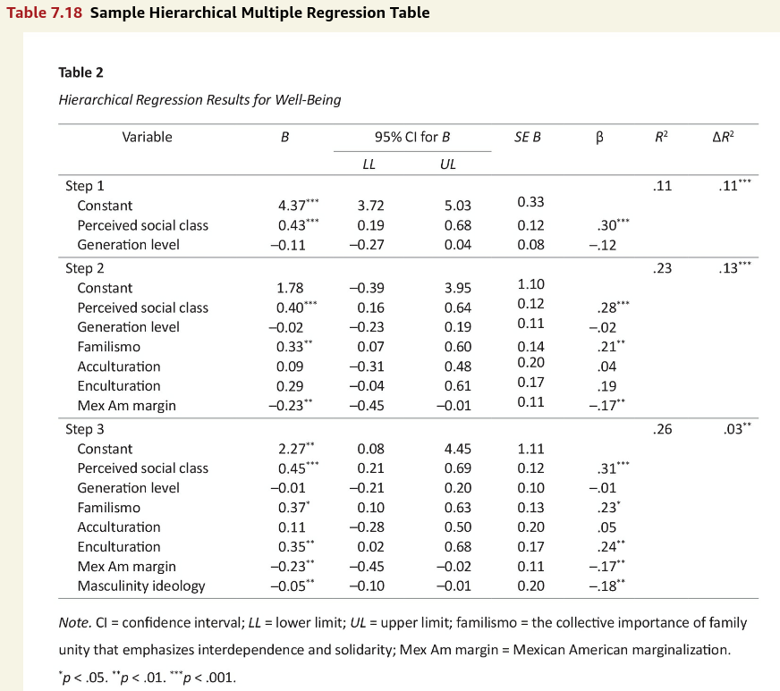

# Making tables in APA style (Part 18 of 24)

In this 24-part series, each of the tables in Chapter 7 of the *Publication Manual of the American Psychological Association* (7th Edition) is recreated with [apa7](https://wjschne.github.io/apa7/), [flextable](https://ardata-fr.github.io/flextable-book/), [easystats](https://easystats.github.io/easystats/), and [tidyverse](https://www.tidyverse.org/packages/) functions.

:::{.callout-note}
# Highlights

* Presenting a sequence of regression models

:::


::: {.cell}

```{.r .cell-code}
library(apa7)
library(flextable)
library(ftExtra)
library(tidyverse)
library(easystats)
library(lavaan)
set_flextable_defaults(theme_fun = theme_apa, 
                       font.family = "Times New Roman")
```
:::


{#fig-718 width="100%"}

To make the conversion of analysis to table more realistic, I simulated data to resemble the Step 3 model.


::: {#tbl-718 .cell tbl-cap='Hierarchical Regression: Results for Well-Being' apa-note='["CI = confidence interval; *LL*&nbsp;=&nbsp;lower limit; *UL*&nbsp;=&nbsp;upper limit; familismo = the collective importance of family unity that emphasizes interdependence and solidarity; Mex Am margin&nbsp;=&nbsp;Mexican American marginalization.","^\\*^*p* < .05. ^\\*\\*^*p* < .01. ^\\*\\*\\*^*p* < .001."]'}

````{.cell-code}
```{{r}}
#| label: tbl-718
#| tbl-cap: "Hierarchical Regression: Results for Well-Being"
#| apa-note: 
#|   - "CI = confidence interval; *LL*&nbsp;=&nbsp;lower limit; 
#|   *UL*&nbsp;=&nbsp;upper limit; familismo = the collective 
#|   importance of family unity that emphasizes interdependence
#|   and solidarity; Mex Am margin&nbsp;=&nbsp;Mexican 
#|   American marginalization."
#|   - "^\\*^*p* < .05. ^\\*\\*^*p* < .01. ^\\*\\*\\*^*p* < .001."
set.seed(123)
# Make coefficients
d_coefficients <- tibble::tribble(
  ~Step,                ~Variable, ~beta,    ~b,
     1L, "Perceived social class",  0.31,  0.45,
     1L,       "Generation level", -0.01, -0.01,
     2L,              "Familismo",  0.23,  0.37,
     2L,          "Acculturation",  0.05,  0.11,
     2L,          "Enculturation",  0.24,  0.35,
     2L,        "Mex {Am} margin", -0.17, -0.23,
     3L,   "Masculinity ideology", -0.18, -0.05
  ) |> 
  mutate(vname = snakecase::to_any_case(
    Variable, 
    case = "parsed") |> fct_inorder(),
    Variable = fct_inorder(Variable))

# Make data
d <- d_coefficients |> 
  unite(vname, c(beta, vname), 
        sep = " * ") |> 
  pull(vname) |> 
  paste(collapse = " + ") |> 
  {
    \(x) paste0("y ~ ", x)
    }() |> 
  simulateData(standardized = TRUE, sample.nobs = 125) |> 
  mutate(y = y + 4) |> 
  as_tibble()

# Rescale data
for (i in seq_len(nrow(d_coefficients))) {
  d[,d_coefficients[i,]$vname] <- d[,d_coefficients[i,]$vname] * 
    d_coefficients[i,]$beta / 
    d_coefficients[i,]$beta
}

# Analyze data
d_analysis <- d_coefficients |>
  select(Step, vname) |>
  crossing(Model = 1:3) |>
  arrange(Model, Step) |>
  filter(Step <= Model) |>
  select(-Step) |>
  summarise(f = paste0(vname, collapse = " + "), 
            .by = Model) |>
  mutate(
    eq = paste0("y ~ ", f) |> map(formula),
    fit = map(eq, lm, data = d),
    Model = paste("Model", Model)
  )

# Format data
d_formatted <- d_analysis |>
  mutate(
    parameters = map(fit, model_parameters),
    std_parameters = map(fit, 
                         model_parameters, 
                         standardize  = "basic") |> 
      map(\(d) select(d, Std_Coefficient))
  ) |>
  select(Model, parameters, std_parameters) |>
  unnest(c(parameters, std_parameters)) |>
  select(-CI, -t, -df_error) |>
  rename(pp = p) |>
  relocate(SE, .before = Std_Coefficient) |>
  apa_format_columns() |>
  rename(`95% CI for *B*_*LL*` = LL,
         `95% CI for *B*_*UL*` = UL) |>
  as_grouped_data("Model") |>
  left_join(
    d_analysis |>
      pull(fit) |>
      apa_performance_comparison(
        starred = "deltaR2", 
        metrics = c("R2", "deltaR2")),
    by = join_by(Model)
  ) |>
  replace_na(list(Model = "", Variable = "")) |>
  unite(Variable, c(Variable, Model), sep = "") |>
  mutate(`&beta;` = ifelse(Variable == "Constant", NA, `&beta;`)) |> 
  add_star_column(c(`*B*`, `&beta;`), p = pp) |> 
  select(-pp) |>
  mutate(Variable = str_replace(Variable, "^Model", "Step") |> 
           snakecase::to_sentence_case() |> 
           str_replace(" am ", " Am "))

# Make table
d_formatted |> 
  apa_flextable(line_spacing = 1.5, 
                layout = "fixed") |>
  padding(i = ~!is.na(`*B*`), 
          j = 1, 
          padding.left = 15) |>
  surround(i = ~is.na(`*B*`), 
           border.top = fp_border_default(color = "gray30")) |> 
  width(width = 6.5 * c(3, .6, .4, 1, 1, 1, 
                           .6, .4, 1, 1) / 10)
```
````

::: {.cell-output-display}

```{=html}
<div class="tabwid tabwid_left"><style>.cl-b001c7fe{}.cl-afec6e36{font-family:'Times New Roman';font-size:12pt;font-weight:normal;font-style:normal;text-decoration:none;color:rgba(0, 0, 0, 1.00);background-color:transparent;}.cl-afec6e40{font-family:'Times New Roman';font-size:12pt;font-weight:normal;font-style:italic;text-decoration:none;color:rgba(0, 0, 0, 1.00);background-color:transparent;}.cl-afec6e4a{font-family:'Times New Roman';font-size:7.2pt;font-weight:normal;font-style:normal;text-decoration:none;color:rgba(0, 0, 0, 1.00);background-color:transparent;position: relative;bottom:3.6pt;}.cl-affbfcca{margin:0;text-align:center;border-bottom: 0 solid rgba(0, 0, 0, 1.00);border-top: 0 solid rgba(0, 0, 0, 1.00);border-left: 0 solid rgba(0, 0, 0, 1.00);border-right: 0 solid rgba(0, 0, 0, 1.00);padding-bottom:4pt;padding-top:4pt;padding-left:3pt;padding-right:3pt;line-height: 1;background-color:transparent;}.cl-affbfcd4{margin:0;text-align:right;border-bottom: 0 solid rgba(0, 0, 0, 1.00);border-top: 0 solid rgba(0, 0, 0, 1.00);border-left: 0 solid rgba(0, 0, 0, 1.00);border-right: 0 solid rgba(0, 0, 0, 1.00);padding-bottom:4pt;padding-top:4pt;padding-left:3pt;padding-right:0;line-height: 1;background-color:transparent;}.cl-affbfcd5{margin:0;text-align:left;border-bottom: 0 solid rgba(0, 0, 0, 1.00);border-top: 0 solid rgba(0, 0, 0, 1.00);border-left: 0 solid rgba(0, 0, 0, 1.00);border-right: 0 solid rgba(0, 0, 0, 1.00);padding-bottom:4pt;padding-top:4pt;padding-left:3pt;padding-right:3pt;line-height: 1;background-color:transparent;}.cl-affbfcd6{margin:0;text-align:left;border-bottom: 0 solid rgba(0, 0, 0, 1.00);border-top: 0 solid rgba(0, 0, 0, 1.00);border-left: 0 solid rgba(0, 0, 0, 1.00);border-right: 0 solid rgba(0, 0, 0, 1.00);padding-bottom:4pt;padding-top:4pt;padding-left:0;padding-right:3pt;line-height: 1;background-color:transparent;}.cl-affbfcde{margin:0;text-align:left;border-bottom: 0 solid rgba(0, 0, 0, 1.00);border-top: 0 solid rgba(0, 0, 0, 1.00);border-left: 0 solid rgba(0, 0, 0, 1.00);border-right: 0 solid rgba(0, 0, 0, 1.00);padding-bottom:4pt;padding-top:4pt;padding-left:15pt;padding-right:3pt;line-height: 1;background-color:transparent;}.cl-affc1e58{width:1.95in;background-color:transparent;vertical-align: top;border-bottom: 0.75pt solid rgba(77, 77, 77, 1.00);border-top: 0.5pt solid rgba(0, 0, 0, 1.00);border-left: 0 solid rgba(255, 255, 255, 0.00);border-right: 0 solid rgba(255, 255, 255, 0.00);margin-bottom:0;margin-top:0;margin-left:0;margin-right:0;}.cl-affc1e62{width:0.39in;background-color:transparent;vertical-align: top;border-bottom: 0.75pt solid rgba(77, 77, 77, 1.00);border-top: 0.5pt solid rgba(0, 0, 0, 1.00);border-left: 0 solid rgba(255, 255, 255, 0.00);border-right: 0 solid rgba(255, 255, 255, 0.00);margin-bottom:0;margin-top:0;margin-left:0;margin-right:0;}.cl-affc1e6c{width:0.26in;background-color:transparent;vertical-align: top;border-bottom: 0.75pt solid rgba(77, 77, 77, 1.00);border-top: 0.5pt solid rgba(0, 0, 0, 1.00);border-left: 0 solid rgba(255, 255, 255, 0.00);border-right: 0 solid rgba(255, 255, 255, 0.00);margin-bottom:0;margin-top:0;margin-left:0;margin-right:0;}.cl-affc1e6d{width:0.65in;background-color:transparent;vertical-align: top;border-bottom: 0.5pt solid rgba(0, 0, 0, 1.00);border-top: 0.5pt solid rgba(0, 0, 0, 1.00);border-left: 0 solid rgba(255, 255, 255, 0.00);border-right: 0 solid rgba(255, 255, 255, 0.00);margin-bottom:0;margin-top:0;margin-left:0;margin-right:0;}.cl-affc1e6e{width:0.65in;background-color:transparent;vertical-align: top;border-bottom: 0.75pt solid rgba(77, 77, 77, 1.00);border-top: 0.5pt solid rgba(0, 0, 0, 1.00);border-left: 0 solid rgba(255, 255, 255, 0.00);border-right: 0 solid rgba(255, 255, 255, 0.00);margin-bottom:0;margin-top:0;margin-left:0;margin-right:0;}.cl-affc1e6f{width:1.95in;background-color:transparent;vertical-align: top;border-bottom: 0 solid rgba(255, 255, 255, 0.00);border-top: 0 solid rgba(255, 255, 255, 0.00);border-left: 0 solid rgba(255, 255, 255, 0.00);border-right: 0 solid rgba(255, 255, 255, 0.00);margin-bottom:0;margin-top:0;margin-left:0;margin-right:0;}.cl-affc1e76{width:0.39in;background-color:transparent;vertical-align: top;border-bottom: 0 solid rgba(255, 255, 255, 0.00);border-top: 0 solid rgba(255, 255, 255, 0.00);border-left: 0 solid rgba(255, 255, 255, 0.00);border-right: 0 solid rgba(255, 255, 255, 0.00);margin-bottom:0;margin-top:0;margin-left:0;margin-right:0;}.cl-affc1e77{width:0.26in;background-color:transparent;vertical-align: top;border-bottom: 0 solid rgba(255, 255, 255, 0.00);border-top: 0 solid rgba(255, 255, 255, 0.00);border-left: 0 solid rgba(255, 255, 255, 0.00);border-right: 0 solid rgba(255, 255, 255, 0.00);margin-bottom:0;margin-top:0;margin-left:0;margin-right:0;}.cl-affc1e78{width:0.65in;background-color:transparent;vertical-align: top;border-bottom: 0 solid rgba(255, 255, 255, 0.00);border-top: 0 solid rgba(255, 255, 255, 0.00);border-left: 0 solid rgba(255, 255, 255, 0.00);border-right: 0 solid rgba(255, 255, 255, 0.00);margin-bottom:0;margin-top:0;margin-left:0;margin-right:0;}.cl-affc1e79{width:1.95in;background-color:transparent;vertical-align: top;border-bottom: 0.75pt solid rgba(77, 77, 77, 1.00);border-top: 0 solid rgba(255, 255, 255, 0.00);border-left: 0 solid rgba(255, 255, 255, 0.00);border-right: 0 solid rgba(255, 255, 255, 0.00);margin-bottom:0;margin-top:0;margin-left:0;margin-right:0;}.cl-affc1e7a{width:0.39in;background-color:transparent;vertical-align: top;border-bottom: 0.75pt solid rgba(77, 77, 77, 1.00);border-top: 0 solid rgba(255, 255, 255, 0.00);border-left: 0 solid rgba(255, 255, 255, 0.00);border-right: 0 solid rgba(255, 255, 255, 0.00);margin-bottom:0;margin-top:0;margin-left:0;margin-right:0;}.cl-affc1e80{width:0.26in;background-color:transparent;vertical-align: top;border-bottom: 0.75pt solid rgba(77, 77, 77, 1.00);border-top: 0 solid rgba(255, 255, 255, 0.00);border-left: 0 solid rgba(255, 255, 255, 0.00);border-right: 0 solid rgba(255, 255, 255, 0.00);margin-bottom:0;margin-top:0;margin-left:0;margin-right:0;}.cl-affc1e81{width:0.65in;background-color:transparent;vertical-align: top;border-bottom: 0.75pt solid rgba(77, 77, 77, 1.00);border-top: 0 solid rgba(255, 255, 255, 0.00);border-left: 0 solid rgba(255, 255, 255, 0.00);border-right: 0 solid rgba(255, 255, 255, 0.00);margin-bottom:0;margin-top:0;margin-left:0;margin-right:0;}.cl-affc1e82{width:1.95in;background-color:transparent;vertical-align: top;border-bottom: 0 solid rgba(255, 255, 255, 0.00);border-top: 0.75pt solid rgba(77, 77, 77, 1.00);border-left: 0 solid rgba(255, 255, 255, 0.00);border-right: 0 solid rgba(255, 255, 255, 0.00);margin-bottom:0;margin-top:0;margin-left:0;margin-right:0;}.cl-affc1e8a{width:0.39in;background-color:transparent;vertical-align: top;border-bottom: 0 solid rgba(255, 255, 255, 0.00);border-top: 0.75pt solid rgba(77, 77, 77, 1.00);border-left: 0 solid rgba(255, 255, 255, 0.00);border-right: 0 solid rgba(255, 255, 255, 0.00);margin-bottom:0;margin-top:0;margin-left:0;margin-right:0;}.cl-affc1e8b{width:0.26in;background-color:transparent;vertical-align: top;border-bottom: 0 solid rgba(255, 255, 255, 0.00);border-top: 0.75pt solid rgba(77, 77, 77, 1.00);border-left: 0 solid rgba(255, 255, 255, 0.00);border-right: 0 solid rgba(255, 255, 255, 0.00);margin-bottom:0;margin-top:0;margin-left:0;margin-right:0;}.cl-affc1e8c{width:0.65in;background-color:transparent;vertical-align: top;border-bottom: 0 solid rgba(255, 255, 255, 0.00);border-top: 0.75pt solid rgba(77, 77, 77, 1.00);border-left: 0 solid rgba(255, 255, 255, 0.00);border-right: 0 solid rgba(255, 255, 255, 0.00);margin-bottom:0;margin-top:0;margin-left:0;margin-right:0;}.cl-affc1e8d{width:1.95in;background-color:transparent;vertical-align: top;border-bottom: 0.5pt solid rgba(0, 0, 0, 1.00);border-top: 0 solid rgba(255, 255, 255, 0.00);border-left: 0 solid rgba(255, 255, 255, 0.00);border-right: 0 solid rgba(255, 255, 255, 0.00);margin-bottom:0;margin-top:0;margin-left:0;margin-right:0;}.cl-affc1e94{width:0.39in;background-color:transparent;vertical-align: top;border-bottom: 0.5pt solid rgba(0, 0, 0, 1.00);border-top: 0 solid rgba(255, 255, 255, 0.00);border-left: 0 solid rgba(255, 255, 255, 0.00);border-right: 0 solid rgba(255, 255, 255, 0.00);margin-bottom:0;margin-top:0;margin-left:0;margin-right:0;}.cl-affc1e95{width:0.26in;background-color:transparent;vertical-align: top;border-bottom: 0.5pt solid rgba(0, 0, 0, 1.00);border-top: 0 solid rgba(255, 255, 255, 0.00);border-left: 0 solid rgba(255, 255, 255, 0.00);border-right: 0 solid rgba(255, 255, 255, 0.00);margin-bottom:0;margin-top:0;margin-left:0;margin-right:0;}.cl-affc1e96{width:0.65in;background-color:transparent;vertical-align: top;border-bottom: 0.5pt solid rgba(0, 0, 0, 1.00);border-top: 0 solid rgba(255, 255, 255, 0.00);border-left: 0 solid rgba(255, 255, 255, 0.00);border-right: 0 solid rgba(255, 255, 255, 0.00);margin-bottom:0;margin-top:0;margin-left:0;margin-right:0;}</style><table data-quarto-disable-processing='true' class='cl-b001c7fe'><thead><tr style="overflow-wrap:break-word;"><th  rowspan="2"class="cl-affc1e58"><p class="cl-affbfcca"><span class="cl-afec6e36">Variable</span></p></th><th  rowspan="2"class="cl-affc1e62"><p class="cl-affbfcd4"><span class="cl-afec6e40">B</span></p></th><th  rowspan="2"class="cl-affc1e6c"><p class="cl-affbfcca"><span class="cl-afec6e36"></span></p></th><th  colspan="2"class="cl-affc1e6d"><p class="cl-affbfcca"><span class="cl-afec6e36">95%</span><span class="cl-afec6e36"> </span><span class="cl-afec6e36">CI</span><span class="cl-afec6e36"> </span><span class="cl-afec6e36">for</span><span class="cl-afec6e36"> </span><span class="cl-afec6e40">B</span></p></th><th  rowspan="2"class="cl-affc1e6e"><p class="cl-affbfcca"><span class="cl-afec6e40">SE</span></p></th><th  rowspan="2"class="cl-affc1e62"><p class="cl-affbfcd4"><span class="cl-afec6e36">β</span></p></th><th  rowspan="2"class="cl-affc1e6c"><p class="cl-affbfcca"><span class="cl-afec6e36"></span></p></th><th  rowspan="2"class="cl-affc1e6e"><p class="cl-affbfcca"><span class="cl-afec6e40">R</span><span class="cl-afec6e4a">2</span></p></th><th  rowspan="2"class="cl-affc1e6e"><p class="cl-affbfcca"><span class="cl-afec6e36">Δ</span><span class="cl-afec6e40">R</span><span class="cl-afec6e4a">2</span></p></th></tr><tr style="overflow-wrap:break-word;"><th class="cl-affc1e6e"><p class="cl-affbfcca"><span class="cl-afec6e40">LL</span></p></th><th class="cl-affc1e6e"><p class="cl-affbfcca"><span class="cl-afec6e40">UL</span></p></th></tr></thead><tbody><tr style="overflow-wrap:break-word;"><td class="cl-affc1e6f"><p class="cl-affbfcd5"><span class="cl-afec6e36">Step</span><span class="cl-afec6e36"> </span><span class="cl-afec6e36">1</span></p></td><td class="cl-affc1e76"><p class="cl-affbfcd4"><span class="cl-afec6e36"></span></p></td><td class="cl-affc1e77"><p class="cl-affbfcd6"><span class="cl-afec6e36"></span></p></td><td class="cl-affc1e78"><p class="cl-affbfcca"><span class="cl-afec6e36"></span></p></td><td class="cl-affc1e78"><p class="cl-affbfcca"><span class="cl-afec6e36"></span></p></td><td class="cl-affc1e78"><p class="cl-affbfcca"><span class="cl-afec6e36"></span></p></td><td class="cl-affc1e76"><p class="cl-affbfcd4"><span class="cl-afec6e36"></span></p></td><td class="cl-affc1e77"><p class="cl-affbfcd6"><span class="cl-afec6e36"></span></p></td><td class="cl-affc1e78"><p class="cl-affbfcca"><span class="cl-afec6e36">.03</span></p></td><td class="cl-affc1e78"><p class="cl-affbfcca"><span class="cl-afec6e36"></span></p></td></tr><tr style="overflow-wrap:break-word;"><td class="cl-affc1e6f"><p class="cl-affbfcde"><span class="cl-afec6e36">Constant</span></p></td><td class="cl-affc1e76"><p class="cl-affbfcd4"><span class="cl-afec6e36"> 4.00</span></p></td><td class="cl-affc1e77"><p class="cl-affbfcd6"><span class="cl-afec6e4a">***</span></p></td><td class="cl-affc1e78"><p class="cl-affbfcca"><span class="cl-afec6e36"> 3.85</span></p></td><td class="cl-affc1e78"><p class="cl-affbfcca"><span class="cl-afec6e36"> 4.16</span></p></td><td class="cl-affc1e78"><p class="cl-affbfcca"><span class="cl-afec6e36">0.08</span></p></td><td class="cl-affc1e76"><p class="cl-affbfcd4"><span class="cl-afec6e36"></span></p></td><td class="cl-affc1e77"><p class="cl-affbfcd6"><span class="cl-afec6e36"></span></p></td><td class="cl-affc1e78"><p class="cl-affbfcca"><span class="cl-afec6e36"></span></p></td><td class="cl-affc1e78"><p class="cl-affbfcca"><span class="cl-afec6e36"></span></p></td></tr><tr style="overflow-wrap:break-word;"><td class="cl-affc1e6f"><p class="cl-affbfcde"><span class="cl-afec6e36">Perceived</span><span class="cl-afec6e36"> </span><span class="cl-afec6e36">Social</span><span class="cl-afec6e36"> </span><span class="cl-afec6e36">Class</span></p></td><td class="cl-affc1e76"><p class="cl-affbfcd4"><span class="cl-afec6e36"> 0.15</span></p></td><td class="cl-affc1e77"><p class="cl-affbfcd6"><span class="cl-afec6e36"></span></p></td><td class="cl-affc1e78"><p class="cl-affbfcca"><span class="cl-afec6e36">−0.01</span></p></td><td class="cl-affc1e78"><p class="cl-affbfcca"><span class="cl-afec6e36"> 0.30</span></p></td><td class="cl-affc1e78"><p class="cl-affbfcca"><span class="cl-afec6e36">0.08</span></p></td><td class="cl-affc1e76"><p class="cl-affbfcd4"><span class="cl-afec6e36"> .16</span></p></td><td class="cl-affc1e77"><p class="cl-affbfcd6"><span class="cl-afec6e36"></span></p></td><td class="cl-affc1e78"><p class="cl-affbfcca"><span class="cl-afec6e36"></span></p></td><td class="cl-affc1e78"><p class="cl-affbfcca"><span class="cl-afec6e36"></span></p></td></tr><tr style="overflow-wrap:break-word;"><td class="cl-affc1e79"><p class="cl-affbfcde"><span class="cl-afec6e36">Generation</span><span class="cl-afec6e36"> </span><span class="cl-afec6e36">Level</span></p></td><td class="cl-affc1e7a"><p class="cl-affbfcd4"><span class="cl-afec6e36">−0.04</span></p></td><td class="cl-affc1e80"><p class="cl-affbfcd6"><span class="cl-afec6e36"></span></p></td><td class="cl-affc1e81"><p class="cl-affbfcca"><span class="cl-afec6e36">−0.19</span></p></td><td class="cl-affc1e81"><p class="cl-affbfcca"><span class="cl-afec6e36"> 0.11</span></p></td><td class="cl-affc1e81"><p class="cl-affbfcca"><span class="cl-afec6e36">0.08</span></p></td><td class="cl-affc1e7a"><p class="cl-affbfcd4"><span class="cl-afec6e36">−.04</span></p></td><td class="cl-affc1e80"><p class="cl-affbfcd6"><span class="cl-afec6e36"></span></p></td><td class="cl-affc1e81"><p class="cl-affbfcca"><span class="cl-afec6e36"></span></p></td><td class="cl-affc1e81"><p class="cl-affbfcca"><span class="cl-afec6e36"></span></p></td></tr><tr style="overflow-wrap:break-word;"><td class="cl-affc1e82"><p class="cl-affbfcd5"><span class="cl-afec6e36">Step</span><span class="cl-afec6e36"> </span><span class="cl-afec6e36">2</span></p></td><td class="cl-affc1e8a"><p class="cl-affbfcd4"><span class="cl-afec6e36"></span></p></td><td class="cl-affc1e8b"><p class="cl-affbfcd6"><span class="cl-afec6e36"></span></p></td><td class="cl-affc1e8c"><p class="cl-affbfcca"><span class="cl-afec6e36"></span></p></td><td class="cl-affc1e8c"><p class="cl-affbfcca"><span class="cl-afec6e36"></span></p></td><td class="cl-affc1e8c"><p class="cl-affbfcca"><span class="cl-afec6e36"></span></p></td><td class="cl-affc1e8a"><p class="cl-affbfcd4"><span class="cl-afec6e36"></span></p></td><td class="cl-affc1e8b"><p class="cl-affbfcd6"><span class="cl-afec6e36"></span></p></td><td class="cl-affc1e8c"><p class="cl-affbfcca"><span class="cl-afec6e36">.16</span></p></td><td class="cl-affc1e8c"><p class="cl-affbfcca"><span class="cl-afec6e36">.13</span><span class="cl-afec6e4a">***</span></p></td></tr><tr style="overflow-wrap:break-word;"><td class="cl-affc1e6f"><p class="cl-affbfcde"><span class="cl-afec6e36">Constant</span></p></td><td class="cl-affc1e76"><p class="cl-affbfcd4"><span class="cl-afec6e36"> 4.03</span></p></td><td class="cl-affc1e77"><p class="cl-affbfcd6"><span class="cl-afec6e4a">***</span></p></td><td class="cl-affc1e78"><p class="cl-affbfcca"><span class="cl-afec6e36"> 3.89</span></p></td><td class="cl-affc1e78"><p class="cl-affbfcca"><span class="cl-afec6e36"> 4.18</span></p></td><td class="cl-affc1e78"><p class="cl-affbfcca"><span class="cl-afec6e36">0.07</span></p></td><td class="cl-affc1e76"><p class="cl-affbfcd4"><span class="cl-afec6e36"></span></p></td><td class="cl-affc1e77"><p class="cl-affbfcd6"><span class="cl-afec6e36"></span></p></td><td class="cl-affc1e78"><p class="cl-affbfcca"><span class="cl-afec6e36"></span></p></td><td class="cl-affc1e78"><p class="cl-affbfcca"><span class="cl-afec6e36"></span></p></td></tr><tr style="overflow-wrap:break-word;"><td class="cl-affc1e6f"><p class="cl-affbfcde"><span class="cl-afec6e36">Perceived</span><span class="cl-afec6e36"> </span><span class="cl-afec6e36">Social</span><span class="cl-afec6e36"> </span><span class="cl-afec6e36">Class</span></p></td><td class="cl-affc1e76"><p class="cl-affbfcd4"><span class="cl-afec6e36"> 0.19</span></p></td><td class="cl-affc1e77"><p class="cl-affbfcd6"><span class="cl-afec6e4a">*</span></p></td><td class="cl-affc1e78"><p class="cl-affbfcca"><span class="cl-afec6e36"> 0.04</span></p></td><td class="cl-affc1e78"><p class="cl-affbfcca"><span class="cl-afec6e36"> 0.34</span></p></td><td class="cl-affc1e78"><p class="cl-affbfcca"><span class="cl-afec6e36">0.08</span></p></td><td class="cl-affc1e76"><p class="cl-affbfcd4"><span class="cl-afec6e36"> .21</span></p></td><td class="cl-affc1e77"><p class="cl-affbfcd6"><span class="cl-afec6e4a">*</span></p></td><td class="cl-affc1e78"><p class="cl-affbfcca"><span class="cl-afec6e36"></span></p></td><td class="cl-affc1e78"><p class="cl-affbfcca"><span class="cl-afec6e36"></span></p></td></tr><tr style="overflow-wrap:break-word;"><td class="cl-affc1e6f"><p class="cl-affbfcde"><span class="cl-afec6e36">Generation</span><span class="cl-afec6e36"> </span><span class="cl-afec6e36">Level</span></p></td><td class="cl-affc1e76"><p class="cl-affbfcd4"><span class="cl-afec6e36">−0.04</span></p></td><td class="cl-affc1e77"><p class="cl-affbfcd6"><span class="cl-afec6e36"></span></p></td><td class="cl-affc1e78"><p class="cl-affbfcca"><span class="cl-afec6e36">−0.18</span></p></td><td class="cl-affc1e78"><p class="cl-affbfcca"><span class="cl-afec6e36"> 0.10</span></p></td><td class="cl-affc1e78"><p class="cl-affbfcca"><span class="cl-afec6e36">0.07</span></p></td><td class="cl-affc1e76"><p class="cl-affbfcd4"><span class="cl-afec6e36">−.05</span></p></td><td class="cl-affc1e77"><p class="cl-affbfcd6"><span class="cl-afec6e36"></span></p></td><td class="cl-affc1e78"><p class="cl-affbfcca"><span class="cl-afec6e36"></span></p></td><td class="cl-affc1e78"><p class="cl-affbfcca"><span class="cl-afec6e36"></span></p></td></tr><tr style="overflow-wrap:break-word;"><td class="cl-affc1e6f"><p class="cl-affbfcde"><span class="cl-afec6e36">Familismo</span></p></td><td class="cl-affc1e76"><p class="cl-affbfcd4"><span class="cl-afec6e36"> 0.18</span></p></td><td class="cl-affc1e77"><p class="cl-affbfcd6"><span class="cl-afec6e4a">*</span></p></td><td class="cl-affc1e78"><p class="cl-affbfcca"><span class="cl-afec6e36"> 0.03</span></p></td><td class="cl-affc1e78"><p class="cl-affbfcca"><span class="cl-afec6e36"> 0.32</span></p></td><td class="cl-affc1e78"><p class="cl-affbfcca"><span class="cl-afec6e36">0.07</span></p></td><td class="cl-affc1e76"><p class="cl-affbfcd4"><span class="cl-afec6e36"> .21</span></p></td><td class="cl-affc1e77"><p class="cl-affbfcd6"><span class="cl-afec6e4a">*</span></p></td><td class="cl-affc1e78"><p class="cl-affbfcca"><span class="cl-afec6e36"></span></p></td><td class="cl-affc1e78"><p class="cl-affbfcca"><span class="cl-afec6e36"></span></p></td></tr><tr style="overflow-wrap:break-word;"><td class="cl-affc1e6f"><p class="cl-affbfcde"><span class="cl-afec6e36">Acculturation</span></p></td><td class="cl-affc1e76"><p class="cl-affbfcd4"><span class="cl-afec6e36"> 0.06</span></p></td><td class="cl-affc1e77"><p class="cl-affbfcd6"><span class="cl-afec6e36"></span></p></td><td class="cl-affc1e78"><p class="cl-affbfcca"><span class="cl-afec6e36">−0.09</span></p></td><td class="cl-affc1e78"><p class="cl-affbfcca"><span class="cl-afec6e36"> 0.22</span></p></td><td class="cl-affc1e78"><p class="cl-affbfcca"><span class="cl-afec6e36">0.08</span></p></td><td class="cl-affc1e76"><p class="cl-affbfcd4"><span class="cl-afec6e36"> .07</span></p></td><td class="cl-affc1e77"><p class="cl-affbfcd6"><span class="cl-afec6e36"></span></p></td><td class="cl-affc1e78"><p class="cl-affbfcca"><span class="cl-afec6e36"></span></p></td><td class="cl-affc1e78"><p class="cl-affbfcca"><span class="cl-afec6e36"></span></p></td></tr><tr style="overflow-wrap:break-word;"><td class="cl-affc1e6f"><p class="cl-affbfcde"><span class="cl-afec6e36">Enculturation</span></p></td><td class="cl-affc1e76"><p class="cl-affbfcd4"><span class="cl-afec6e36"> 0.09</span></p></td><td class="cl-affc1e77"><p class="cl-affbfcd6"><span class="cl-afec6e36"></span></p></td><td class="cl-affc1e78"><p class="cl-affbfcca"><span class="cl-afec6e36">−0.06</span></p></td><td class="cl-affc1e78"><p class="cl-affbfcca"><span class="cl-afec6e36"> 0.24</span></p></td><td class="cl-affc1e78"><p class="cl-affbfcca"><span class="cl-afec6e36">0.08</span></p></td><td class="cl-affc1e76"><p class="cl-affbfcd4"><span class="cl-afec6e36"> .10</span></p></td><td class="cl-affc1e77"><p class="cl-affbfcd6"><span class="cl-afec6e36"></span></p></td><td class="cl-affc1e78"><p class="cl-affbfcca"><span class="cl-afec6e36"></span></p></td><td class="cl-affc1e78"><p class="cl-affbfcca"><span class="cl-afec6e36"></span></p></td></tr><tr style="overflow-wrap:break-word;"><td class="cl-affc1e79"><p class="cl-affbfcde"><span class="cl-afec6e36">Mex</span><span class="cl-afec6e36"> </span><span class="cl-afec6e36">Am</span><span class="cl-afec6e36"> </span><span class="cl-afec6e36">Margin</span></p></td><td class="cl-affc1e7a"><p class="cl-affbfcd4"><span class="cl-afec6e36">−0.23</span></p></td><td class="cl-affc1e80"><p class="cl-affbfcd6"><span class="cl-afec6e4a">**</span></p></td><td class="cl-affc1e81"><p class="cl-affbfcca"><span class="cl-afec6e36">−0.38</span></p></td><td class="cl-affc1e81"><p class="cl-affbfcca"><span class="cl-afec6e36">−0.08</span></p></td><td class="cl-affc1e81"><p class="cl-affbfcca"><span class="cl-afec6e36">0.08</span></p></td><td class="cl-affc1e7a"><p class="cl-affbfcd4"><span class="cl-afec6e36">−.26</span></p></td><td class="cl-affc1e80"><p class="cl-affbfcd6"><span class="cl-afec6e4a">**</span></p></td><td class="cl-affc1e81"><p class="cl-affbfcca"><span class="cl-afec6e36"></span></p></td><td class="cl-affc1e81"><p class="cl-affbfcca"><span class="cl-afec6e36"></span></p></td></tr><tr style="overflow-wrap:break-word;"><td class="cl-affc1e82"><p class="cl-affbfcd5"><span class="cl-afec6e36">Step</span><span class="cl-afec6e36"> </span><span class="cl-afec6e36">3</span></p></td><td class="cl-affc1e8a"><p class="cl-affbfcd4"><span class="cl-afec6e36"></span></p></td><td class="cl-affc1e8b"><p class="cl-affbfcd6"><span class="cl-afec6e36"></span></p></td><td class="cl-affc1e8c"><p class="cl-affbfcca"><span class="cl-afec6e36"></span></p></td><td class="cl-affc1e8c"><p class="cl-affbfcca"><span class="cl-afec6e36"></span></p></td><td class="cl-affc1e8c"><p class="cl-affbfcca"><span class="cl-afec6e36"></span></p></td><td class="cl-affc1e8a"><p class="cl-affbfcd4"><span class="cl-afec6e36"></span></p></td><td class="cl-affc1e8b"><p class="cl-affbfcd6"><span class="cl-afec6e36"></span></p></td><td class="cl-affc1e8c"><p class="cl-affbfcca"><span class="cl-afec6e36">.23</span></p></td><td class="cl-affc1e8c"><p class="cl-affbfcca"><span class="cl-afec6e36">.06</span><span class="cl-afec6e4a">**</span><span class="cl-afec6e36"> </span></p></td></tr><tr style="overflow-wrap:break-word;"><td class="cl-affc1e6f"><p class="cl-affbfcde"><span class="cl-afec6e36">Constant</span></p></td><td class="cl-affc1e76"><p class="cl-affbfcd4"><span class="cl-afec6e36"> 4.03</span></p></td><td class="cl-affc1e77"><p class="cl-affbfcd6"><span class="cl-afec6e4a">***</span></p></td><td class="cl-affc1e78"><p class="cl-affbfcca"><span class="cl-afec6e36"> 3.89</span></p></td><td class="cl-affc1e78"><p class="cl-affbfcca"><span class="cl-afec6e36"> 4.17</span></p></td><td class="cl-affc1e78"><p class="cl-affbfcca"><span class="cl-afec6e36">0.07</span></p></td><td class="cl-affc1e76"><p class="cl-affbfcd4"><span class="cl-afec6e36"></span></p></td><td class="cl-affc1e77"><p class="cl-affbfcd6"><span class="cl-afec6e36"></span></p></td><td class="cl-affc1e78"><p class="cl-affbfcca"><span class="cl-afec6e36"></span></p></td><td class="cl-affc1e78"><p class="cl-affbfcca"><span class="cl-afec6e36"></span></p></td></tr><tr style="overflow-wrap:break-word;"><td class="cl-affc1e6f"><p class="cl-affbfcde"><span class="cl-afec6e36">Perceived</span><span class="cl-afec6e36"> </span><span class="cl-afec6e36">Social</span><span class="cl-afec6e36"> </span><span class="cl-afec6e36">Class</span></p></td><td class="cl-affc1e76"><p class="cl-affbfcd4"><span class="cl-afec6e36"> 0.18</span></p></td><td class="cl-affc1e77"><p class="cl-affbfcd6"><span class="cl-afec6e4a">*</span></p></td><td class="cl-affc1e78"><p class="cl-affbfcca"><span class="cl-afec6e36"> 0.03</span></p></td><td class="cl-affc1e78"><p class="cl-affbfcca"><span class="cl-afec6e36"> 0.32</span></p></td><td class="cl-affc1e78"><p class="cl-affbfcca"><span class="cl-afec6e36">0.07</span></p></td><td class="cl-affc1e76"><p class="cl-affbfcd4"><span class="cl-afec6e36"> .20</span></p></td><td class="cl-affc1e77"><p class="cl-affbfcd6"><span class="cl-afec6e4a">*</span></p></td><td class="cl-affc1e78"><p class="cl-affbfcca"><span class="cl-afec6e36"></span></p></td><td class="cl-affc1e78"><p class="cl-affbfcca"><span class="cl-afec6e36"></span></p></td></tr><tr style="overflow-wrap:break-word;"><td class="cl-affc1e6f"><p class="cl-affbfcde"><span class="cl-afec6e36">Generation</span><span class="cl-afec6e36"> </span><span class="cl-afec6e36">Level</span></p></td><td class="cl-affc1e76"><p class="cl-affbfcd4"><span class="cl-afec6e36">−0.08</span></p></td><td class="cl-affc1e77"><p class="cl-affbfcd6"><span class="cl-afec6e36"></span></p></td><td class="cl-affc1e78"><p class="cl-affbfcca"><span class="cl-afec6e36">−0.22</span></p></td><td class="cl-affc1e78"><p class="cl-affbfcca"><span class="cl-afec6e36"> 0.06</span></p></td><td class="cl-affc1e78"><p class="cl-affbfcca"><span class="cl-afec6e36">0.07</span></p></td><td class="cl-affc1e76"><p class="cl-affbfcd4"><span class="cl-afec6e36">−.09</span></p></td><td class="cl-affc1e77"><p class="cl-affbfcd6"><span class="cl-afec6e36"></span></p></td><td class="cl-affc1e78"><p class="cl-affbfcca"><span class="cl-afec6e36"></span></p></td><td class="cl-affc1e78"><p class="cl-affbfcca"><span class="cl-afec6e36"></span></p></td></tr><tr style="overflow-wrap:break-word;"><td class="cl-affc1e6f"><p class="cl-affbfcde"><span class="cl-afec6e36">Familismo</span></p></td><td class="cl-affc1e76"><p class="cl-affbfcd4"><span class="cl-afec6e36"> 0.18</span></p></td><td class="cl-affc1e77"><p class="cl-affbfcd6"><span class="cl-afec6e4a">*</span></p></td><td class="cl-affc1e78"><p class="cl-affbfcca"><span class="cl-afec6e36"> 0.04</span></p></td><td class="cl-affc1e78"><p class="cl-affbfcca"><span class="cl-afec6e36"> 0.32</span></p></td><td class="cl-affc1e78"><p class="cl-affbfcca"><span class="cl-afec6e36">0.07</span></p></td><td class="cl-affc1e76"><p class="cl-affbfcd4"><span class="cl-afec6e36"> .21</span></p></td><td class="cl-affc1e77"><p class="cl-affbfcd6"><span class="cl-afec6e4a">*</span></p></td><td class="cl-affc1e78"><p class="cl-affbfcca"><span class="cl-afec6e36"></span></p></td><td class="cl-affc1e78"><p class="cl-affbfcca"><span class="cl-afec6e36"></span></p></td></tr><tr style="overflow-wrap:break-word;"><td class="cl-affc1e6f"><p class="cl-affbfcde"><span class="cl-afec6e36">Acculturation</span></p></td><td class="cl-affc1e76"><p class="cl-affbfcd4"><span class="cl-afec6e36"> 0.06</span></p></td><td class="cl-affc1e77"><p class="cl-affbfcd6"><span class="cl-afec6e36"></span></p></td><td class="cl-affc1e78"><p class="cl-affbfcca"><span class="cl-afec6e36">−0.09</span></p></td><td class="cl-affc1e78"><p class="cl-affbfcca"><span class="cl-afec6e36"> 0.21</span></p></td><td class="cl-affc1e78"><p class="cl-affbfcca"><span class="cl-afec6e36">0.07</span></p></td><td class="cl-affc1e76"><p class="cl-affbfcd4"><span class="cl-afec6e36"> .07</span></p></td><td class="cl-affc1e77"><p class="cl-affbfcd6"><span class="cl-afec6e36"></span></p></td><td class="cl-affc1e78"><p class="cl-affbfcca"><span class="cl-afec6e36"></span></p></td><td class="cl-affc1e78"><p class="cl-affbfcca"><span class="cl-afec6e36"></span></p></td></tr><tr style="overflow-wrap:break-word;"><td class="cl-affc1e6f"><p class="cl-affbfcde"><span class="cl-afec6e36">Enculturation</span></p></td><td class="cl-affc1e76"><p class="cl-affbfcd4"><span class="cl-afec6e36"> 0.09</span></p></td><td class="cl-affc1e77"><p class="cl-affbfcd6"><span class="cl-afec6e36"></span></p></td><td class="cl-affc1e78"><p class="cl-affbfcca"><span class="cl-afec6e36">−0.06</span></p></td><td class="cl-affc1e78"><p class="cl-affbfcca"><span class="cl-afec6e36"> 0.24</span></p></td><td class="cl-affc1e78"><p class="cl-affbfcca"><span class="cl-afec6e36">0.07</span></p></td><td class="cl-affc1e76"><p class="cl-affbfcd4"><span class="cl-afec6e36"> .10</span></p></td><td class="cl-affc1e77"><p class="cl-affbfcd6"><span class="cl-afec6e36"></span></p></td><td class="cl-affc1e78"><p class="cl-affbfcca"><span class="cl-afec6e36"></span></p></td><td class="cl-affc1e78"><p class="cl-affbfcca"><span class="cl-afec6e36"></span></p></td></tr><tr style="overflow-wrap:break-word;"><td class="cl-affc1e6f"><p class="cl-affbfcde"><span class="cl-afec6e36">Mex</span><span class="cl-afec6e36"> </span><span class="cl-afec6e36">Am</span><span class="cl-afec6e36"> </span><span class="cl-afec6e36">Margin</span></p></td><td class="cl-affc1e76"><p class="cl-affbfcd4"><span class="cl-afec6e36">−0.22</span></p></td><td class="cl-affc1e77"><p class="cl-affbfcd6"><span class="cl-afec6e4a">**</span></p></td><td class="cl-affc1e78"><p class="cl-affbfcca"><span class="cl-afec6e36">−0.37</span></p></td><td class="cl-affc1e78"><p class="cl-affbfcca"><span class="cl-afec6e36">−0.08</span></p></td><td class="cl-affc1e78"><p class="cl-affbfcca"><span class="cl-afec6e36">0.07</span></p></td><td class="cl-affc1e76"><p class="cl-affbfcd4"><span class="cl-afec6e36">−.26</span></p></td><td class="cl-affc1e77"><p class="cl-affbfcd6"><span class="cl-afec6e4a">**</span></p></td><td class="cl-affc1e78"><p class="cl-affbfcca"><span class="cl-afec6e36"></span></p></td><td class="cl-affc1e78"><p class="cl-affbfcca"><span class="cl-afec6e36"></span></p></td></tr><tr style="overflow-wrap:break-word;"><td class="cl-affc1e8d"><p class="cl-affbfcde"><span class="cl-afec6e36">Masculinity</span><span class="cl-afec6e36"> </span><span class="cl-afec6e36">Ideology</span></p></td><td class="cl-affc1e94"><p class="cl-affbfcd4"><span class="cl-afec6e36">−0.22</span></p></td><td class="cl-affc1e95"><p class="cl-affbfcd6"><span class="cl-afec6e4a">**</span></p></td><td class="cl-affc1e96"><p class="cl-affbfcca"><span class="cl-afec6e36">−0.37</span></p></td><td class="cl-affc1e96"><p class="cl-affbfcca"><span class="cl-afec6e36">−0.08</span></p></td><td class="cl-affc1e96"><p class="cl-affbfcca"><span class="cl-afec6e36">0.07</span></p></td><td class="cl-affc1e94"><p class="cl-affbfcd4"><span class="cl-afec6e36">−.26</span></p></td><td class="cl-affc1e95"><p class="cl-affbfcd6"><span class="cl-afec6e4a">**</span></p></td><td class="cl-affc1e96"><p class="cl-affbfcca"><span class="cl-afec6e36"></span></p></td><td class="cl-affc1e96"><p class="cl-affbfcca"><span class="cl-afec6e36"></span></p></td></tr></tbody></table></div>
```

:::
:::


<nav aria-label="Page navigation example">
  <ul class="pagination justify-content-end">
    <li class="page-item"><a class="page-link" href="apa701.html">First</a></li>
    <li class="page-item"><a class="page-link" href="apa717.html">Previous</a></li>
    <li class="page-item"><a class="page-link" href="apa719.html">Next</a></li>
    <li class="page-item"><a class="page-link" href="apa724.html">Last</a></li>
  </ul>
</nav>

