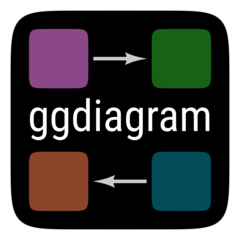
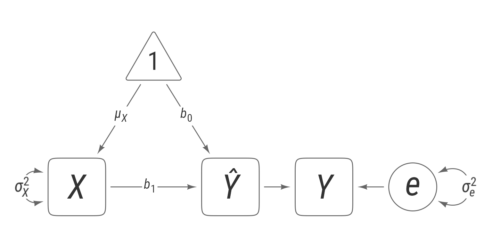
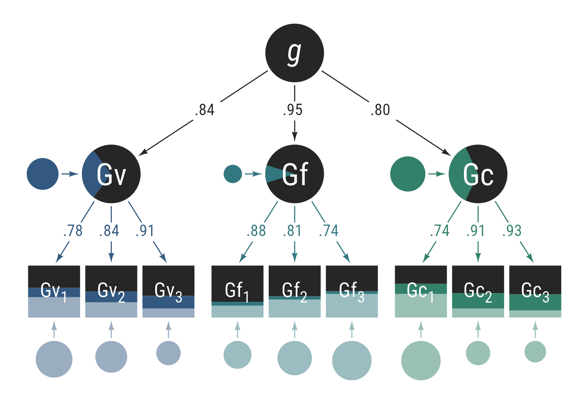
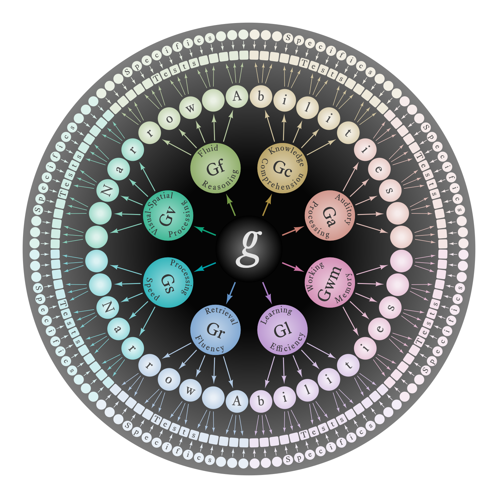
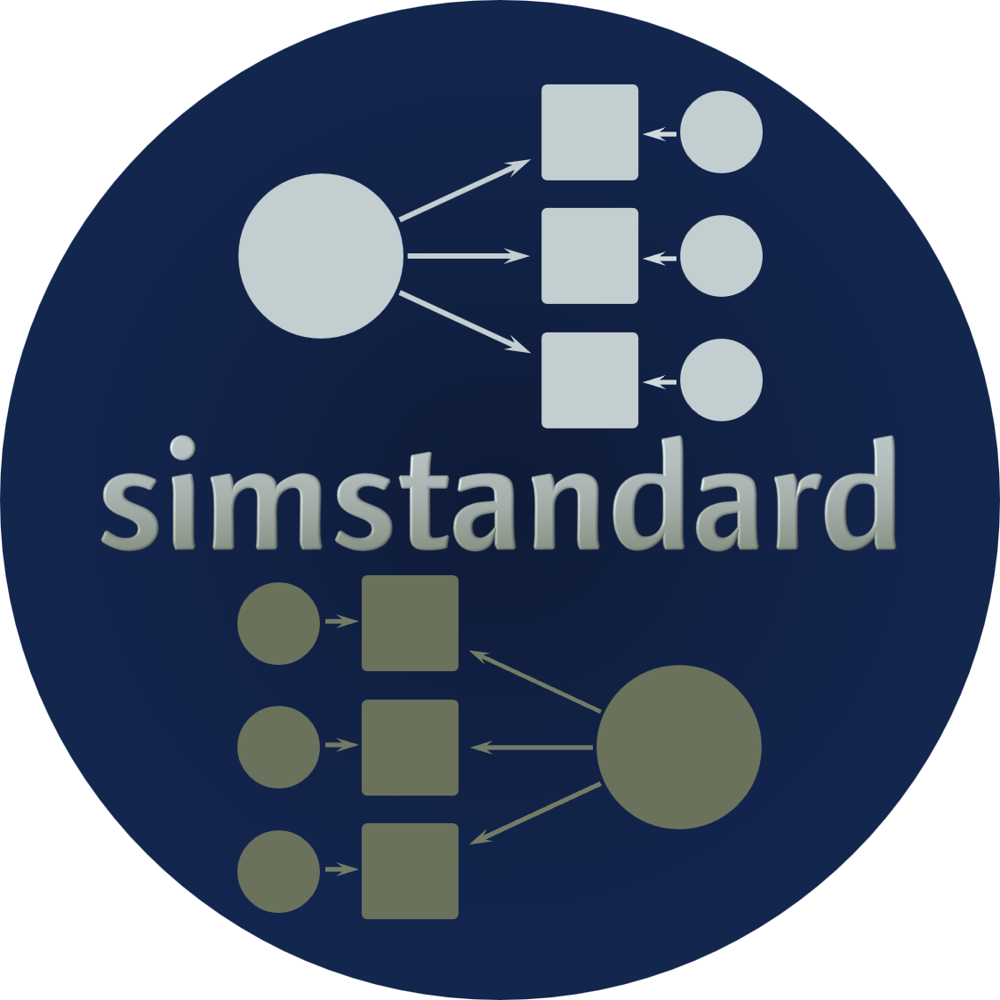
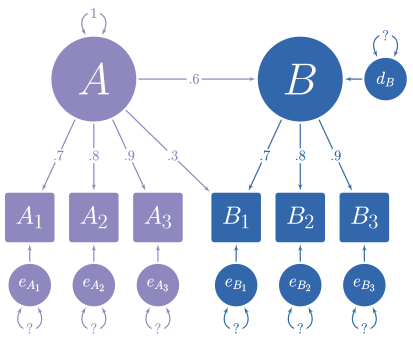
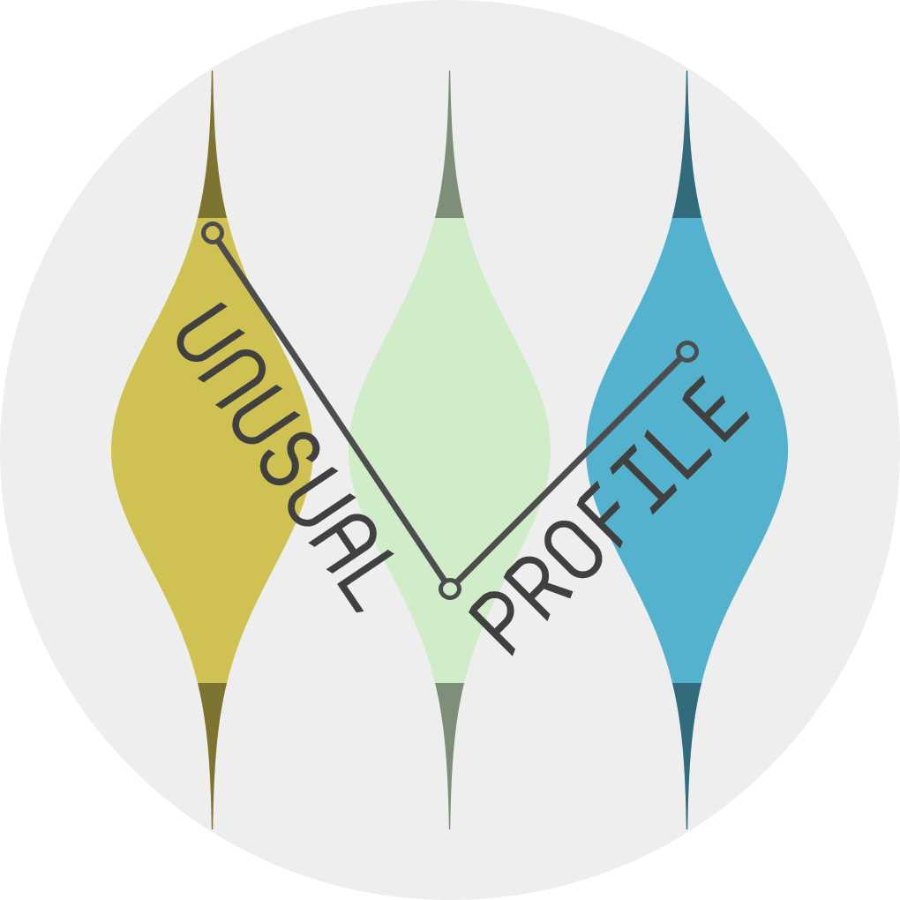
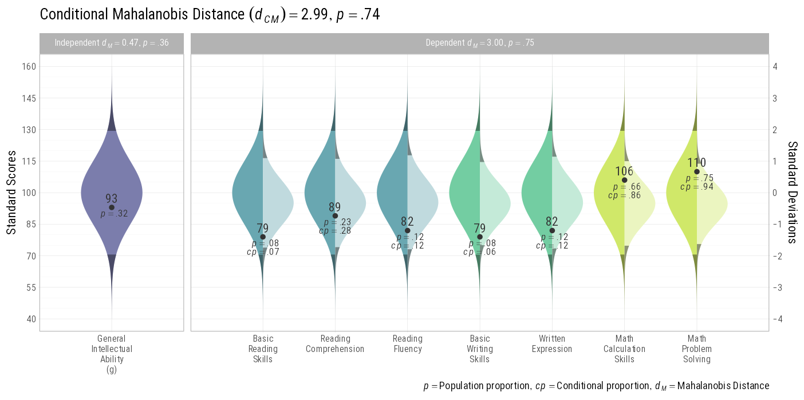

# R Packages

## [apa7](https://wjschne.github.io/apa7/)

::::{.columns}
:::{.column width=60%}
[Facilitate writing documents in APA Style]{.lead}

:::
:::{.column width=40%}
[{width="600px"}](https://wjschne.github.io/apa7/index.html){style='position:relative; bottom:65px'}
:::
::::

## [ggdiagram](https://wjschne.github.io/ggdiagram/)

::::{.columns}
:::{.column width=70%}
[An object-oriented approach to making diagrams via ggplot2]{.lead}

:::
:::{.column width=30%}
[{width="150px"}](https://wjschne.github.io/ggdiagram/index.html){style='position:relative; bottom:65px'}
:::
::::

Complex diagrams can take a long time to get right. The ggdiagram package can take away much of the burden of tedious calculation.

{width="600px"}

{width="600px"}

{width="600px"}

## [simstandard](https://wjschne.github.io/simstandard/index.html) 

::::{.columns}
:::{.column width=70%}
[R package for simulating data using standardized coefficients]{.lead}

[Tutorial](https://wjschne.github.io/simstandard/articles/simstandard_tutorial.html)

:::
:::{.column width=30%}
[{width="150px"}](https://wjschne.github.io/simstandard/index.html){style='position:relative; bottom:65px'}
:::
::::

In the model below, the path coefficients are standardized. You would like to simulate the variables in the model, but you do not know the disturbance and residual variances. The simstandard package can help.

{width="600px"}

## [unusualprofile](https://wjschne.github.io/unusualprofile/index.html) 

::::{.columns}
:::{.column width=70%}
[An R package for detecting unusual scores in a test profile]{.lead}

[Tutorial](https://wjschne.github.io/unusualprofile/articles/tutorial_unusualprofile.html)

:::
:::{.column width=30%}
[{width="150px"}](https://wjschne.github.io/unusualprofile/index.html){style='position:relative; bottom:65px'}
:::
::::

This package estimates how unusual a multivariate normal profile is. 

{width="600px"}

## [ggnormalviolin](https://wjschne.github.io/ggnormalviolin/index.html) 

::::{.columns}
:::{.column width=70%}
[A ggplot2 extension package for creating normal violin plots]{.lead}
:::
:::{.column width=30%}
[{width="150px"}](https://wjschne.github.io/ggnormalviolin/index.html){style='position:relative; bottom:65px'}
:::
::::

I needed to show confidence intervals and conditional normal distributions with specific means and standard deviations. I wrote the ggnormalviolin package to make this happen.

It makes plots like this:

## [psycheval](https://wjschne.github.io/psycheval/) 

::::{.columns}
:::{.column width=70%}
[Functions useful for psychological evaluations]{.lead}

This package is still in a preliminary state, just like [Individual Psychometrics](https://individual-psychometrics.rbind.io/), the book it accompanies.
:::
:::{.column width=30%}
[{width="150px"}](https://wjschne.github.iopsycheval/index.html){style='position:relative; bottom:65px'}
:::
::::

## [WJSmisc](https://wjschne.github.io/WJSmisc/) 

::::{.columns}
:::{.column width=70%}
[A set of functions I find convenient to have readily available to me]{.lead}
:::
:::{.column width=30%}
[{width="150px"}](https://wjschne.github.io/WJSmisc/index.html){style='position:relative; bottom:65px'}
:::
::::

## [spiro](https://wjschne.github.io/spiro/index.html) 

::::{.columns}
:::{.column width=70%}
[An R package for making digital spirographs]{.lead}

[Tutorial](https://wjschne.github.io/spiro/articles/HowToUse/spiro.html)

[My Gallery](https://wjschne.github.io/spirogallery/#1)
:::
:::{.column width=30%}
[{width="150px"}](https://wjschne.github.io/spiro/index.html){style='position:relative; bottom:65px'}
:::
::::

Making digital spirographs is fun! I made an R package called [spiro](https://wjschne.github.io/spiro/index.html) that can make animated spirographs like this one:

## [arrowheadr](https://wjschne.github.io/arrowheadr/)

::::{.columns}
:::{.column width=70%}
[R package for making a custom arrowheads for ggplot2 using ggarrow]{.lead}

[Tutorial](https://wjschne.github.io/posts/2023-08-26-making-a-custom-arrowhead-for-ggplot2-using-ggarrow-and-arrowheadr/)

:::
:::{.column width=30%}
[{width="150px"}](https://wjschne.github.io/arrowheadr/index.html){style='position:relative; bottom:65px'}
:::
::::

The arrowheadr package allows one to create custom arrowheads that can be used with the [ggarrow](https://github.com/teunbrand/ggarrow) package.

# Quarto Extensions

## [apaquarto](https://github.com/wjschne/apaquarto)

[A Quarto Extension for Creating APA 7 Style Documents]{.lead}

This is a quarto article template that creates [APA Style 7th Edition documents](https://apastyle.apa.org/) in .docx, .html. and .pdf. I made this extension for my own workflow. If it helps you, too, I am happy. The output of the template is displayed below:

<object data="files/apaquarto.pdf" type="application/pdf" width="100%" height="500px">
      
Unable to display PDF file. <a href="files/apaquarto.pdf">Download</a> instead.

    </object>

# Shiny Apps

## [Composite IQ Calculator](https://wjschne.github.io/compositeiq)

This [app](https://wjschne.github.io/compositeiq) calculates a composite IQ from multiple IQ test administrations. Be patient! This app usually takes 10--30 seconds to load.

## [Unusual Profiles](https://w-joel-schneider.shinyapps.io/unusualprofile/)

This [app](https://w-joel-schneider.shinyapps.io/unusualprofile/) identifies unusal sets of scores. The Mahalanobis distance measures how unusual a set of scores is. It is often used to detect multivariate outliers. The conditional Mahalanobis distance measures how unusual a set of scores is after controlling for one or more other scores. For example, how unusual is a set of scores at time 2 after controlling for the scores at time 1? How unusual is a set of scores after controlling for their overall elevation?

A full explanation can be found in Schneider, W. J., & Ji, F. (2023). [Detecting unusual score patterns in the context of relevant predictors](https://doi.org/10.1007/s40817-022-00137-x). *Journal of Pediatric Neuropsychology, 9*, 1–17.

## [Generalized Relative Proficiency Index](https://wjschne.github.io/relativeproficiency/)

This [app](https://wjschne.github.io/relativeproficiency/) extends Richard Woodcock's Relative Proficiency Index (RPI). Woodcock believed that the optimal difficulty for learning was the point at which the student gets the question right about 90% of the time. Such questions are just hard enough to prevent boredom but also easy enough to prevent frustration. The RPI tells us how difficult an item is for a student when a typical peer is able to answer it correctly 90% of the time.

The Generalized RPI allows us to set any difficulty criterion we wish (e.g., 50%). In addition, we can flip the comparison such that we can say how difficulty the typical peer finds the item when the individual can answer it at the criterion level. This alternative is especially useful for communicating the abilities of gifted students. The traditional RPI for gifted students is generally high, but it is not easy to see the difference between an RPI of 99, 99.9, and 99.9999. In all three cases, the student is almost certain to answer the question correctly.

The "flipped" Generalized RPI can communicate the degree of giftedness in a more straightforward way. For example, when a particular student encounters an item in the optimal 90% difficulty level, the typical peer has a 2% probability of answering it correctly.

## [Latent Variable Conditional Distributions](https://w-joel-schneider.shinyapps.io/ConditionalDistribution/)

This [app](https://w-joel-schneider.shinyapps.io/ConditionalDistribution/) allows a user to specify any latent variable model, input the values of the indicator variables, and the app will display the distributions of the latent variables, disturbance varianbles, and error variables.

## [Accuracy of a Simplified PSW Model of SLD Identification](https://w-joel-schneider.shinyapps.io/conditionalppv/)

This [app](https://w-joel-schneider.shinyapps.io/conditionalppv/) uses a simple model of Specific Learning Disability to show the conditions in which a classification decision is stable (or not). It demonstrated points made in Schneider, W. J., Flanagan, D. P., Niileksela, C. R., & Engler, J. R. (2024). [The effect of measurement error on the positive predictive value of PSW methods for SLD identification: How buffer zones dispel the illusion of inaccuracy](https://doi.org/10.1016/j.jsp.2023.101280). Journal of School Psychology, 103, 101280. 

The app is not intended to be used in real SLD identiification decisions, but it may be useful in helping practitioners develop more accurate intuitions and heuristics about how the interaction of an individual’s observed scores, decision thresholds, and measurement error affects the stability of diagnostic/identification decisions.

## [Item Response Theory Curves](https://wjschne.github.io/irtplot/)

This [app](https://wjschne.github.io/irtplot/) demonstrates how a 4PL item characteristic curve (the relationship between ability and probability of answering correctly) change depending on *a* (Discrimination/Loading), *b* (Item Difficulty), *c* (Guessing Parameter), *d* (Upper Bound). Useful for teach principles of item response theory.