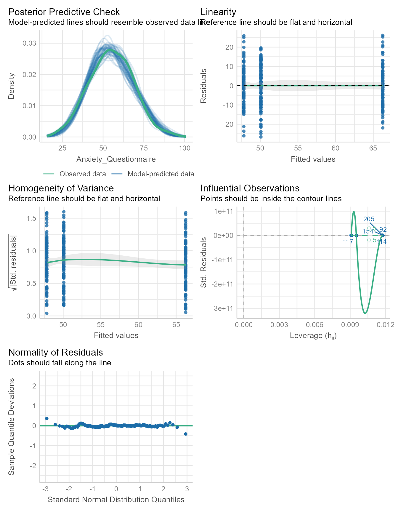

# Load Packages


::: {.cell}

```{.r .cell-code}
library(tidyverse)
library(easystats)
```
:::


# Import Data and Create Labelled Factors

:::{.column-margin}
The haven package will import data as a "tibble." A tibble is a container for tabular data. It is an enhancement of the base R's data.frame.

Hadley Wickham, the programmer who started the tidyverse, enjoys naming things precisely but with a touch of humor.  "Tibble" is what people in the U.S. sometimes hear when New Zealanders like Hadley say the word "table." 
:::


::: {.cell}

```{.r .cell-code}
# File location
file <- "https://github.com/wjschne/EDUC5325/raw/master/Attachment.sav"


# Import SPSS data file using haven
# Also, change the Attachment variable to a factor
d <- haven::read_spss(file) %>%
  mutate(Attachment = as_factor(Attachment))
```
:::


# Descriptives

The variables in `d` are:

* `Attachment`: Classifies each person's attachment type: Secure, Avoidant, or Ambivalent
* `Anxiety_Questionnaire`: A summary score from a questionnaire measure of anxiety
* `Anxiety_Physiological`: A summary score from various physiological measures of anxiety


There are 300 rows (cases) and 3 columns (variables).

Let's get a sense of what is in the data frame.

We can look at the first 6 rows of the data using the `head` function:


::: {.cell}

```{.r .cell-code}
head(d)
```

::: {.cell-output .cell-output-stdout}

```
# A tibble: 6 × 3
  Attachment Anxiety_Physiological Anxiety_Questionnaire
  <fct>                      <dbl>                 <dbl>
1 Secure                      59.8                  57.9
2 Ambivalent                  63.3                  63.4
3 Avoidant                    72.2                  51.5
4 Secure                      41.6                  38.6
5 Ambivalent                  77.8                  82.5
6 Ambivalent                  51.6                  50.8
```


:::
:::


A nice summary of what the variables are:


::: {.cell}

```{.r .cell-code}
data_codebook(d)
```

::: {.cell-output .cell-output-stdout}

```
d (300 rows and 3 variables, 3 shown)

ID | Name                  | Type        | Missings |         Values |           N
---+-----------------------+-------------+----------+----------------+------------
1  | Attachment            | categorical | 0 (0.0%) |         Secure | 110 (36.7%)
   |                       |             |          |       Avoidant |  85 (28.3%)
   |                       |             |          |     Ambivalent | 105 (35.0%)
---+-----------------------+-------------+----------+----------------+------------
2  | Anxiety_Physiological | numeric     | 0 (0.0%) | [22.78, 93.88] |         300
---+-----------------------+-------------+----------+----------------+------------
3  | Anxiety_Questionnaire | numeric     | 0 (0.0%) | [21.79, 92.38] |         300
----------------------------------------------------------------------------------
```


:::
:::


# Selecting specific variables

Data sets in tutorials like this one are often unrealistically small. If there are only three variables, we are happy to describe all the variables in a single table. 

Real data sets can have dozens, hundreds, or even thousands of variables. Describing hundreds of variables in a single table is usually impractical. We need a way to select from the data just the variables we want.


There are many ways to select variables in R, but I am going to keep things simple and consistent. I will use the `select` function from the tidyverse any time I select a variable. The `select` function is rarely used by itself. We use it as a preliminary step before doing something else (i.e., to specify which variables to describe, analyze, or plot). For this reason, it is often used in the middle sequence of commands linked with the "pipe" operator: `%>%` 


::: {.cell}

```{.r .cell-code}
d %>% 
  select(Anxiety_Questionnaire, Anxiety_Physiological) %>% 
  cor()
```

::: {.cell-output .cell-output-stdout}

```
                      Anxiety_Questionnaire Anxiety_Physiological
Anxiety_Questionnaire                  1.00                  0.75
Anxiety_Physiological                  0.75                  1.00
```


:::
:::


The pipe operator inserts the output of the previous command into the next function. You can think of it as meaning "and then..." 

The code above can be interpreted as a series of steps:
1. Start with the data in `d`AND THEN
2. Select the variables `Anxiety_Questionnaire` and `Anxiety_Physiological` AND THEN 
3. Create a correlation matrix.

It makes it convenient to link a series of commands in a readable format.

You can select as many variables as you wish, separated by commas. You do not need to put variable names in quotes.

The `select` function allows for selecting as many variables from the data as you wish:


::: {.cell}

```{.r .cell-code}
d %>% 
  select(Attachment, Anxiety_Physiological)
```

::: {.cell-output .cell-output-stdout}

```
# A tibble: 300 × 2
   Attachment Anxiety_Physiological
   <fct>                      <dbl>
 1 Secure                      59.8
 2 Ambivalent                  63.3
 3 Avoidant                    72.2
 4 Secure                      41.6
 5 Ambivalent                  77.8
 6 Ambivalent                  51.6
 7 Secure                      57.7
 8 Ambivalent                  69.6
 9 Avoidant                    67.7
10 Avoidant                    71.7
# ℹ 290 more rows
```


:::
:::


Use the `-` sign to exclude a variable:


::: {.cell}

```{.r .cell-code}
d %>% 
  select(-Attachment)
```

::: {.cell-output .cell-output-stdout}

```
# A tibble: 300 × 2
   Anxiety_Physiological Anxiety_Questionnaire
                   <dbl>                 <dbl>
 1                  59.8                  57.9
 2                  63.3                  63.4
 3                  72.2                  51.5
 4                  41.6                  38.6
 5                  77.8                  82.5
 6                  51.6                  50.8
 7                  57.7                  56.1
 8                  69.6                  75.9
 9                  67.7                  49.7
10                  71.7                  52.3
# ℹ 290 more rows
```


:::
:::


Select variables that contain "Anxiety"


::: {.cell}

```{.r .cell-code}
d %>% 
  select(contains("Anxiety"))
```

::: {.cell-output .cell-output-stdout}

```
# A tibble: 300 × 2
   Anxiety_Physiological Anxiety_Questionnaire
                   <dbl>                 <dbl>
 1                  59.8                  57.9
 2                  63.3                  63.4
 3                  72.2                  51.5
 4                  41.6                  38.6
 5                  77.8                  82.5
 6                  51.6                  50.8
 7                  57.7                  56.1
 8                  69.6                  75.9
 9                  67.7                  49.7
10                  71.7                  52.3
# ℹ 290 more rows
```


:::
:::


:::{.callout-note collapse=true}

# Alternative Selection Methods

R's delightful flexibility makes for a bewildering array of options! Here just a few of the many ways we could select the `Attachment` variable from data.frame `d`:


::: {.cell}

```{.r .cell-code}
# By name
d[, "Attachment"] 
```

::: {.cell-output .cell-output-stdout}

```
# A tibble: 300 × 1
   Attachment
   <fct>     
 1 Secure    
 2 Ambivalent
 3 Avoidant  
 4 Secure    
 5 Ambivalent
 6 Ambivalent
 7 Secure    
 8 Ambivalent
 9 Avoidant  
10 Avoidant  
# ℹ 290 more rows
```


:::

```{.r .cell-code}
# By position
d[, 1] 
```

::: {.cell-output .cell-output-stdout}

```
# A tibble: 300 × 1
   Attachment
   <fct>     
 1 Secure    
 2 Ambivalent
 3 Avoidant  
 4 Secure    
 5 Ambivalent
 6 Ambivalent
 7 Secure    
 8 Ambivalent
 9 Avoidant  
10 Avoidant  
# ℹ 290 more rows
```


:::

```{.r .cell-code}
# Selecting always returns a data.frame or tibble
select(d, Attachment)
```

::: {.cell-output .cell-output-stdout}

```
# A tibble: 300 × 1
   Attachment
   <fct>     
 1 Secure    
 2 Ambivalent
 3 Avoidant  
 4 Secure    
 5 Ambivalent
 6 Ambivalent
 7 Secure    
 8 Ambivalent
 9 Avoidant  
10 Avoidant  
# ℹ 290 more rows
```


:::

```{.r .cell-code}
# Extracting a vector from the data
d$Attachment
```

::: {.cell-output .cell-output-stdout}

```
  [1] Secure     Ambivalent Avoidant   Secure     Ambivalent Ambivalent
  [7] Secure     Ambivalent Avoidant   Avoidant   Avoidant   Secure    
 [13] Ambivalent Secure     Avoidant   Ambivalent Ambivalent Secure    
 [19] Avoidant   Secure     Avoidant   Avoidant   Ambivalent Secure    
 [25] Avoidant   Avoidant   Secure     Avoidant   Ambivalent Secure    
 [31] Secure     Secure     Ambivalent Ambivalent Avoidant   Avoidant  
 [37] Ambivalent Secure     Ambivalent Secure     Ambivalent Secure    
 [43] Secure     Secure     Ambivalent Ambivalent Ambivalent Avoidant  
 [49] Avoidant   Ambivalent Secure     Secure     Ambivalent Ambivalent
 [55] Secure     Ambivalent Ambivalent Ambivalent Avoidant   Ambivalent
 [61] Ambivalent Ambivalent Avoidant   Secure     Ambivalent Avoidant  
 [67] Avoidant   Avoidant   Secure     Secure     Secure     Secure    
 [73] Secure     Secure     Secure     Ambivalent Secure     Ambivalent
 [79] Avoidant   Avoidant   Avoidant   Ambivalent Secure     Avoidant  
 [85] Secure     Ambivalent Ambivalent Secure     Ambivalent Avoidant  
 [91] Ambivalent Avoidant   Avoidant   Avoidant   Avoidant   Secure    
 [97] Avoidant   Secure     Secure     Avoidant   Secure     Avoidant  
[103] Ambivalent Ambivalent Secure     Avoidant   Ambivalent Avoidant  
[109] Secure     Secure     Secure     Ambivalent Avoidant   Avoidant  
[115] Ambivalent Ambivalent Ambivalent Secure     Ambivalent Avoidant  
[121] Secure     Secure     Ambivalent Ambivalent Secure     Ambivalent
[127] Avoidant   Secure     Ambivalent Avoidant   Secure     Ambivalent
[133] Secure     Ambivalent Secure     Avoidant   Avoidant   Ambivalent
[139] Secure     Avoidant   Secure     Secure     Avoidant   Secure    
[145] Avoidant   Ambivalent Ambivalent Secure     Avoidant   Secure    
[151] Secure     Avoidant   Ambivalent Avoidant   Ambivalent Secure    
[157] Ambivalent Secure     Secure     Secure     Ambivalent Ambivalent
[163] Secure     Ambivalent Secure     Avoidant   Secure     Ambivalent
[169] Secure     Avoidant   Ambivalent Secure     Secure     Ambivalent
[175] Avoidant   Ambivalent Avoidant   Secure     Avoidant   Avoidant  
[181] Ambivalent Avoidant   Ambivalent Ambivalent Secure     Ambivalent
[187] Secure     Ambivalent Secure     Secure     Secure     Avoidant  
[193] Ambivalent Secure     Avoidant   Secure     Secure     Secure    
[199] Secure     Secure     Ambivalent Avoidant   Avoidant   Ambivalent
[205] Avoidant   Ambivalent Secure     Secure     Secure     Secure    
[211] Ambivalent Avoidant   Ambivalent Ambivalent Ambivalent Secure    
[217] Avoidant   Secure     Avoidant   Secure     Secure     Ambivalent
[223] Avoidant   Avoidant   Ambivalent Ambivalent Ambivalent Avoidant  
[229] Ambivalent Ambivalent Ambivalent Avoidant   Ambivalent Avoidant  
[235] Ambivalent Secure     Avoidant   Secure     Secure     Avoidant  
[241] Ambivalent Secure     Avoidant   Ambivalent Ambivalent Ambivalent
[247] Avoidant   Avoidant   Secure     Avoidant   Ambivalent Secure    
[253] Secure     Secure     Ambivalent Secure     Secure     Secure    
[259] Secure     Avoidant   Ambivalent Secure     Avoidant   Avoidant  
[265] Ambivalent Ambivalent Secure     Ambivalent Ambivalent Avoidant  
[271] Ambivalent Ambivalent Ambivalent Secure     Ambivalent Avoidant  
[277] Ambivalent Secure     Secure     Secure     Secure     Ambivalent
[283] Avoidant   Ambivalent Secure     Ambivalent Avoidant   Avoidant  
[289] Ambivalent Avoidant   Secure     Secure     Ambivalent Avoidant  
[295] Ambivalent Avoidant   Secure     Secure     Secure     Avoidant  
Levels: Secure Avoidant Ambivalent
```


:::

```{.r .cell-code}
# Pulling a vector frome the data (a pipe-friendly version of `$`)
d %>% 
  pull(Attachment)
```

::: {.cell-output .cell-output-stdout}

```
  [1] Secure     Ambivalent Avoidant   Secure     Ambivalent Ambivalent
  [7] Secure     Ambivalent Avoidant   Avoidant   Avoidant   Secure    
 [13] Ambivalent Secure     Avoidant   Ambivalent Ambivalent Secure    
 [19] Avoidant   Secure     Avoidant   Avoidant   Ambivalent Secure    
 [25] Avoidant   Avoidant   Secure     Avoidant   Ambivalent Secure    
 [31] Secure     Secure     Ambivalent Ambivalent Avoidant   Avoidant  
 [37] Ambivalent Secure     Ambivalent Secure     Ambivalent Secure    
 [43] Secure     Secure     Ambivalent Ambivalent Ambivalent Avoidant  
 [49] Avoidant   Ambivalent Secure     Secure     Ambivalent Ambivalent
 [55] Secure     Ambivalent Ambivalent Ambivalent Avoidant   Ambivalent
 [61] Ambivalent Ambivalent Avoidant   Secure     Ambivalent Avoidant  
 [67] Avoidant   Avoidant   Secure     Secure     Secure     Secure    
 [73] Secure     Secure     Secure     Ambivalent Secure     Ambivalent
 [79] Avoidant   Avoidant   Avoidant   Ambivalent Secure     Avoidant  
 [85] Secure     Ambivalent Ambivalent Secure     Ambivalent Avoidant  
 [91] Ambivalent Avoidant   Avoidant   Avoidant   Avoidant   Secure    
 [97] Avoidant   Secure     Secure     Avoidant   Secure     Avoidant  
[103] Ambivalent Ambivalent Secure     Avoidant   Ambivalent Avoidant  
[109] Secure     Secure     Secure     Ambivalent Avoidant   Avoidant  
[115] Ambivalent Ambivalent Ambivalent Secure     Ambivalent Avoidant  
[121] Secure     Secure     Ambivalent Ambivalent Secure     Ambivalent
[127] Avoidant   Secure     Ambivalent Avoidant   Secure     Ambivalent
[133] Secure     Ambivalent Secure     Avoidant   Avoidant   Ambivalent
[139] Secure     Avoidant   Secure     Secure     Avoidant   Secure    
[145] Avoidant   Ambivalent Ambivalent Secure     Avoidant   Secure    
[151] Secure     Avoidant   Ambivalent Avoidant   Ambivalent Secure    
[157] Ambivalent Secure     Secure     Secure     Ambivalent Ambivalent
[163] Secure     Ambivalent Secure     Avoidant   Secure     Ambivalent
[169] Secure     Avoidant   Ambivalent Secure     Secure     Ambivalent
[175] Avoidant   Ambivalent Avoidant   Secure     Avoidant   Avoidant  
[181] Ambivalent Avoidant   Ambivalent Ambivalent Secure     Ambivalent
[187] Secure     Ambivalent Secure     Secure     Secure     Avoidant  
[193] Ambivalent Secure     Avoidant   Secure     Secure     Secure    
[199] Secure     Secure     Ambivalent Avoidant   Avoidant   Ambivalent
[205] Avoidant   Ambivalent Secure     Secure     Secure     Secure    
[211] Ambivalent Avoidant   Ambivalent Ambivalent Ambivalent Secure    
[217] Avoidant   Secure     Avoidant   Secure     Secure     Ambivalent
[223] Avoidant   Avoidant   Ambivalent Ambivalent Ambivalent Avoidant  
[229] Ambivalent Ambivalent Ambivalent Avoidant   Ambivalent Avoidant  
[235] Ambivalent Secure     Avoidant   Secure     Secure     Avoidant  
[241] Ambivalent Secure     Avoidant   Ambivalent Ambivalent Ambivalent
[247] Avoidant   Avoidant   Secure     Avoidant   Ambivalent Secure    
[253] Secure     Secure     Ambivalent Secure     Secure     Secure    
[259] Secure     Avoidant   Ambivalent Secure     Avoidant   Avoidant  
[265] Ambivalent Ambivalent Secure     Ambivalent Ambivalent Avoidant  
[271] Ambivalent Ambivalent Ambivalent Secure     Ambivalent Avoidant  
[277] Ambivalent Secure     Secure     Secure     Secure     Ambivalent
[283] Avoidant   Ambivalent Secure     Ambivalent Avoidant   Avoidant  
[289] Ambivalent Avoidant   Secure     Secure     Ambivalent Avoidant  
[295] Ambivalent Avoidant   Secure     Secure     Secure     Avoidant  
Levels: Secure Avoidant Ambivalent
```


:::
:::


In this case, there is no strong reason to prefer one method over the other. As you gain experience with R, you might find reasons to use different methods of selection. For now, we will stick to `select`

:::


## Basic descriptives

Numeric variables can be described in terms of means, standard deviations (SD), interquartile ranges (IQR), skewness, and kurtosis:


::: {.cell}

```{.r .cell-code}
describe_distribution(d)
```

::: {.cell-output .cell-output-stdout}

```
Variable              |  Mean |    SD |   IQR |          Range | Skewness
-------------------------------------------------------------------------
Anxiety_Physiological | 60.49 | 12.79 | 16.43 | [22.78, 93.88] |    -0.29
Anxiety_Questionnaire | 55.11 | 13.30 | 18.24 | [21.79, 92.38] |     0.05

Variable              | Kurtosis |   n | n_Missing
--------------------------------------------------
Anxiety_Physiological |     0.24 | 300 |         0
Anxiety_Questionnaire |    -0.16 | 300 |         0
```


:::
:::


Categorical variables are often described in terms of frequencies tables.


::: {.cell}

```{.r .cell-code}
d %>% 
  select(Attachment) %>% 
  data_tabulate()
```

::: {.cell-output .cell-output-stdout}

```
Attachment (Attachment) <categorical>
# total N=300 valid N=300

Value      |   N | Raw % | Valid % | Cumulative %
-----------+-----+-------+---------+-------------
Secure     | 110 | 36.67 |   36.67 |        36.67
Avoidant   |  85 | 28.33 |   28.33 |        65.00
Ambivalent | 105 | 35.00 |   35.00 |       100.00
<NA>       |   0 |  0.00 |    <NA> |         <NA>
```


:::
:::


We can get descriptives statistics of our numeric variables separated by group. There are many ways to do this, but the simplest is the `describeBy` function from the psych package


::: {.cell}

```{.r .cell-code}
psych::describeBy(d, group = "Attachment")
```

::: {.cell-output .cell-output-stdout}

```

 Descriptive statistics by group 
Attachment: 1
                      vars   n mean sd median trimmed mad min max range  skew
Attachment               1 110    1  0      1       1   0   1   1     0   NaN
Anxiety_Physiological    2 110   50 11     51      51  12  23  70    48 -0.44
Anxiety_Questionnaire    3 110   50 11     51      51  12  23  70    46 -0.36
                      kurtosis se
Attachment                 NaN  0
Anxiety_Physiological    -0.41  1
Anxiety_Questionnaire    -0.61  1
------------------------------------------------------------ 
Attachment: 2
                      vars  n mean   sd median trimmed mad min max range skew
Attachment               1 85    2  0.0      2       2 0.0   2   2     0  NaN
Anxiety_Physiological    2 85   67  9.8     67      67 9.5  46  94    48 0.27
Anxiety_Questionnaire    3 85   48 10.6     48      48 9.9  22  74    52 0.11
                      kurtosis  se
Attachment                 NaN 0.0
Anxiety_Physiological    -0.13 1.1
Anxiety_Questionnaire    -0.10 1.1
------------------------------------------------------------ 
Attachment: 3
                      vars   n mean  sd median trimmed mad min max range skew
Attachment               1 105    3 0.0      3       3 0.0   3   3     0  NaN
Anxiety_Physiological    2 105   66 9.3     65      66 7.8  45  94    48 0.19
Anxiety_Questionnaire    3 105   66 9.9     66      66 9.3  44  92    48 0.31
                      kurtosis   se
Attachment                 NaN 0.00
Anxiety_Physiological     0.08 0.91
Anxiety_Questionnaire    -0.10 0.97
```


:::
:::


The datawizard package has some really nice functions for descriptives:


::: {.cell}

```{.r .cell-code}
d %>% 
  datawizard::means_by_group(
    select = contains("Anxiety") , 
    by = "Attachment")
```

::: {.cell-output .cell-output-stdout}

```
# Mean of Anxiety_Physiological by Attachment

Category   |  Mean |   N |    SD |         95% CI |      p
----------------------------------------------------------
Secure     | 49.95 | 110 | 10.67 | [48.08, 51.83] | < .001
Avoidant   | 67.20 |  85 |  9.84 | [65.07, 69.33] | < .001
Ambivalent | 66.09 | 105 |  9.33 | [64.17, 68.00] | < .001
Total      | 60.49 | 300 | 12.79 |                |       

Anova: R2=0.395; adj.R2=0.391; F=96.988; p<.001

# Mean of Anxiety_Questionnaire by Attachment

Category   |  Mean |   N |    SD |         95% CI |      p
----------------------------------------------------------
Secure     | 50.09 | 110 | 10.90 | [48.13, 52.05] | < .001
Avoidant   | 47.82 |  85 | 10.57 | [45.59, 50.06] | < .001
Ambivalent | 66.27 | 105 |  9.90 | [64.26, 68.28] | < .001
Total      | 55.11 | 300 | 13.30 |                |       

Anova: R2=0.385; adj.R2=0.381; F=92.975; p<.001
```


:::
:::


The skimr package is also quite nice:


::: {.cell}

```{.r .cell-code}
library(skimr)
# Overall summary
d %>% 
  skim()
```

::: {.cell-output-display}

Table: Data summary

|                         |           |
|:------------------------|:----------|
|Name                     |Piped data |
|Number of rows           |300        |
|Number of columns        |3          |
|_______________________  |           |
|Column type frequency:   |           |
|factor                   |1          |
|numeric                  |2          |
|________________________ |           |
|Group variables          |None       |


**Variable type: factor**

|skim_variable | n_missing| complete_rate|ordered | n_unique|top_counts                  |
|:-------------|---------:|-------------:|:-------|--------:|:---------------------------|
|Attachment    |         0|             1|FALSE   |        3|Sec: 110, Amb: 105, Avo: 85 |


**Variable type: numeric**

|skim_variable         | n_missing| complete_rate| mean| sd| p0| p25| p50| p75| p100|hist  |
|:---------------------|---------:|-------------:|----:|--:|--:|---:|---:|---:|----:|:-----|
|Anxiety_Physiological |         0|             1|   60| 13| 23|  53|  61|  69|   94|▁▃▇▅▁ |
|Anxiety_Questionnaire |         0|             1|   55| 13| 22|  46|  55|  64|   92|▂▆▇▅▁ |


:::

```{.r .cell-code}
# Grouped summaries
d %>% 
  group_by(Attachment) %>% 
  skim()
```

::: {.cell-output-display}

Table: Data summary

|                         |           |
|:------------------------|:----------|
|Name                     |Piped data |
|Number of rows           |300        |
|Number of columns        |3          |
|_______________________  |           |
|Column type frequency:   |           |
|numeric                  |2          |
|________________________ |           |
|Group variables          |Attachment |


**Variable type: numeric**

|skim_variable         |Attachment | n_missing| complete_rate| mean|   sd| p0| p25| p50| p75| p100|hist  |
|:---------------------|:----------|---------:|-------------:|----:|----:|--:|---:|---:|---:|----:|:-----|
|Anxiety_Physiological |Secure     |         0|             1|   50| 10.7| 23|  43|  51|  58|   70|▂▅▆▇▃ |
|Anxiety_Physiological |Avoidant   |         0|             1|   67|  9.8| 46|  61|  67|  73|   94|▂▇▇▅▁ |
|Anxiety_Physiological |Ambivalent |         0|             1|   66|  9.3| 45|  61|  65|  72|   94|▃▆▇▃▁ |
|Anxiety_Questionnaire |Secure     |         0|             1|   50| 10.9| 23|  42|  51|  59|   70|▂▅▇▇▆ |
|Anxiety_Questionnaire |Avoidant   |         0|             1|   48| 10.6| 22|  41|  48|  54|   74|▁▅▇▃▂ |
|Anxiety_Questionnaire |Ambivalent |         0|             1|   66|  9.9| 44|  60|  66|  72|   92|▂▆▇▃▂ |


:::
:::


These are convenience functions. If they do exactly what you want, great! However, I often need statistics in a data frame in a format optimal for further processing (e.g., for publication-worthy tables or plots).


::: {.cell}

```{.r .cell-code}
d_descriptives <- d %>% 
  pivot_longer(contains("Anxiety"), 
               names_to = "Measure") %>% 
  summarise(Mean = mean(value),
            SD = sd(value),
            n = n(),
            .by = c(Attachment, Measure)) %>% 
  mutate(Measure = snakecase::to_title_case(Measure))

d_descriptives
```

::: {.cell-output .cell-output-stdout}

```
# A tibble: 6 × 5
  Attachment Measure                Mean    SD     n
  <fct>      <chr>                 <dbl> <dbl> <int>
1 Secure     Anxiety Physiological  50.0 10.7    110
2 Secure     Anxiety Questionnaire  50.1 10.9    110
3 Ambivalent Anxiety Physiological  66.1  9.33   105
4 Ambivalent Anxiety Questionnaire  66.3  9.90   105
5 Avoidant   Anxiety Physiological  67.2  9.84    85
6 Avoidant   Anxiety Questionnaire  47.8 10.6     85
```


:::
:::


This output is not pretty, but it was not intended to be. It is in a format that is easy to adapt for other things. For example, I can use the gt ("Great Tables") package to get exactly what I want to display:


::: {.cell}

```{.r .cell-code  code-fold="true"}
library(gt)
d_descriptives %>% 
  gt(groupname_col = "Measure", 
     rowname_col = "Attachment") %>%
  tab_stub_indent(everything(), indent = 5)
```

::: {.cell-output-display}

```{=html}
<div id="lvsxgtlmhj" style="padding-left:0px;padding-right:0px;padding-top:10px;padding-bottom:10px;overflow-x:auto;overflow-y:auto;width:auto;height:auto;">
<style>#lvsxgtlmhj table {
  font-family: system-ui, 'Segoe UI', Roboto, Helvetica, Arial, sans-serif, 'Apple Color Emoji', 'Segoe UI Emoji', 'Segoe UI Symbol', 'Noto Color Emoji';
  -webkit-font-smoothing: antialiased;
  -moz-osx-font-smoothing: grayscale;
}

#lvsxgtlmhj thead, #lvsxgtlmhj tbody, #lvsxgtlmhj tfoot, #lvsxgtlmhj tr, #lvsxgtlmhj td, #lvsxgtlmhj th {
  border-style: none;
}

#lvsxgtlmhj p {
  margin: 0;
  padding: 0;
}

#lvsxgtlmhj .gt_table {
  display: table;
  border-collapse: collapse;
  line-height: normal;
  margin-left: auto;
  margin-right: auto;
  color: #333333;
  font-size: 16px;
  font-weight: normal;
  font-style: normal;
  background-color: #FFFFFF;
  width: auto;
  border-top-style: solid;
  border-top-width: 2px;
  border-top-color: #A8A8A8;
  border-right-style: none;
  border-right-width: 2px;
  border-right-color: #D3D3D3;
  border-bottom-style: solid;
  border-bottom-width: 2px;
  border-bottom-color: #A8A8A8;
  border-left-style: none;
  border-left-width: 2px;
  border-left-color: #D3D3D3;
}

#lvsxgtlmhj .gt_caption {
  padding-top: 4px;
  padding-bottom: 4px;
}

#lvsxgtlmhj .gt_title {
  color: #333333;
  font-size: 125%;
  font-weight: initial;
  padding-top: 4px;
  padding-bottom: 4px;
  padding-left: 5px;
  padding-right: 5px;
  border-bottom-color: #FFFFFF;
  border-bottom-width: 0;
}

#lvsxgtlmhj .gt_subtitle {
  color: #333333;
  font-size: 85%;
  font-weight: initial;
  padding-top: 3px;
  padding-bottom: 5px;
  padding-left: 5px;
  padding-right: 5px;
  border-top-color: #FFFFFF;
  border-top-width: 0;
}

#lvsxgtlmhj .gt_heading {
  background-color: #FFFFFF;
  text-align: center;
  border-bottom-color: #FFFFFF;
  border-left-style: none;
  border-left-width: 1px;
  border-left-color: #D3D3D3;
  border-right-style: none;
  border-right-width: 1px;
  border-right-color: #D3D3D3;
}

#lvsxgtlmhj .gt_bottom_border {
  border-bottom-style: solid;
  border-bottom-width: 2px;
  border-bottom-color: #D3D3D3;
}

#lvsxgtlmhj .gt_col_headings {
  border-top-style: solid;
  border-top-width: 2px;
  border-top-color: #D3D3D3;
  border-bottom-style: solid;
  border-bottom-width: 2px;
  border-bottom-color: #D3D3D3;
  border-left-style: none;
  border-left-width: 1px;
  border-left-color: #D3D3D3;
  border-right-style: none;
  border-right-width: 1px;
  border-right-color: #D3D3D3;
}

#lvsxgtlmhj .gt_col_heading {
  color: #333333;
  background-color: #FFFFFF;
  font-size: 100%;
  font-weight: normal;
  text-transform: inherit;
  border-left-style: none;
  border-left-width: 1px;
  border-left-color: #D3D3D3;
  border-right-style: none;
  border-right-width: 1px;
  border-right-color: #D3D3D3;
  vertical-align: bottom;
  padding-top: 5px;
  padding-bottom: 6px;
  padding-left: 5px;
  padding-right: 5px;
  overflow-x: hidden;
}

#lvsxgtlmhj .gt_column_spanner_outer {
  color: #333333;
  background-color: #FFFFFF;
  font-size: 100%;
  font-weight: normal;
  text-transform: inherit;
  padding-top: 0;
  padding-bottom: 0;
  padding-left: 4px;
  padding-right: 4px;
}

#lvsxgtlmhj .gt_column_spanner_outer:first-child {
  padding-left: 0;
}

#lvsxgtlmhj .gt_column_spanner_outer:last-child {
  padding-right: 0;
}

#lvsxgtlmhj .gt_column_spanner {
  border-bottom-style: solid;
  border-bottom-width: 2px;
  border-bottom-color: #D3D3D3;
  vertical-align: bottom;
  padding-top: 5px;
  padding-bottom: 5px;
  overflow-x: hidden;
  display: inline-block;
  width: 100%;
}

#lvsxgtlmhj .gt_spanner_row {
  border-bottom-style: hidden;
}

#lvsxgtlmhj .gt_group_heading {
  padding-top: 8px;
  padding-bottom: 8px;
  padding-left: 5px;
  padding-right: 5px;
  color: #333333;
  background-color: #FFFFFF;
  font-size: 100%;
  font-weight: initial;
  text-transform: inherit;
  border-top-style: solid;
  border-top-width: 2px;
  border-top-color: #D3D3D3;
  border-bottom-style: solid;
  border-bottom-width: 2px;
  border-bottom-color: #D3D3D3;
  border-left-style: none;
  border-left-width: 1px;
  border-left-color: #D3D3D3;
  border-right-style: none;
  border-right-width: 1px;
  border-right-color: #D3D3D3;
  vertical-align: middle;
  text-align: left;
}

#lvsxgtlmhj .gt_empty_group_heading {
  padding: 0.5px;
  color: #333333;
  background-color: #FFFFFF;
  font-size: 100%;
  font-weight: initial;
  border-top-style: solid;
  border-top-width: 2px;
  border-top-color: #D3D3D3;
  border-bottom-style: solid;
  border-bottom-width: 2px;
  border-bottom-color: #D3D3D3;
  vertical-align: middle;
}

#lvsxgtlmhj .gt_from_md > :first-child {
  margin-top: 0;
}

#lvsxgtlmhj .gt_from_md > :last-child {
  margin-bottom: 0;
}

#lvsxgtlmhj .gt_row {
  padding-top: 8px;
  padding-bottom: 8px;
  padding-left: 5px;
  padding-right: 5px;
  margin: 10px;
  border-top-style: solid;
  border-top-width: 1px;
  border-top-color: #D3D3D3;
  border-left-style: none;
  border-left-width: 1px;
  border-left-color: #D3D3D3;
  border-right-style: none;
  border-right-width: 1px;
  border-right-color: #D3D3D3;
  vertical-align: middle;
  overflow-x: hidden;
}

#lvsxgtlmhj .gt_stub {
  color: #333333;
  background-color: #FFFFFF;
  font-size: 100%;
  font-weight: initial;
  text-transform: inherit;
  border-right-style: solid;
  border-right-width: 2px;
  border-right-color: #D3D3D3;
  padding-left: 5px;
  padding-right: 5px;
}

#lvsxgtlmhj .gt_stub_row_group {
  color: #333333;
  background-color: #FFFFFF;
  font-size: 100%;
  font-weight: initial;
  text-transform: inherit;
  border-right-style: solid;
  border-right-width: 2px;
  border-right-color: #D3D3D3;
  padding-left: 5px;
  padding-right: 5px;
  vertical-align: top;
}

#lvsxgtlmhj .gt_row_group_first td {
  border-top-width: 2px;
}

#lvsxgtlmhj .gt_row_group_first th {
  border-top-width: 2px;
}

#lvsxgtlmhj .gt_summary_row {
  color: #333333;
  background-color: #FFFFFF;
  text-transform: inherit;
  padding-top: 8px;
  padding-bottom: 8px;
  padding-left: 5px;
  padding-right: 5px;
}

#lvsxgtlmhj .gt_first_summary_row {
  border-top-style: solid;
  border-top-color: #D3D3D3;
}

#lvsxgtlmhj .gt_first_summary_row.thick {
  border-top-width: 2px;
}

#lvsxgtlmhj .gt_last_summary_row {
  padding-top: 8px;
  padding-bottom: 8px;
  padding-left: 5px;
  padding-right: 5px;
  border-bottom-style: solid;
  border-bottom-width: 2px;
  border-bottom-color: #D3D3D3;
}

#lvsxgtlmhj .gt_grand_summary_row {
  color: #333333;
  background-color: #FFFFFF;
  text-transform: inherit;
  padding-top: 8px;
  padding-bottom: 8px;
  padding-left: 5px;
  padding-right: 5px;
}

#lvsxgtlmhj .gt_first_grand_summary_row {
  padding-top: 8px;
  padding-bottom: 8px;
  padding-left: 5px;
  padding-right: 5px;
  border-top-style: double;
  border-top-width: 6px;
  border-top-color: #D3D3D3;
}

#lvsxgtlmhj .gt_last_grand_summary_row_top {
  padding-top: 8px;
  padding-bottom: 8px;
  padding-left: 5px;
  padding-right: 5px;
  border-bottom-style: double;
  border-bottom-width: 6px;
  border-bottom-color: #D3D3D3;
}

#lvsxgtlmhj .gt_striped {
  background-color: rgba(128, 128, 128, 0.05);
}

#lvsxgtlmhj .gt_table_body {
  border-top-style: solid;
  border-top-width: 2px;
  border-top-color: #D3D3D3;
  border-bottom-style: solid;
  border-bottom-width: 2px;
  border-bottom-color: #D3D3D3;
}

#lvsxgtlmhj .gt_footnotes {
  color: #333333;
  background-color: #FFFFFF;
  border-bottom-style: none;
  border-bottom-width: 2px;
  border-bottom-color: #D3D3D3;
  border-left-style: none;
  border-left-width: 2px;
  border-left-color: #D3D3D3;
  border-right-style: none;
  border-right-width: 2px;
  border-right-color: #D3D3D3;
}

#lvsxgtlmhj .gt_footnote {
  margin: 0px;
  font-size: 90%;
  padding-top: 4px;
  padding-bottom: 4px;
  padding-left: 5px;
  padding-right: 5px;
}

#lvsxgtlmhj .gt_sourcenotes {
  color: #333333;
  background-color: #FFFFFF;
  border-bottom-style: none;
  border-bottom-width: 2px;
  border-bottom-color: #D3D3D3;
  border-left-style: none;
  border-left-width: 2px;
  border-left-color: #D3D3D3;
  border-right-style: none;
  border-right-width: 2px;
  border-right-color: #D3D3D3;
}

#lvsxgtlmhj .gt_sourcenote {
  font-size: 90%;
  padding-top: 4px;
  padding-bottom: 4px;
  padding-left: 5px;
  padding-right: 5px;
}

#lvsxgtlmhj .gt_left {
  text-align: left;
}

#lvsxgtlmhj .gt_center {
  text-align: center;
}

#lvsxgtlmhj .gt_right {
  text-align: right;
  font-variant-numeric: tabular-nums;
}

#lvsxgtlmhj .gt_font_normal {
  font-weight: normal;
}

#lvsxgtlmhj .gt_font_bold {
  font-weight: bold;
}

#lvsxgtlmhj .gt_font_italic {
  font-style: italic;
}

#lvsxgtlmhj .gt_super {
  font-size: 65%;
}

#lvsxgtlmhj .gt_footnote_marks {
  font-size: 75%;
  vertical-align: 0.4em;
  position: initial;
}

#lvsxgtlmhj .gt_asterisk {
  font-size: 100%;
  vertical-align: 0;
}

#lvsxgtlmhj .gt_indent_1 {
  text-indent: 5px;
}

#lvsxgtlmhj .gt_indent_2 {
  text-indent: 10px;
}

#lvsxgtlmhj .gt_indent_3 {
  text-indent: 15px;
}

#lvsxgtlmhj .gt_indent_4 {
  text-indent: 20px;
}

#lvsxgtlmhj .gt_indent_5 {
  text-indent: 25px;
}

#lvsxgtlmhj .katex-display {
  display: inline-flex !important;
  margin-bottom: 0.75em !important;
}

#lvsxgtlmhj div.Reactable > div.rt-table > div.rt-thead > div.rt-tr.rt-tr-group-header > div.rt-th-group:after {
  height: 0px !important;
}
</style>
<table class="gt_table" data-quarto-disable-processing="false" data-quarto-bootstrap="false">
  <thead>
    <tr class="gt_col_headings">
      <th class="gt_col_heading gt_columns_bottom_border gt_left" rowspan="1" colspan="1" scope="col" id="a::stub"></th>
      <th class="gt_col_heading gt_columns_bottom_border gt_right" rowspan="1" colspan="1" scope="col" id="Mean">Mean</th>
      <th class="gt_col_heading gt_columns_bottom_border gt_right" rowspan="1" colspan="1" scope="col" id="SD">SD</th>
      <th class="gt_col_heading gt_columns_bottom_border gt_right" rowspan="1" colspan="1" scope="col" id="n">n</th>
    </tr>
  </thead>
  <tbody class="gt_table_body">
    <tr class="gt_group_heading_row">
      <th colspan="4" class="gt_group_heading" scope="colgroup" id="Anxiety Physiological">Anxiety Physiological</th>
    </tr>
    <tr class="gt_row_group_first"><td headers="Anxiety Physiological stub_1_1 stub_1" class="gt_row gt_center gt_stub gt_indent_5">Secure</td>
<td headers="Anxiety Physiological stub_1_1 Mean" class="gt_row gt_right">50</td>
<td headers="Anxiety Physiological stub_1_1 SD" class="gt_row gt_right">10.7</td>
<td headers="Anxiety Physiological stub_1_1 n" class="gt_row gt_right">110</td></tr>
    <tr><td headers="Anxiety Physiological stub_1_2 stub_1" class="gt_row gt_center gt_stub gt_indent_5">Ambivalent</td>
<td headers="Anxiety Physiological stub_1_2 Mean" class="gt_row gt_right">66</td>
<td headers="Anxiety Physiological stub_1_2 SD" class="gt_row gt_right">9.3</td>
<td headers="Anxiety Physiological stub_1_2 n" class="gt_row gt_right">105</td></tr>
    <tr><td headers="Anxiety Physiological stub_1_3 stub_1" class="gt_row gt_center gt_stub gt_indent_5">Avoidant</td>
<td headers="Anxiety Physiological stub_1_3 Mean" class="gt_row gt_right">67</td>
<td headers="Anxiety Physiological stub_1_3 SD" class="gt_row gt_right">9.8</td>
<td headers="Anxiety Physiological stub_1_3 n" class="gt_row gt_right">85</td></tr>
    <tr class="gt_group_heading_row">
      <th colspan="4" class="gt_group_heading" scope="colgroup" id="Anxiety Questionnaire">Anxiety Questionnaire</th>
    </tr>
    <tr class="gt_row_group_first"><td headers="Anxiety Questionnaire stub_1_4 stub_1" class="gt_row gt_center gt_stub gt_indent_5">Secure</td>
<td headers="Anxiety Questionnaire stub_1_4 Mean" class="gt_row gt_right">50</td>
<td headers="Anxiety Questionnaire stub_1_4 SD" class="gt_row gt_right">10.9</td>
<td headers="Anxiety Questionnaire stub_1_4 n" class="gt_row gt_right">110</td></tr>
    <tr><td headers="Anxiety Questionnaire stub_1_5 stub_1" class="gt_row gt_center gt_stub gt_indent_5">Ambivalent</td>
<td headers="Anxiety Questionnaire stub_1_5 Mean" class="gt_row gt_right">66</td>
<td headers="Anxiety Questionnaire stub_1_5 SD" class="gt_row gt_right">9.9</td>
<td headers="Anxiety Questionnaire stub_1_5 n" class="gt_row gt_right">105</td></tr>
    <tr><td headers="Anxiety Questionnaire stub_1_6 stub_1" class="gt_row gt_center gt_stub gt_indent_5">Avoidant</td>
<td headers="Anxiety Questionnaire stub_1_6 Mean" class="gt_row gt_right">48</td>
<td headers="Anxiety Questionnaire stub_1_6 SD" class="gt_row gt_right">10.6</td>
<td headers="Anxiety Questionnaire stub_1_6 n" class="gt_row gt_right">85</td></tr>
  </tbody>
  
  
</table>
</div>
```

:::
:::


Or I can use ggplot2 to display means and standard deviations graphically:


::: {.cell}

```{.r .cell-code  code-fold="true"}
d_descriptives %>%
  mutate(mean_label = scales::number(Mean, .1)) %>% 
  ggplot(aes(Attachment, Mean)) +
  facet_grid(cols = vars(Measure)) +
  geom_pointrange(aes(ymin = Mean - SD,
                      ymax = Mean + SD)) +
  geom_label(
    aes(label = mean_label), 
    hjust = -.3)
```

::: {.cell-output-display}
{width=672}
:::
:::


# Plot


::: {.cell}

```{.r .cell-code}
d |> 
  ggplot(aes(x = Attachment,
             y = Anxiety_Questionnaire)) +
  geom_violin() +
  stat_summary() 
```

::: {.cell-output-display}
{width=672}
:::
:::


Just looking at the plot, we can see that the Ambivalent group has a higher mean anxiety than the other two groups. However, let's conduct a formal test of the difference of the group means.

# Create One-Way ANOVA

The `aov` (Analysis of Variance) function is what you want to use. The `anova` function is better used for comparing models. The dependent variable goes on the left, and any predictor variables are on the right hand side of the ~.


::: {.cell}

```{.r .cell-code}
fit <- aov(Anxiety_Questionnaire ~ Attachment, data = d)
```
:::


## Diagnostic Plots


::: {.cell}

```{.r .cell-code}
check_model(fit)
```

::: {.cell-output-display}
{width=672}
:::
:::


None of the diagnostic checks raise any alarms. Specifically, the residuals are reasonably normal and have consistent variance acrross groups (i.e., the homogeneeity of variance assumption is reasonable).

## Summary

The base R function `summary` gives us most of what we might want to know.


::: {.cell}

```{.r .cell-code}
summary(fit)
```

::: {.cell-output .cell-output-stdout}

```
             Df Sum Sq Mean Sq F value Pr(>F)    
Attachment    2  20359   10179      93 <2e-16 ***
Residuals   297  32517     109                   
---
Signif. codes:  0 '***' 0.001 '**' 0.01 '*' 0.05 '.' 0.1 ' ' 1
```


:::
:::


We can see that overall model is significant, meaning that at least two groups have reliably different means. At this point we do not know which means differ, but from the plot we have a good guess that the Ambivalent group scores higher on the Anxiety Questionnaire than the other two groups.

A similar, but tidier display can be found with the `parameters` function:


::: {.cell}

```{.r .cell-code}
parameters(fit)
```

::: {.cell-output .cell-output-stdout}

```
Parameter  | Sum_Squares |  df | Mean_Square |     F |      p
-------------------------------------------------------------
Attachment |    20358.60 |   2 |    10179.30 | 92.98 | < .001
Residuals  |    32516.83 | 297 |      109.48 |       |       

Anova Table (Type 1 tests)
```


:::
:::


## Other Summary Functions

The overall "fit" or "performance" of the model:


::: {.cell}

```{.r .cell-code}
performance(fit)
```

::: {.cell-output .cell-output-stdout}

```
# Indices of model performance

AIC      |     AICc |      BIC |    R2 | R2 (adj.) |   RMSE |  Sigma
--------------------------------------------------------------------
2265.082 | 2265.218 | 2279.897 | 0.385 |     0.381 | 10.411 | 10.463
```


:::
:::


* `AIC`: [Akaike's Information Criterion](https://en.wikipedia.org/wiki/Akaike_information_criterion)
* `AICc`: AIC with a correction for small sample sizes
* `BIC`: [Bayesian Information Criterion](https://en.wikipedia.org/wiki/Bayesian_information_criterion)
* `R2`: R-squared: [Coefficient of Determination](https://en.wikipedia.org/wiki/Coefficient_of_determination)
* `R2_adj`: [Adjusted r-squared](https://en.wikipedia.org/wiki/Coefficient_of_determination#Adjusted_R2)
* `RMSE`: Root mean squared error $=\sqrt{\frac{\sum_{i = 1}^{n}{e_i}}{n}}$
* `SIGMA`: Residual standard deviation (The SD of the residuals $=\sqrt{\frac{\sum_{i = 1}^{n}{e_i}}{n-k-1}}$) 


## Automated Interpretation


::: {.cell}

```{.r .cell-code}
report(fit)
```

::: {.cell-output .cell-output-stdout}

```
The ANOVA (formula: Anxiety_Questionnaire ~ Attachment) suggests that:

  - The main effect of Attachment is statistically significant and large (F(2,
297) = 92.98, p < .001; Eta2 = 0.39, 95% CI [0.32, 1.00])

Effect sizes were labelled following Field's (2013) recommendations.
```


:::
:::


## Post-hoc Tests

We would like to compare all means but control for family-wise error.


::: {.cell}

```{.r .cell-code}
estimate_contrasts(fit)
```

::: {.cell-output .cell-output-stderr}

```
No variable was specified for contrast estimation. Selecting `contrast =
  "
  Attachment
  "`.
```


:::

::: {.cell-output .cell-output-stdout}

```
Marginal Contrasts Analysis

Level1   |     Level2 | Difference |           95% CI |   SE | t(297) |      p
------------------------------------------------------------------------------
Avoidant | Ambivalent |     -18.44 | [-22.12, -14.77] | 1.53 | -12.08 | < .001
Secure   | Ambivalent |     -16.18 | [-19.62, -12.74] | 1.43 | -11.33 | < .001
Secure   |   Avoidant |       2.27 | [ -1.37,   5.90] | 1.51 |   1.50 | 0.135 

Marginal contrasts estimated at Attachment
p-value adjustment method: Holm (1979)
```


:::

```{.r .cell-code}
estimate_contrasts(fit) |> 
  report()
```

::: {.cell-output .cell-output-stderr}

```
No variable was specified for contrast estimation. Selecting `contrast =
  "
  Attachment
  "`.
```


:::

::: {.cell-output .cell-output-stdout}

```
The marginal contrasts analysis suggests the following. The difference between
Avoidant and Ambivalent is negative and statistically significant (difference =
-18.44, 95% CI [-22.12, -14.77], t(297) = -12.08, p < .001). The difference
between Secure and Ambivalent is negative and statistically significant
(difference = -16.18, 95% CI [-19.62, -12.74], t(297) = -11.33, p < .001). The
difference between Secure and Avoidant is positive and statistically
non-significant (difference = 2.27, 95% CI [ -1.37, 5.90], t(297) = 1.50, p =
0.135)
```


:::
:::

