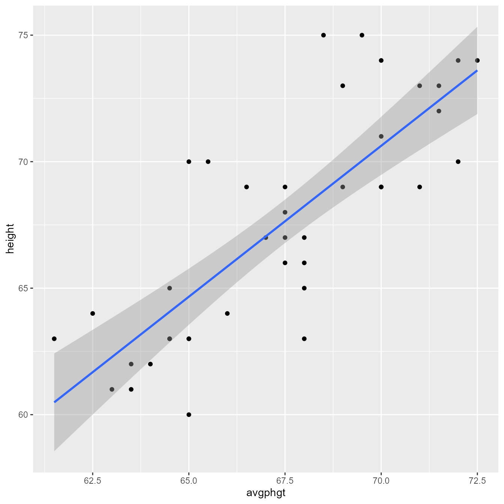
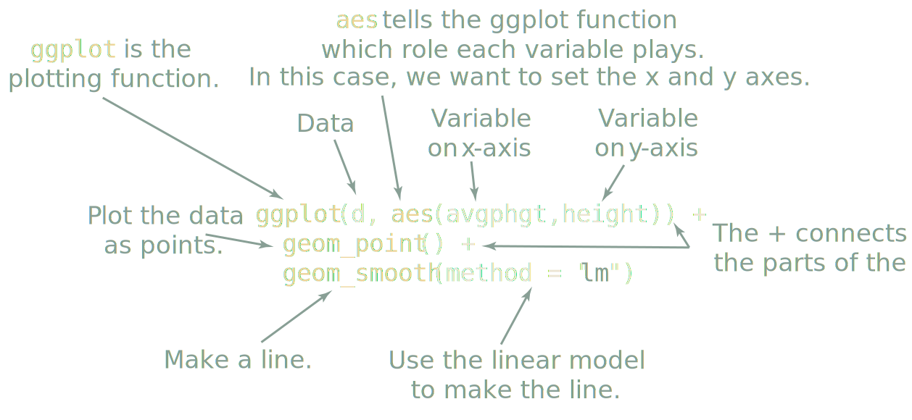
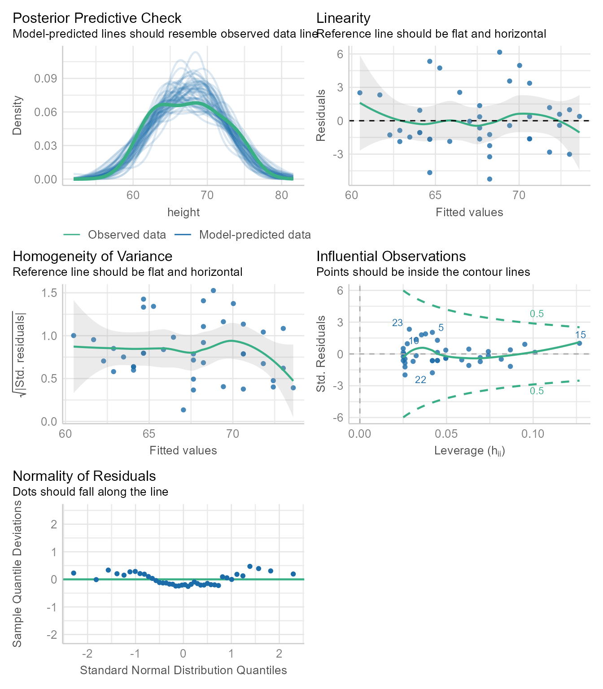
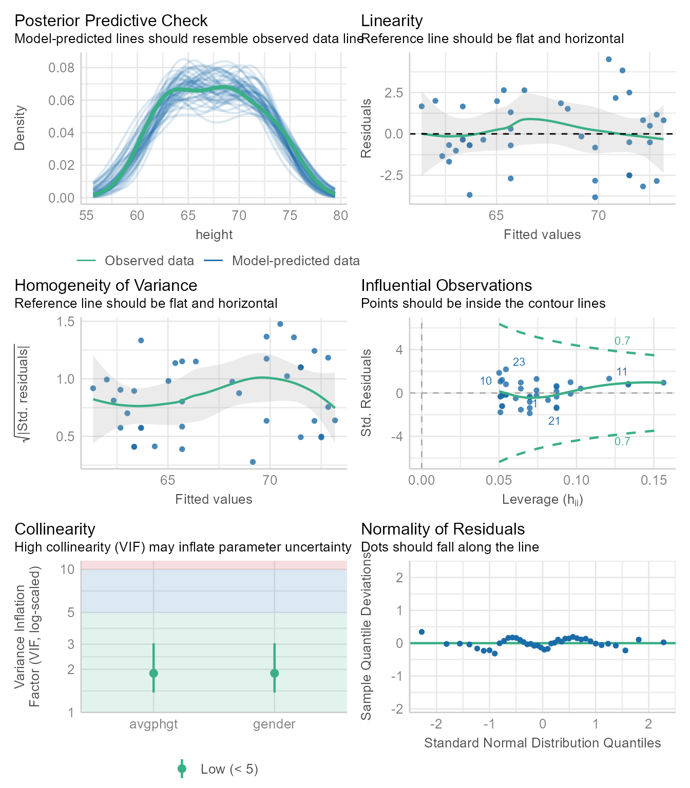
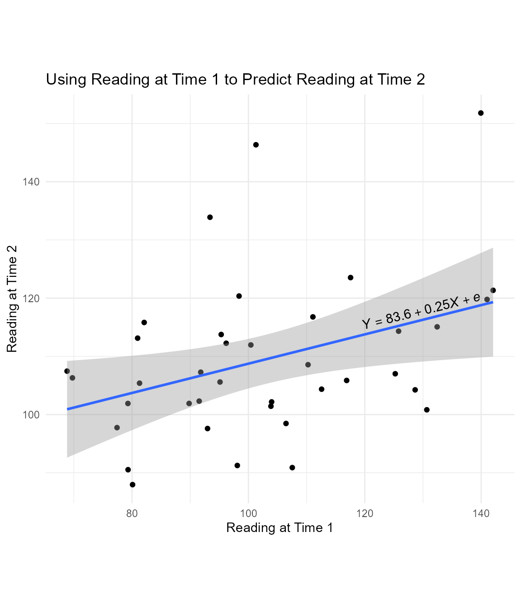

Here we are going to use a small data set to predict people's height using the height of their parents.

# Install packages

An **R package** is software that extends the capabilities of R. To use a package, you must first install it on your machine. You only need to install it once.

## Install tidyverse 

Some packages are designed to work with several other packages as a system. The [tidyverse package](https://www.tidyverse.org/) is a "meta-package" that installs and loads a coherent set of packages designed to help you import, manipulate, visualize, and interpret data. It also installs the [haven](https://haven.tidyverse.org/) package, which we will use to import some data. If you do not have a recent version of tidyverse already installed, you can install it with this code:


::: {.cell}

```{.r .cell-code}
install.packages("tidyverse")
```
:::


## Install easystats

The [easystats](https://easystats.github.io/easystats/) package is another "meta-package" that installs a set of packages designed to work together to make data analysis easier.


If you do not have a recent version of easystats already installed, you can install it with this code:


::: {.cell}

```{.r .cell-code}
install.packages("easystats")
```
:::


# Load packages

A package that is installed on your machine has additional functions that you can use. Each session, you can "load" a package with the `library` function:


::: {.cell}

```{.r .cell-code}
library(tidyverse) # Loads primary packages for data wrangling and plotting
library(easystats) # Loads packages that make extracting data from model fit objects easier
```
:::


# Import data

:::{.column-margin}
If I use only one data set in an analysis, I call it `d`. If I need multiple data sets, I use a `d_` prefix to differentiate them. For example, if I have separate data sets for juniors and seniors, I might call them, `d_juniors` and `d_seniors`, respectively. This kind of consistency seems like extra work, but it pays off in making it easy for *future-you* to read and understand your own code.
:::

You can import the `height.sav` data set directly from my github repository for this course. There is no need to save the data anywhere. This code loads the data into variable `d` using the [`read_spss`](https://haven.tidyverse.org/reference/read_spss.html) function from the [haven package](https://haven.tidyverse.org/).

We could load haven using `library(haven)`, but we only need to use one function one time. So instead of loading the whole package, we can use a function without loading the package by using the package name as prefix followed by two colons like so:


::: {.cell}

```{.r .cell-code}
d <- haven::read_spss("https://github.com/wjschne/EDUC5325/raw/master/height.sav")
```
:::


This code reaches across the web to the file in quotes, "reads" it into our session, and holds the data in a new variable we called `d`. Every time we need the data, we will get it from the `d` variable.

# Make a plot

Use the [`ggplot`](https://ggplot2.tidyverse.org/reference/ggplot.html) function from the [ggplot2](https://ggplot2.tidyverse.org/) package to make a scatterplot with points and a regression line:


::: {.cell .preview-image}

```{.r .cell-code}
ggplot(d, aes(avgphgt,height)) +
  geom_point() +
  geom_smooth(method = "lm")
```

::: {.cell-output .cell-output-stderr}

```
`geom_smooth()` using formula = 'y ~ x'
```


:::

::: {.cell-output-display}
{width=100%}
:::
:::


Annotated, here is what the code does:



## Save the plot!

You can save to your hard drive a high-quality plot with the [`ggsave`](https://ggplot2.tidyverse.org/reference/ggsave.html) function. It will save whatever the last plot you created with [`ggplot`](https://ggplot2.tidyverse.org/reference/ggplot.html). It will guess the file format from the file extension. 

Here I save a .pdf file of the plot to the working directory:


::: {.cell}

```{.r .cell-code}
ggsave("my_plot.pdf")
```
:::


What is the working directory? Is the folder on your machine that R thinks it should look first if it needs to find files or save files. If you are ever curious about which directory is the working directory, you can see the current working directory with the `getwd` function:


::: {.cell}

```{.r .cell-code}
getwd()
```
:::


If you saved the plot above as `"my_plot.pdf"`, you will find the file in the working directory returned by `getwd`.

If you need to set the working working directly to something different from what it is, use the `setwd` function. In the `Session` menu in RStudio, you can also set the working directory with a point-an-click dialog box.


## Vector-based images

The .pdf format gives the best image quality but can only be viewed in a .pdf reader. The .svg format is almost as good and can be incorporated into webpages and Office documents. One downside of their near-perfect image quality is that .pdf and .svg image file sizes can become quite large. 

## Raster images

The .png format gives good image quality and renders small file sizes. I prefer using the `ragg::agg_png` device to render a .png because it handles system fonts without any fuss. 

The primary use of the .gif format is to create animated plots. Otherwise stick with .png.

Although the .jpg format is good for photos, it is terrible for plots---it often renders text and sharp corners with pixelated smudges. 

# Creating the regression model

To run regression models, use the [`lm`](https://www.rdocumentation.org/packages/stats/versions/3.6.2/topics/lm) function. The `lm` stands for "linear model." The general pattern is `lm(Y~X, data = d)`, which means "`Y` is predicted by `X`, using the data set `d`."

Here we predict height from Average of Parent Height (`avgphgt`):


::: {.cell}

```{.r .cell-code}
m1 <- lm(height~avgphgt, data = d)
```
:::


Notice that we did not get any results. Instead, we created the model fit object `m1`, which contains information about the model. There are a variety of functions we can use to extract information from `m1`.

# Checking assumptions

Regression assumes that the observations should independent, and the residuals should be normal and homoscedastic. The [performance package](https://easystats.github.io/performance/index.html) has a great function for checking model assumptions: [`check_model`](https://easystats.github.io/performance/reference/check_model.html)


::: {.cell}

```{.r .cell-code}
check_model(m1)
```

::: {.cell-output-display}
{width=100%}
:::
:::


Here we see that none of the assumptions have been severely violated.

# Summarising results

Base R gives you most of what you would want to know about the regression results with the `summary` function:


::: {.cell}

```{.r .cell-code}
summary(m1)
```

::: {.cell-output .cell-output-stdout}

```

Call:
lm(formula = height ~ avgphgt, data = d)

Residuals:
   Min     1Q Median     3Q    Max 
-5.241 -1.649 -0.539  1.224  6.163 

Coefficients:
            Estimate Std. Error t value Pr(>|t|)    
(Intercept)  -12.878      9.779   -1.32      0.2    
avgphgt        1.193      0.145    8.23  5.7e-10 ***
---
Signif. codes:  0 '***' 0.001 '**' 0.01 '*' 0.05 '.' 0.1 ' ' 1

Residual standard error: 2.68 on 38 degrees of freedom
Multiple R-squared:  0.641,	Adjusted R-squared:  0.631 
F-statistic: 67.7 on 1 and 38 DF,  p-value: 5.7e-10
```


:::
:::


This output is not pretty, nor was it intended to be. It is designed for you, the analyst. The `summary` function's print method is optimized for reading results in the console, not in a document.  Presentation-worthy results need a lot more care and attention.

An automated report from the [report](https://easystats.github.io/report/articles/report.html) package:


::: {.cell}

```{.r .cell-code}
report::report(m1)
```

::: {.cell-output .cell-output-stdout}

```
We fitted a linear model (estimated using OLS) to predict height with avgphgt
(formula: height ~ avgphgt). The model explains a statistically significant and
substantial proportion of variance (R2 = 0.64, F(1, 38) = 67.73, p < .001, adj.
R2 = 0.63). The model's intercept, corresponding to avgphgt = 0, is at -12.88
(95% CI [-32.67, 6.92], t(38) = -1.32, p = 0.196). Within this model:

  - The effect of avgphgt is statistically significant and positive (beta = 1.19,
95% CI [0.90, 1.49], t(38) = 8.23, p < .001; Std. beta = 0.80, 95% CI [0.60,
1.00])

Standardized parameters were obtained by fitting the model on a standardized
version of the dataset. 95% Confidence Intervals (CIs) and p-values were
computed using a Wald t-distribution approximation.
```


:::
:::


## Model-level statistics

Some statistics like the *coefficient of determination* (*R*^2^) or the *standard error of the estimate* (*&sigma;~e~*) describe the model as a whole.

The model-level statistics can be extracted with the performance package's [`model_performance`](https://easystats.github.io/performance/reference/model_performance.lm.html) function.


::: {.cell}

```{.r .cell-code}
performance(m1)
```

::: {.cell-output-display}
<div class="kable-table">

| AIC| AICc| BIC|    R2| R2_adjusted| RMSE| Sigma|
|---:|----:|---:|-----:|-----------:|----:|-----:|
| 196|  197| 201| 0.641|       0.631| 2.61|  2.68|

</div>
:::
:::


*R*^2^ is in the `glance` function's `r.squared` column, and the *standard error of the estimate* is in the `sigma` column.
If all you wanted was the *R*^2^, you could do this:


::: {.cell}

```{.r .cell-code}
r2(m1)
```

::: {.cell-output .cell-output-stdout}

```
# R2 for Linear Regression
       R2: 0.641
  adj. R2: 0.631
```


:::
:::


For the *standard error of the estimate*:


::: {.cell}

```{.r .cell-code}
sigma(m1)
```

::: {.cell-output .cell-output-stdout}

```
[1] 2.68
```


:::
:::


Why would you want just one number instead of reading it from a table? In reproducible research, we intermingle text and code so that it is clear where every number came from. Thus, "hard-coding" your results like this is considered poor practice:

```
The model explains 64% of the variance.
```

Using rmarkdown, instead of typing the numeric results, we type pull the results using an [inline code chunk](https://rmarkdown.rstudio.com/lesson-4.html):


``` md
The model explains 64% of the variance.
```

Which, when rendered, produces the correct output:

> The model explains 64% of the variance.

That seems like a lot of extra work, right? Yes, it is---unless there is a possibility that your underlying data might change or that you might copy your numbers incorrectly. If you are imperfect, the extra time and effort is worth it. It makes it easy for other scholars to see exactly where each number came from. Hard-coded results are harder to trust.

## Coefficient-level statistics

The regression coefficients---the intercept (*b*~0~) and the slope (*b*~1~)---have a number of statistics associated with them, which we will discuss later in the course.

If you just wanted the intercept and the slope coefficients, use the `coef` function:


::: {.cell}

```{.r .cell-code}
coef(m1)
```

::: {.cell-output .cell-output-stdout}

```
(Intercept)     avgphgt 
     -12.88        1.19 
```


:::
:::


Thus, the intercept is -12.88 and the slope is 1.19.

To get the model parameters (intercept and slope coefficients) along with their p-values and other statistical information


::: {.cell}

```{.r .cell-code}
parameters(m1) 
```

::: {.cell-output-display}
<div class="kable-table">

|Parameter   | Coefficient|    SE|   CI|  CI_low| CI_high|     t| df_error|     p|
|:-----------|-----------:|-----:|----:|-------:|-------:|-----:|--------:|-----:|
|(Intercept) |      -12.88| 9.779| 0.95| -32.675|    6.92| -1.32|       38| 0.196|
|avgphgt     |        1.19| 0.145| 0.95|   0.899|    1.49|  8.23|       38| 0.000|

</div>
:::
:::


If you want standardized parameters:


::: {.cell}

```{.r .cell-code}
standardise_parameters(m1)
```

::: {.cell-output-display}
<div class="kable-table">

|Parameter   | Std_Coefficient|   CI| CI_low| CI_high|
|:-----------|---------------:|----:|------:|-------:|
|(Intercept) |             0.0| 0.95| -0.194|   0.194|
|avgphgt     |             0.8| 0.95|  0.603|   0.997|

</div>
:::
:::


# Multiple regression

In this data set, all participants self-identified as either male or female on the traditional gender binary. We assume that males are, on average, taller than females. The codes are male = 1 and female = 2. Let's `mutate` the gender variable so that it becomes a categorical "factor" instead of a numeric variable.


::: {.cell}

```{.r .cell-code}
d <- d %>% 
  mutate(gender = factor(gender, levels = c(1, 2), 
                         labels = c("Males", "Females"))) 
```
:::


By default, the first category in a factor is the "reference level" that all other categories are compared to. Thus, the regression coefficient for `gender` will refer to how much "Females" differ from "Males," on average. If want to do it the other way around, you can reverse the order of the levels and labels in the `factor` function. See also the [`fct_rev`](https://forcats.tidyverse.org/reference/fct_rev.html) or [`fct_relevel`](https://forcats.tidyverse.org/reference/fct_relevel.html) function for other ways to do this.


We run the regression model with 2 predictors like so:


::: {.cell}

```{.r .cell-code}
m2 <- lm(height ~ avgphgt + gender, data = d)
```
:::


## Checking assumptions


::: {.cell}

```{.r .cell-code}
check_model(m2)
```

::: {.cell-output-display}
{width=100%}
:::
:::


All looks well.

## Summarizing results

To summarize the results, use the `summary` function:


::: {.cell}

```{.r .cell-code}
summary(m2)
```

::: {.cell-output .cell-output-stdout}

```

Call:
lm(formula = height ~ avgphgt + gender, data = d)

Residuals:
   Min     1Q Median     3Q    Max 
-3.826 -1.094 -0.347  1.656  4.503 

Coefficients:
              Estimate Std. Error t value Pr(>|t|)    
(Intercept)     24.567     10.932    2.25  0.03068 *  
avgphgt          0.671      0.157    4.26  0.00013 ***
genderFemales   -4.468      0.920   -4.85  2.2e-05 ***
---
Signif. codes:  0 '***' 0.001 '**' 0.01 '*' 0.05 '.' 0.1 ' ' 1

Residual standard error: 2.12 on 37 degrees of freedom
Multiple R-squared:  0.78,	Adjusted R-squared:  0.769 
F-statistic: 65.7 on 2 and 37 DF,  p-value: 6.6e-13
```


:::
:::


Standardized coefficients:


::: {.cell}

```{.r .cell-code}
standardise_parameters(m2)
```

::: {.cell-output-display}
<div class="kable-table">

|Parameter     | Std_Coefficient|   CI| CI_low| CI_high|
|:-------------|---------------:|----:|------:|-------:|
|(Intercept)   |           0.506| 0.95|  0.245|   0.768|
|avgphgt       |           0.450| 0.95|  0.236|   0.664|
|genderFemales |          -1.012| 0.95| -1.435|  -0.590|

</div>
:::
:::


An automated report:


::: {.cell}

```{.r .cell-code}
report(m2)
```

::: {.cell-output .cell-output-stdout}

```
We fitted a linear model (estimated using OLS) to predict height with avgphgt
and gender (formula: height ~ avgphgt + gender). The model explains a
statistically significant and substantial proportion of variance (R2 = 0.78,
F(2, 37) = 65.75, p < .001, adj. R2 = 0.77). The model's intercept,
corresponding to avgphgt = 0 and gender = Males, is at 24.57 (95% CI [2.42,
46.72], t(37) = 2.25, p = 0.031). Within this model:

  - The effect of avgphgt is statistically significant and positive (beta = 0.67,
95% CI [0.35, 0.99], t(37) = 4.26, p < .001; Std. beta = 0.45, 95% CI [0.24,
0.66])
  - The effect of gender [Females] is statistically significant and negative
(beta = -4.47, 95% CI [-6.33, -2.60], t(37) = -4.85, p < .001; Std. beta =
-1.01, 95% CI [-1.43, -0.59])

Standardized parameters were obtained by fitting the model on a standardized
version of the dataset. 95% Confidence Intervals (CIs) and p-values were
computed using a Wald t-distribution approximation.
```


:::
:::


## Comparing models

To compare two regression models:


::: {.cell}

```{.r .cell-code}
test_wald(m1, m2)
```

::: {.cell-output-display}
<div class="kable-table">

|Name |Model | df| df_diff|    F|  p|
|:----|:-----|--:|-------:|----:|--:|
|m1   |lm    | 38|        |     |   |
|m2   |lm    | 37|       1| 23.6|  0|

</div>
:::
:::


The p-value is significant, meaning that `m2` explains more variance than `m1`.

This uses Bayes Factor instead of a p-value:


::: {.cell}

```{.r .cell-code}
test_bf(m1, m2)
```

::: {.cell-output-display}
<div class="kable-table">

|Model            | log_BF|   BF|
|:----------------|------:|----:|
|avgphgt          |       |     |
|avgphgt + gender |   8.01| 3010|

</div>
:::
:::


A BF > 1 means that `m2` is more strongly supported than `m1`. A BF < 1 means that `m1` is more strongly supported than `m2`. If you are not sure how to interpret the output of `test_bf`, you can get an automated interpretation:


::: {.cell}

```{.r .cell-code}
test_bf(m1, m2) %>% 
  report()
```

::: {.cell-output .cell-output-stdout}

```
Bayes factors were computed using the BIC approximation, by which BF10 =
exp((BIC0 - BIC1)/2). Compared to the avgphgt model, we found extreme evidence
(BF = 3.01e+03) in favour of the avgphgt + gender model (the least supported
model).
```


:::
:::


To compare many performance statistics at once: 


::: {.cell}

```{.r .cell-code}
compare_performance(m1, m2) 
```

::: {.cell-output-display}
<div class="kable-table">

|Name |Model | AIC| AIC_wt| AICc| AICc_wt| BIC| BIC_wt|    R2| R2_adjusted| RMSE| Sigma|
|:----|:-----|---:|------:|----:|-------:|---:|------:|-----:|-----------:|----:|-----:|
|m1   |lm    | 196|      0|  197|       0| 201|      0| 0.641|       0.631| 2.61|  2.68|
|m2   |lm    | 179|      1|  180|       1| 185|      1| 0.780|       0.769| 2.04|  2.12|

</div>
:::
:::


# Pretty Regression Tables

There are several packages that automate the production of pretty regression tables. There is a trade-off here between ease of use and getting exactly what you want. If you are okay with a function's defaults and the programmer's choices, then there is no problem. If you want full control of the display, you are best off creating your own functions or adapting existing functions. 

:::{.panel-tabset}

## sjPlot

The [`tab_model` function in sjPlot](https://strengejacke.github.io/sjPlot/articles/tab_model_estimates.html) look great as is, but if it gives you too much or not enough, check out [its options](https://strengejacke.github.io/sjPlot/reference/tab_model.html) to see if it can do what you want.

Show a single model


::: {.cell}

```{.r .cell-code}
sjPlot::tab_model(m1)
```

::: {.cell-output-display}

`````{=html}
<table style="border-collapse:collapse; border:none;">
<tr>
<th style="border-top: double; text-align:center; font-style:normal; font-weight:bold; padding:0.2cm;  text-align:left; ">&nbsp;</th>
<th colspan="3" style="border-top: double; text-align:center; font-style:normal; font-weight:bold; padding:0.2cm; ">height(in inches)</th>
</tr>
<tr>
<td style=" text-align:center; border-bottom:1px solid; font-style:italic; font-weight:normal;  text-align:left; ">Predictors</td>
<td style=" text-align:center; border-bottom:1px solid; font-style:italic; font-weight:normal;  ">Estimates</td>
<td style=" text-align:center; border-bottom:1px solid; font-style:italic; font-weight:normal;  ">CI</td>
<td style=" text-align:center; border-bottom:1px solid; font-style:italic; font-weight:normal;  ">p</td>
</tr>
<tr>
<td style=" padding:0.2cm; text-align:left; vertical-align:top; text-align:left; ">(Intercept)</td>
<td style=" padding:0.2cm; text-align:left; vertical-align:top; text-align:center;  ">&#45;12.88</td>
<td style=" padding:0.2cm; text-align:left; vertical-align:top; text-align:center;  ">&#45;32.67&nbsp;&ndash;&nbsp;6.92</td>
<td style=" padding:0.2cm; text-align:left; vertical-align:top; text-align:center;  ">0.196</td>
</tr>
<tr>
<td style=" padding:0.2cm; text-align:left; vertical-align:top; text-align:left; ">Average height of parents</td>
<td style=" padding:0.2cm; text-align:left; vertical-align:top; text-align:center;  ">1.19</td>
<td style=" padding:0.2cm; text-align:left; vertical-align:top; text-align:center;  ">0.90&nbsp;&ndash;&nbsp;1.49</td>
<td style=" padding:0.2cm; text-align:left; vertical-align:top; text-align:center;  "><strong>&lt;0.001</strong></td>
</tr>
<tr>
<td style=" padding:0.2cm; text-align:left; vertical-align:top; text-align:left; padding-top:0.1cm; padding-bottom:0.1cm; border-top:1px solid;">Observations</td>
<td style=" padding:0.2cm; text-align:left; vertical-align:top; padding-top:0.1cm; padding-bottom:0.1cm; text-align:left; border-top:1px solid;" colspan="3">40</td>
</tr>
<tr>
<td style=" padding:0.2cm; text-align:left; vertical-align:top; text-align:left; padding-top:0.1cm; padding-bottom:0.1cm;">R<sup>2</sup> / R<sup>2</sup> adjusted</td>
<td style=" padding:0.2cm; text-align:left; vertical-align:top; padding-top:0.1cm; padding-bottom:0.1cm; text-align:left;" colspan="3">0.641 / 0.631</td>
</tr>

</table>

`````

:::
:::


Compare nested models


::: {.cell}

```{.r .cell-code}
sjPlot::tab_model(m1, m2)
```

::: {.cell-output-display}

`````{=html}
<table style="border-collapse:collapse; border:none;">
<tr>
<th style="border-top: double; text-align:center; font-style:normal; font-weight:bold; padding:0.2cm;  text-align:left; ">&nbsp;</th>
<th colspan="3" style="border-top: double; text-align:center; font-style:normal; font-weight:bold; padding:0.2cm; ">height(in inches)</th>
<th colspan="3" style="border-top: double; text-align:center; font-style:normal; font-weight:bold; padding:0.2cm; ">height(in inches)</th>
</tr>
<tr>
<td style=" text-align:center; border-bottom:1px solid; font-style:italic; font-weight:normal;  text-align:left; ">Predictors</td>
<td style=" text-align:center; border-bottom:1px solid; font-style:italic; font-weight:normal;  ">Estimates</td>
<td style=" text-align:center; border-bottom:1px solid; font-style:italic; font-weight:normal;  ">CI</td>
<td style=" text-align:center; border-bottom:1px solid; font-style:italic; font-weight:normal;  ">p</td>
<td style=" text-align:center; border-bottom:1px solid; font-style:italic; font-weight:normal;  ">Estimates</td>
<td style=" text-align:center; border-bottom:1px solid; font-style:italic; font-weight:normal;  ">CI</td>
<td style=" text-align:center; border-bottom:1px solid; font-style:italic; font-weight:normal;  col7">p</td>
</tr>
<tr>
<td style=" padding:0.2cm; text-align:left; vertical-align:top; text-align:left; ">(Intercept)</td>
<td style=" padding:0.2cm; text-align:left; vertical-align:top; text-align:center;  ">&#45;12.88</td>
<td style=" padding:0.2cm; text-align:left; vertical-align:top; text-align:center;  ">&#45;32.67&nbsp;&ndash;&nbsp;6.92</td>
<td style=" padding:0.2cm; text-align:left; vertical-align:top; text-align:center;  ">0.196</td>
<td style=" padding:0.2cm; text-align:left; vertical-align:top; text-align:center;  ">24.57</td>
<td style=" padding:0.2cm; text-align:left; vertical-align:top; text-align:center;  ">2.42&nbsp;&ndash;&nbsp;46.72</td>
<td style=" padding:0.2cm; text-align:left; vertical-align:top; text-align:center;  col7"><strong>0.031</strong></td>
</tr>
<tr>
<td style=" padding:0.2cm; text-align:left; vertical-align:top; text-align:left; ">Average height of parents</td>
<td style=" padding:0.2cm; text-align:left; vertical-align:top; text-align:center;  ">1.19</td>
<td style=" padding:0.2cm; text-align:left; vertical-align:top; text-align:center;  ">0.90&nbsp;&ndash;&nbsp;1.49</td>
<td style=" padding:0.2cm; text-align:left; vertical-align:top; text-align:center;  "><strong>&lt;0.001</strong></td>
<td style=" padding:0.2cm; text-align:left; vertical-align:top; text-align:center;  ">0.67</td>
<td style=" padding:0.2cm; text-align:left; vertical-align:top; text-align:center;  ">0.35&nbsp;&ndash;&nbsp;0.99</td>
<td style=" padding:0.2cm; text-align:left; vertical-align:top; text-align:center;  col7"><strong>&lt;0.001</strong></td>
</tr>
<tr>
<td style=" padding:0.2cm; text-align:left; vertical-align:top; text-align:left; ">gender: Females</td>
<td style=" padding:0.2cm; text-align:left; vertical-align:top; text-align:center;  "></td>
<td style=" padding:0.2cm; text-align:left; vertical-align:top; text-align:center;  "></td>
<td style=" padding:0.2cm; text-align:left; vertical-align:top; text-align:center;  "></td>
<td style=" padding:0.2cm; text-align:left; vertical-align:top; text-align:center;  ">&#45;4.47</td>
<td style=" padding:0.2cm; text-align:left; vertical-align:top; text-align:center;  ">&#45;6.33&nbsp;&ndash;&nbsp;-2.60</td>
<td style=" padding:0.2cm; text-align:left; vertical-align:top; text-align:center;  col7"><strong>&lt;0.001</strong></td>
</tr>
<tr>
<td style=" padding:0.2cm; text-align:left; vertical-align:top; text-align:left; padding-top:0.1cm; padding-bottom:0.1cm; border-top:1px solid;">Observations</td>
<td style=" padding:0.2cm; text-align:left; vertical-align:top; padding-top:0.1cm; padding-bottom:0.1cm; text-align:left; border-top:1px solid;" colspan="3">40</td>
<td style=" padding:0.2cm; text-align:left; vertical-align:top; padding-top:0.1cm; padding-bottom:0.1cm; text-align:left; border-top:1px solid;" colspan="3">40</td>
</tr>
<tr>
<td style=" padding:0.2cm; text-align:left; vertical-align:top; text-align:left; padding-top:0.1cm; padding-bottom:0.1cm;">R<sup>2</sup> / R<sup>2</sup> adjusted</td>
<td style=" padding:0.2cm; text-align:left; vertical-align:top; padding-top:0.1cm; padding-bottom:0.1cm; text-align:left;" colspan="3">0.641 / 0.631</td>
<td style=" padding:0.2cm; text-align:left; vertical-align:top; padding-top:0.1cm; padding-bottom:0.1cm; text-align:left;" colspan="3">0.780 / 0.769</td>
</tr>

</table>

`````

:::
:::


## gtsummary


::: {.cell}

```{.r .cell-code}
library(gtsummary)
# Plain table
tbl_regression(m1)
```

::: {.cell-output-display}


```{=html}
<div id="ykuwyjggwq" style="padding-left:0px;padding-right:0px;padding-top:10px;padding-bottom:10px;overflow-x:auto;overflow-y:auto;width:auto;height:auto;">
<style>#ykuwyjggwq table {
  font-family: system-ui, 'Segoe UI', Roboto, Helvetica, Arial, sans-serif, 'Apple Color Emoji', 'Segoe UI Emoji', 'Segoe UI Symbol', 'Noto Color Emoji';
  -webkit-font-smoothing: antialiased;
  -moz-osx-font-smoothing: grayscale;
}

#ykuwyjggwq thead, #ykuwyjggwq tbody, #ykuwyjggwq tfoot, #ykuwyjggwq tr, #ykuwyjggwq td, #ykuwyjggwq th {
  border-style: none;
}

#ykuwyjggwq p {
  margin: 0;
  padding: 0;
}

#ykuwyjggwq .gt_table {
  display: table;
  border-collapse: collapse;
  line-height: normal;
  margin-left: auto;
  margin-right: auto;
  color: #333333;
  font-size: 16px;
  font-weight: normal;
  font-style: normal;
  background-color: #FFFFFF;
  width: auto;
  border-top-style: solid;
  border-top-width: 2px;
  border-top-color: #A8A8A8;
  border-right-style: none;
  border-right-width: 2px;
  border-right-color: #D3D3D3;
  border-bottom-style: solid;
  border-bottom-width: 2px;
  border-bottom-color: #A8A8A8;
  border-left-style: none;
  border-left-width: 2px;
  border-left-color: #D3D3D3;
}

#ykuwyjggwq .gt_caption {
  padding-top: 4px;
  padding-bottom: 4px;
}

#ykuwyjggwq .gt_title {
  color: #333333;
  font-size: 125%;
  font-weight: initial;
  padding-top: 4px;
  padding-bottom: 4px;
  padding-left: 5px;
  padding-right: 5px;
  border-bottom-color: #FFFFFF;
  border-bottom-width: 0;
}

#ykuwyjggwq .gt_subtitle {
  color: #333333;
  font-size: 85%;
  font-weight: initial;
  padding-top: 3px;
  padding-bottom: 5px;
  padding-left: 5px;
  padding-right: 5px;
  border-top-color: #FFFFFF;
  border-top-width: 0;
}

#ykuwyjggwq .gt_heading {
  background-color: #FFFFFF;
  text-align: center;
  border-bottom-color: #FFFFFF;
  border-left-style: none;
  border-left-width: 1px;
  border-left-color: #D3D3D3;
  border-right-style: none;
  border-right-width: 1px;
  border-right-color: #D3D3D3;
}

#ykuwyjggwq .gt_bottom_border {
  border-bottom-style: solid;
  border-bottom-width: 2px;
  border-bottom-color: #D3D3D3;
}

#ykuwyjggwq .gt_col_headings {
  border-top-style: solid;
  border-top-width: 2px;
  border-top-color: #D3D3D3;
  border-bottom-style: solid;
  border-bottom-width: 2px;
  border-bottom-color: #D3D3D3;
  border-left-style: none;
  border-left-width: 1px;
  border-left-color: #D3D3D3;
  border-right-style: none;
  border-right-width: 1px;
  border-right-color: #D3D3D3;
}

#ykuwyjggwq .gt_col_heading {
  color: #333333;
  background-color: #FFFFFF;
  font-size: 100%;
  font-weight: normal;
  text-transform: inherit;
  border-left-style: none;
  border-left-width: 1px;
  border-left-color: #D3D3D3;
  border-right-style: none;
  border-right-width: 1px;
  border-right-color: #D3D3D3;
  vertical-align: bottom;
  padding-top: 5px;
  padding-bottom: 6px;
  padding-left: 5px;
  padding-right: 5px;
  overflow-x: hidden;
}

#ykuwyjggwq .gt_column_spanner_outer {
  color: #333333;
  background-color: #FFFFFF;
  font-size: 100%;
  font-weight: normal;
  text-transform: inherit;
  padding-top: 0;
  padding-bottom: 0;
  padding-left: 4px;
  padding-right: 4px;
}

#ykuwyjggwq .gt_column_spanner_outer:first-child {
  padding-left: 0;
}

#ykuwyjggwq .gt_column_spanner_outer:last-child {
  padding-right: 0;
}

#ykuwyjggwq .gt_column_spanner {
  border-bottom-style: solid;
  border-bottom-width: 2px;
  border-bottom-color: #D3D3D3;
  vertical-align: bottom;
  padding-top: 5px;
  padding-bottom: 5px;
  overflow-x: hidden;
  display: inline-block;
  width: 100%;
}

#ykuwyjggwq .gt_spanner_row {
  border-bottom-style: hidden;
}

#ykuwyjggwq .gt_group_heading {
  padding-top: 8px;
  padding-bottom: 8px;
  padding-left: 5px;
  padding-right: 5px;
  color: #333333;
  background-color: #FFFFFF;
  font-size: 100%;
  font-weight: initial;
  text-transform: inherit;
  border-top-style: solid;
  border-top-width: 2px;
  border-top-color: #D3D3D3;
  border-bottom-style: solid;
  border-bottom-width: 2px;
  border-bottom-color: #D3D3D3;
  border-left-style: none;
  border-left-width: 1px;
  border-left-color: #D3D3D3;
  border-right-style: none;
  border-right-width: 1px;
  border-right-color: #D3D3D3;
  vertical-align: middle;
  text-align: left;
}

#ykuwyjggwq .gt_empty_group_heading {
  padding: 0.5px;
  color: #333333;
  background-color: #FFFFFF;
  font-size: 100%;
  font-weight: initial;
  border-top-style: solid;
  border-top-width: 2px;
  border-top-color: #D3D3D3;
  border-bottom-style: solid;
  border-bottom-width: 2px;
  border-bottom-color: #D3D3D3;
  vertical-align: middle;
}

#ykuwyjggwq .gt_from_md > :first-child {
  margin-top: 0;
}

#ykuwyjggwq .gt_from_md > :last-child {
  margin-bottom: 0;
}

#ykuwyjggwq .gt_row {
  padding-top: 8px;
  padding-bottom: 8px;
  padding-left: 5px;
  padding-right: 5px;
  margin: 10px;
  border-top-style: solid;
  border-top-width: 1px;
  border-top-color: #D3D3D3;
  border-left-style: none;
  border-left-width: 1px;
  border-left-color: #D3D3D3;
  border-right-style: none;
  border-right-width: 1px;
  border-right-color: #D3D3D3;
  vertical-align: middle;
  overflow-x: hidden;
}

#ykuwyjggwq .gt_stub {
  color: #333333;
  background-color: #FFFFFF;
  font-size: 100%;
  font-weight: initial;
  text-transform: inherit;
  border-right-style: solid;
  border-right-width: 2px;
  border-right-color: #D3D3D3;
  padding-left: 5px;
  padding-right: 5px;
}

#ykuwyjggwq .gt_stub_row_group {
  color: #333333;
  background-color: #FFFFFF;
  font-size: 100%;
  font-weight: initial;
  text-transform: inherit;
  border-right-style: solid;
  border-right-width: 2px;
  border-right-color: #D3D3D3;
  padding-left: 5px;
  padding-right: 5px;
  vertical-align: top;
}

#ykuwyjggwq .gt_row_group_first td {
  border-top-width: 2px;
}

#ykuwyjggwq .gt_row_group_first th {
  border-top-width: 2px;
}

#ykuwyjggwq .gt_summary_row {
  color: #333333;
  background-color: #FFFFFF;
  text-transform: inherit;
  padding-top: 8px;
  padding-bottom: 8px;
  padding-left: 5px;
  padding-right: 5px;
}

#ykuwyjggwq .gt_first_summary_row {
  border-top-style: solid;
  border-top-color: #D3D3D3;
}

#ykuwyjggwq .gt_first_summary_row.thick {
  border-top-width: 2px;
}

#ykuwyjggwq .gt_last_summary_row {
  padding-top: 8px;
  padding-bottom: 8px;
  padding-left: 5px;
  padding-right: 5px;
  border-bottom-style: solid;
  border-bottom-width: 2px;
  border-bottom-color: #D3D3D3;
}

#ykuwyjggwq .gt_grand_summary_row {
  color: #333333;
  background-color: #FFFFFF;
  text-transform: inherit;
  padding-top: 8px;
  padding-bottom: 8px;
  padding-left: 5px;
  padding-right: 5px;
}

#ykuwyjggwq .gt_first_grand_summary_row {
  padding-top: 8px;
  padding-bottom: 8px;
  padding-left: 5px;
  padding-right: 5px;
  border-top-style: double;
  border-top-width: 6px;
  border-top-color: #D3D3D3;
}

#ykuwyjggwq .gt_last_grand_summary_row_top {
  padding-top: 8px;
  padding-bottom: 8px;
  padding-left: 5px;
  padding-right: 5px;
  border-bottom-style: double;
  border-bottom-width: 6px;
  border-bottom-color: #D3D3D3;
}

#ykuwyjggwq .gt_striped {
  background-color: rgba(128, 128, 128, 0.05);
}

#ykuwyjggwq .gt_table_body {
  border-top-style: solid;
  border-top-width: 2px;
  border-top-color: #D3D3D3;
  border-bottom-style: solid;
  border-bottom-width: 2px;
  border-bottom-color: #D3D3D3;
}

#ykuwyjggwq .gt_footnotes {
  color: #333333;
  background-color: #FFFFFF;
  border-bottom-style: none;
  border-bottom-width: 2px;
  border-bottom-color: #D3D3D3;
  border-left-style: none;
  border-left-width: 2px;
  border-left-color: #D3D3D3;
  border-right-style: none;
  border-right-width: 2px;
  border-right-color: #D3D3D3;
}

#ykuwyjggwq .gt_footnote {
  margin: 0px;
  font-size: 90%;
  padding-top: 4px;
  padding-bottom: 4px;
  padding-left: 5px;
  padding-right: 5px;
}

#ykuwyjggwq .gt_sourcenotes {
  color: #333333;
  background-color: #FFFFFF;
  border-bottom-style: none;
  border-bottom-width: 2px;
  border-bottom-color: #D3D3D3;
  border-left-style: none;
  border-left-width: 2px;
  border-left-color: #D3D3D3;
  border-right-style: none;
  border-right-width: 2px;
  border-right-color: #D3D3D3;
}

#ykuwyjggwq .gt_sourcenote {
  font-size: 90%;
  padding-top: 4px;
  padding-bottom: 4px;
  padding-left: 5px;
  padding-right: 5px;
}

#ykuwyjggwq .gt_left {
  text-align: left;
}

#ykuwyjggwq .gt_center {
  text-align: center;
}

#ykuwyjggwq .gt_right {
  text-align: right;
  font-variant-numeric: tabular-nums;
}

#ykuwyjggwq .gt_font_normal {
  font-weight: normal;
}

#ykuwyjggwq .gt_font_bold {
  font-weight: bold;
}

#ykuwyjggwq .gt_font_italic {
  font-style: italic;
}

#ykuwyjggwq .gt_super {
  font-size: 65%;
}

#ykuwyjggwq .gt_footnote_marks {
  font-size: 75%;
  vertical-align: 0.4em;
  position: initial;
}

#ykuwyjggwq .gt_asterisk {
  font-size: 100%;
  vertical-align: 0;
}

#ykuwyjggwq .gt_indent_1 {
  text-indent: 5px;
}

#ykuwyjggwq .gt_indent_2 {
  text-indent: 10px;
}

#ykuwyjggwq .gt_indent_3 {
  text-indent: 15px;
}

#ykuwyjggwq .gt_indent_4 {
  text-indent: 20px;
}

#ykuwyjggwq .gt_indent_5 {
  text-indent: 25px;
}

#ykuwyjggwq .katex-display {
  display: inline-flex !important;
  margin-bottom: 0.75em !important;
}

#ykuwyjggwq div.Reactable > div.rt-table > div.rt-thead > div.rt-tr.rt-tr-group-header > div.rt-th-group:after {
  height: 0px !important;
}
</style>
<table class="gt_table" data-quarto-disable-processing="false" data-quarto-bootstrap="false">
  <thead>
    <tr class="gt_col_headings">
      <th class="gt_col_heading gt_columns_bottom_border gt_left" rowspan="1" colspan="1" scope="col" id="label"><span data-qmd-base64="PHN0cm9uZz5DaGFyYWN0ZXJpc3RpYzwvc3Ryb25nPg=="><span class='gt_from_md'><strong>Characteristic</strong></span></span></th>
      <th class="gt_col_heading gt_columns_bottom_border gt_center" rowspan="1" colspan="1" scope="col" id="estimate"><span data-qmd-base64="PHN0cm9uZz5CZXRhPC9zdHJvbmc+"><span class='gt_from_md'><strong>Beta</strong></span></span></th>
      <th class="gt_col_heading gt_columns_bottom_border gt_center" rowspan="1" colspan="1" scope="col" id="conf.low"><span data-qmd-base64="PHN0cm9uZz45NSUgQ0k8L3N0cm9uZz4="><span class='gt_from_md'><strong>95% CI</strong></span></span><span class="gt_footnote_marks" style="white-space:nowrap;font-style:italic;font-weight:normal;line-height:0;"><sup>1</sup></span></th>
      <th class="gt_col_heading gt_columns_bottom_border gt_center" rowspan="1" colspan="1" scope="col" id="p.value"><span data-qmd-base64="PHN0cm9uZz5wLXZhbHVlPC9zdHJvbmc+"><span class='gt_from_md'><strong>p-value</strong></span></span></th>
    </tr>
  </thead>
  <tbody class="gt_table_body">
    <tr><td headers="label" class="gt_row gt_left">Average height of parents</td>
<td headers="estimate" class="gt_row gt_center">1.2</td>
<td headers="conf.low" class="gt_row gt_center">0.90, 1.5</td>
<td headers="p.value" class="gt_row gt_center"><0.001</td></tr>
  </tbody>
  
  <tfoot class="gt_footnotes">
    <tr>
      <td class="gt_footnote" colspan="4"><span class="gt_footnote_marks" style="white-space:nowrap;font-style:italic;font-weight:normal;line-height:0;"><sup>1</sup></span> <span data-qmd-base64="Q0kgPSBDb25maWRlbmNlIEludGVydmFs"><span class='gt_from_md'>CI = Confidence Interval</span></span></td>
    </tr>
  </tfoot>
</table>
</div>
```


:::

```{.r .cell-code}
# Merging tables
tbl_merge(tbls = list(tbl_regression(m1) %>% add_glance_table(),
                      tbl_regression(m2) %>% add_glance_table()),
          tab_spanner = c("Parent Height", "Parent Height + Gender")) 
```

::: {.cell-output-display}


```{=html}
<div id="ovmehtbmgq" style="padding-left:0px;padding-right:0px;padding-top:10px;padding-bottom:10px;overflow-x:auto;overflow-y:auto;width:auto;height:auto;">
<style>#ovmehtbmgq table {
  font-family: system-ui, 'Segoe UI', Roboto, Helvetica, Arial, sans-serif, 'Apple Color Emoji', 'Segoe UI Emoji', 'Segoe UI Symbol', 'Noto Color Emoji';
  -webkit-font-smoothing: antialiased;
  -moz-osx-font-smoothing: grayscale;
}

#ovmehtbmgq thead, #ovmehtbmgq tbody, #ovmehtbmgq tfoot, #ovmehtbmgq tr, #ovmehtbmgq td, #ovmehtbmgq th {
  border-style: none;
}

#ovmehtbmgq p {
  margin: 0;
  padding: 0;
}

#ovmehtbmgq .gt_table {
  display: table;
  border-collapse: collapse;
  line-height: normal;
  margin-left: auto;
  margin-right: auto;
  color: #333333;
  font-size: 16px;
  font-weight: normal;
  font-style: normal;
  background-color: #FFFFFF;
  width: auto;
  border-top-style: solid;
  border-top-width: 2px;
  border-top-color: #A8A8A8;
  border-right-style: none;
  border-right-width: 2px;
  border-right-color: #D3D3D3;
  border-bottom-style: solid;
  border-bottom-width: 2px;
  border-bottom-color: #A8A8A8;
  border-left-style: none;
  border-left-width: 2px;
  border-left-color: #D3D3D3;
}

#ovmehtbmgq .gt_caption {
  padding-top: 4px;
  padding-bottom: 4px;
}

#ovmehtbmgq .gt_title {
  color: #333333;
  font-size: 125%;
  font-weight: initial;
  padding-top: 4px;
  padding-bottom: 4px;
  padding-left: 5px;
  padding-right: 5px;
  border-bottom-color: #FFFFFF;
  border-bottom-width: 0;
}

#ovmehtbmgq .gt_subtitle {
  color: #333333;
  font-size: 85%;
  font-weight: initial;
  padding-top: 3px;
  padding-bottom: 5px;
  padding-left: 5px;
  padding-right: 5px;
  border-top-color: #FFFFFF;
  border-top-width: 0;
}

#ovmehtbmgq .gt_heading {
  background-color: #FFFFFF;
  text-align: center;
  border-bottom-color: #FFFFFF;
  border-left-style: none;
  border-left-width: 1px;
  border-left-color: #D3D3D3;
  border-right-style: none;
  border-right-width: 1px;
  border-right-color: #D3D3D3;
}

#ovmehtbmgq .gt_bottom_border {
  border-bottom-style: solid;
  border-bottom-width: 2px;
  border-bottom-color: #D3D3D3;
}

#ovmehtbmgq .gt_col_headings {
  border-top-style: solid;
  border-top-width: 2px;
  border-top-color: #D3D3D3;
  border-bottom-style: solid;
  border-bottom-width: 2px;
  border-bottom-color: #D3D3D3;
  border-left-style: none;
  border-left-width: 1px;
  border-left-color: #D3D3D3;
  border-right-style: none;
  border-right-width: 1px;
  border-right-color: #D3D3D3;
}

#ovmehtbmgq .gt_col_heading {
  color: #333333;
  background-color: #FFFFFF;
  font-size: 100%;
  font-weight: normal;
  text-transform: inherit;
  border-left-style: none;
  border-left-width: 1px;
  border-left-color: #D3D3D3;
  border-right-style: none;
  border-right-width: 1px;
  border-right-color: #D3D3D3;
  vertical-align: bottom;
  padding-top: 5px;
  padding-bottom: 6px;
  padding-left: 5px;
  padding-right: 5px;
  overflow-x: hidden;
}

#ovmehtbmgq .gt_column_spanner_outer {
  color: #333333;
  background-color: #FFFFFF;
  font-size: 100%;
  font-weight: normal;
  text-transform: inherit;
  padding-top: 0;
  padding-bottom: 0;
  padding-left: 4px;
  padding-right: 4px;
}

#ovmehtbmgq .gt_column_spanner_outer:first-child {
  padding-left: 0;
}

#ovmehtbmgq .gt_column_spanner_outer:last-child {
  padding-right: 0;
}

#ovmehtbmgq .gt_column_spanner {
  border-bottom-style: solid;
  border-bottom-width: 2px;
  border-bottom-color: #D3D3D3;
  vertical-align: bottom;
  padding-top: 5px;
  padding-bottom: 5px;
  overflow-x: hidden;
  display: inline-block;
  width: 100%;
}

#ovmehtbmgq .gt_spanner_row {
  border-bottom-style: hidden;
}

#ovmehtbmgq .gt_group_heading {
  padding-top: 8px;
  padding-bottom: 8px;
  padding-left: 5px;
  padding-right: 5px;
  color: #333333;
  background-color: #FFFFFF;
  font-size: 100%;
  font-weight: initial;
  text-transform: inherit;
  border-top-style: solid;
  border-top-width: 2px;
  border-top-color: #D3D3D3;
  border-bottom-style: solid;
  border-bottom-width: 2px;
  border-bottom-color: #D3D3D3;
  border-left-style: none;
  border-left-width: 1px;
  border-left-color: #D3D3D3;
  border-right-style: none;
  border-right-width: 1px;
  border-right-color: #D3D3D3;
  vertical-align: middle;
  text-align: left;
}

#ovmehtbmgq .gt_empty_group_heading {
  padding: 0.5px;
  color: #333333;
  background-color: #FFFFFF;
  font-size: 100%;
  font-weight: initial;
  border-top-style: solid;
  border-top-width: 2px;
  border-top-color: #D3D3D3;
  border-bottom-style: solid;
  border-bottom-width: 2px;
  border-bottom-color: #D3D3D3;
  vertical-align: middle;
}

#ovmehtbmgq .gt_from_md > :first-child {
  margin-top: 0;
}

#ovmehtbmgq .gt_from_md > :last-child {
  margin-bottom: 0;
}

#ovmehtbmgq .gt_row {
  padding-top: 8px;
  padding-bottom: 8px;
  padding-left: 5px;
  padding-right: 5px;
  margin: 10px;
  border-top-style: solid;
  border-top-width: 1px;
  border-top-color: #D3D3D3;
  border-left-style: none;
  border-left-width: 1px;
  border-left-color: #D3D3D3;
  border-right-style: none;
  border-right-width: 1px;
  border-right-color: #D3D3D3;
  vertical-align: middle;
  overflow-x: hidden;
}

#ovmehtbmgq .gt_stub {
  color: #333333;
  background-color: #FFFFFF;
  font-size: 100%;
  font-weight: initial;
  text-transform: inherit;
  border-right-style: solid;
  border-right-width: 2px;
  border-right-color: #D3D3D3;
  padding-left: 5px;
  padding-right: 5px;
}

#ovmehtbmgq .gt_stub_row_group {
  color: #333333;
  background-color: #FFFFFF;
  font-size: 100%;
  font-weight: initial;
  text-transform: inherit;
  border-right-style: solid;
  border-right-width: 2px;
  border-right-color: #D3D3D3;
  padding-left: 5px;
  padding-right: 5px;
  vertical-align: top;
}

#ovmehtbmgq .gt_row_group_first td {
  border-top-width: 2px;
}

#ovmehtbmgq .gt_row_group_first th {
  border-top-width: 2px;
}

#ovmehtbmgq .gt_summary_row {
  color: #333333;
  background-color: #FFFFFF;
  text-transform: inherit;
  padding-top: 8px;
  padding-bottom: 8px;
  padding-left: 5px;
  padding-right: 5px;
}

#ovmehtbmgq .gt_first_summary_row {
  border-top-style: solid;
  border-top-color: #D3D3D3;
}

#ovmehtbmgq .gt_first_summary_row.thick {
  border-top-width: 2px;
}

#ovmehtbmgq .gt_last_summary_row {
  padding-top: 8px;
  padding-bottom: 8px;
  padding-left: 5px;
  padding-right: 5px;
  border-bottom-style: solid;
  border-bottom-width: 2px;
  border-bottom-color: #D3D3D3;
}

#ovmehtbmgq .gt_grand_summary_row {
  color: #333333;
  background-color: #FFFFFF;
  text-transform: inherit;
  padding-top: 8px;
  padding-bottom: 8px;
  padding-left: 5px;
  padding-right: 5px;
}

#ovmehtbmgq .gt_first_grand_summary_row {
  padding-top: 8px;
  padding-bottom: 8px;
  padding-left: 5px;
  padding-right: 5px;
  border-top-style: double;
  border-top-width: 6px;
  border-top-color: #D3D3D3;
}

#ovmehtbmgq .gt_last_grand_summary_row_top {
  padding-top: 8px;
  padding-bottom: 8px;
  padding-left: 5px;
  padding-right: 5px;
  border-bottom-style: double;
  border-bottom-width: 6px;
  border-bottom-color: #D3D3D3;
}

#ovmehtbmgq .gt_striped {
  background-color: rgba(128, 128, 128, 0.05);
}

#ovmehtbmgq .gt_table_body {
  border-top-style: solid;
  border-top-width: 2px;
  border-top-color: #D3D3D3;
  border-bottom-style: solid;
  border-bottom-width: 2px;
  border-bottom-color: #D3D3D3;
}

#ovmehtbmgq .gt_footnotes {
  color: #333333;
  background-color: #FFFFFF;
  border-bottom-style: none;
  border-bottom-width: 2px;
  border-bottom-color: #D3D3D3;
  border-left-style: none;
  border-left-width: 2px;
  border-left-color: #D3D3D3;
  border-right-style: none;
  border-right-width: 2px;
  border-right-color: #D3D3D3;
}

#ovmehtbmgq .gt_footnote {
  margin: 0px;
  font-size: 90%;
  padding-top: 4px;
  padding-bottom: 4px;
  padding-left: 5px;
  padding-right: 5px;
}

#ovmehtbmgq .gt_sourcenotes {
  color: #333333;
  background-color: #FFFFFF;
  border-bottom-style: none;
  border-bottom-width: 2px;
  border-bottom-color: #D3D3D3;
  border-left-style: none;
  border-left-width: 2px;
  border-left-color: #D3D3D3;
  border-right-style: none;
  border-right-width: 2px;
  border-right-color: #D3D3D3;
}

#ovmehtbmgq .gt_sourcenote {
  font-size: 90%;
  padding-top: 4px;
  padding-bottom: 4px;
  padding-left: 5px;
  padding-right: 5px;
}

#ovmehtbmgq .gt_left {
  text-align: left;
}

#ovmehtbmgq .gt_center {
  text-align: center;
}

#ovmehtbmgq .gt_right {
  text-align: right;
  font-variant-numeric: tabular-nums;
}

#ovmehtbmgq .gt_font_normal {
  font-weight: normal;
}

#ovmehtbmgq .gt_font_bold {
  font-weight: bold;
}

#ovmehtbmgq .gt_font_italic {
  font-style: italic;
}

#ovmehtbmgq .gt_super {
  font-size: 65%;
}

#ovmehtbmgq .gt_footnote_marks {
  font-size: 75%;
  vertical-align: 0.4em;
  position: initial;
}

#ovmehtbmgq .gt_asterisk {
  font-size: 100%;
  vertical-align: 0;
}

#ovmehtbmgq .gt_indent_1 {
  text-indent: 5px;
}

#ovmehtbmgq .gt_indent_2 {
  text-indent: 10px;
}

#ovmehtbmgq .gt_indent_3 {
  text-indent: 15px;
}

#ovmehtbmgq .gt_indent_4 {
  text-indent: 20px;
}

#ovmehtbmgq .gt_indent_5 {
  text-indent: 25px;
}

#ovmehtbmgq .katex-display {
  display: inline-flex !important;
  margin-bottom: 0.75em !important;
}

#ovmehtbmgq div.Reactable > div.rt-table > div.rt-thead > div.rt-tr.rt-tr-group-header > div.rt-th-group:after {
  height: 0px !important;
}
</style>
<table class="gt_table" data-quarto-disable-processing="false" data-quarto-bootstrap="false">
  <thead>
    <tr class="gt_col_headings gt_spanner_row">
      <th class="gt_col_heading gt_columns_bottom_border gt_left" rowspan="2" colspan="1" scope="col" id="label"><span data-qmd-base64="PHN0cm9uZz5DaGFyYWN0ZXJpc3RpYzwvc3Ryb25nPg=="><span class='gt_from_md'><strong>Characteristic</strong></span></span></th>
      <th class="gt_center gt_columns_top_border gt_column_spanner_outer" rowspan="1" colspan="3" scope="colgroup" id="Parent Height">
        <div class="gt_column_spanner"><span data-qmd-base64="UGFyZW50IEhlaWdodA=="><span class='gt_from_md'>Parent Height</span></span></div>
      </th>
      <th class="gt_center gt_columns_top_border gt_column_spanner_outer" rowspan="1" colspan="3" scope="colgroup" id="Parent Height + Gender">
        <div class="gt_column_spanner"><span data-qmd-base64="UGFyZW50IEhlaWdodCArIEdlbmRlcg=="><span class='gt_from_md'>Parent Height + Gender</span></span></div>
      </th>
    </tr>
    <tr class="gt_col_headings">
      <th class="gt_col_heading gt_columns_bottom_border gt_center" rowspan="1" colspan="1" scope="col" id="estimate_1"><span data-qmd-base64="PHN0cm9uZz5CZXRhPC9zdHJvbmc+"><span class='gt_from_md'><strong>Beta</strong></span></span></th>
      <th class="gt_col_heading gt_columns_bottom_border gt_center" rowspan="1" colspan="1" scope="col" id="conf.low_1"><span data-qmd-base64="PHN0cm9uZz45NSUgQ0k8L3N0cm9uZz4="><span class='gt_from_md'><strong>95% CI</strong></span></span><span class="gt_footnote_marks" style="white-space:nowrap;font-style:italic;font-weight:normal;line-height:0;"><sup>1</sup></span></th>
      <th class="gt_col_heading gt_columns_bottom_border gt_center" rowspan="1" colspan="1" scope="col" id="p.value_1"><span data-qmd-base64="PHN0cm9uZz5wLXZhbHVlPC9zdHJvbmc+"><span class='gt_from_md'><strong>p-value</strong></span></span></th>
      <th class="gt_col_heading gt_columns_bottom_border gt_center" rowspan="1" colspan="1" scope="col" id="estimate_2"><span data-qmd-base64="PHN0cm9uZz5CZXRhPC9zdHJvbmc+"><span class='gt_from_md'><strong>Beta</strong></span></span></th>
      <th class="gt_col_heading gt_columns_bottom_border gt_center" rowspan="1" colspan="1" scope="col" id="conf.low_2"><span data-qmd-base64="PHN0cm9uZz45NSUgQ0k8L3N0cm9uZz4="><span class='gt_from_md'><strong>95% CI</strong></span></span><span class="gt_footnote_marks" style="white-space:nowrap;font-style:italic;font-weight:normal;line-height:0;"><sup>1</sup></span></th>
      <th class="gt_col_heading gt_columns_bottom_border gt_center" rowspan="1" colspan="1" scope="col" id="p.value_2"><span data-qmd-base64="PHN0cm9uZz5wLXZhbHVlPC9zdHJvbmc+"><span class='gt_from_md'><strong>p-value</strong></span></span></th>
    </tr>
  </thead>
  <tbody class="gt_table_body">
    <tr><td headers="label" class="gt_row gt_left">Average height of parents</td>
<td headers="estimate_1" class="gt_row gt_center">1.2</td>
<td headers="conf.low_1" class="gt_row gt_center">0.90, 1.5</td>
<td headers="p.value_1" class="gt_row gt_center"><0.001</td>
<td headers="estimate_2" class="gt_row gt_center">0.67</td>
<td headers="conf.low_2" class="gt_row gt_center">0.35, 0.99</td>
<td headers="p.value_2" class="gt_row gt_center"><0.001</td></tr>
    <tr><td headers="label" class="gt_row gt_left" style="border-top-width: 2px; border-top-style: solid; border-top-color: #D3D3D3;">R</td>
<td headers="estimate_1" class="gt_row gt_center" style="border-top-width: 2px; border-top-style: solid; border-top-color: #D3D3D3;">0.641</td>
<td headers="conf.low_1" class="gt_row gt_center" style="border-top-width: 2px; border-top-style: solid; border-top-color: #D3D3D3;"><br /></td>
<td headers="p.value_1" class="gt_row gt_center" style="border-top-width: 2px; border-top-style: solid; border-top-color: #D3D3D3;"><br /></td>
<td headers="estimate_2" class="gt_row gt_center" style="border-top-width: 2px; border-top-style: solid; border-top-color: #D3D3D3;">0.780</td>
<td headers="conf.low_2" class="gt_row gt_center" style="border-top-width: 2px; border-top-style: solid; border-top-color: #D3D3D3;"><br /></td>
<td headers="p.value_2" class="gt_row gt_center" style="border-top-width: 2px; border-top-style: solid; border-top-color: #D3D3D3;"><br /></td></tr>
    <tr><td headers="label" class="gt_row gt_left">Adjusted R</td>
<td headers="estimate_1" class="gt_row gt_center">0.631</td>
<td headers="conf.low_1" class="gt_row gt_center"><br /></td>
<td headers="p.value_1" class="gt_row gt_center"><br /></td>
<td headers="estimate_2" class="gt_row gt_center">0.769</td>
<td headers="conf.low_2" class="gt_row gt_center"><br /></td>
<td headers="p.value_2" class="gt_row gt_center"><br /></td></tr>
    <tr><td headers="label" class="gt_row gt_left">Sigma</td>
<td headers="estimate_1" class="gt_row gt_center">2.68</td>
<td headers="conf.low_1" class="gt_row gt_center"><br /></td>
<td headers="p.value_1" class="gt_row gt_center"><br /></td>
<td headers="estimate_2" class="gt_row gt_center">2.12</td>
<td headers="conf.low_2" class="gt_row gt_center"><br /></td>
<td headers="p.value_2" class="gt_row gt_center"><br /></td></tr>
    <tr><td headers="label" class="gt_row gt_left">Statistic</td>
<td headers="estimate_1" class="gt_row gt_center">67.7</td>
<td headers="conf.low_1" class="gt_row gt_center"><br /></td>
<td headers="p.value_1" class="gt_row gt_center"><br /></td>
<td headers="estimate_2" class="gt_row gt_center">65.7</td>
<td headers="conf.low_2" class="gt_row gt_center"><br /></td>
<td headers="p.value_2" class="gt_row gt_center"><br /></td></tr>
    <tr><td headers="label" class="gt_row gt_left">p-value</td>
<td headers="estimate_1" class="gt_row gt_center"><0.001</td>
<td headers="conf.low_1" class="gt_row gt_center"><br /></td>
<td headers="p.value_1" class="gt_row gt_center"><br /></td>
<td headers="estimate_2" class="gt_row gt_center"><0.001</td>
<td headers="conf.low_2" class="gt_row gt_center"><br /></td>
<td headers="p.value_2" class="gt_row gt_center"><br /></td></tr>
    <tr><td headers="label" class="gt_row gt_left">df</td>
<td headers="estimate_1" class="gt_row gt_center">1</td>
<td headers="conf.low_1" class="gt_row gt_center"><br /></td>
<td headers="p.value_1" class="gt_row gt_center"><br /></td>
<td headers="estimate_2" class="gt_row gt_center">2</td>
<td headers="conf.low_2" class="gt_row gt_center"><br /></td>
<td headers="p.value_2" class="gt_row gt_center"><br /></td></tr>
    <tr><td headers="label" class="gt_row gt_left">Log-likelihood</td>
<td headers="estimate_1" class="gt_row gt_center">-95.2</td>
<td headers="conf.low_1" class="gt_row gt_center"><br /></td>
<td headers="p.value_1" class="gt_row gt_center"><br /></td>
<td headers="estimate_2" class="gt_row gt_center">-85.3</td>
<td headers="conf.low_2" class="gt_row gt_center"><br /></td>
<td headers="p.value_2" class="gt_row gt_center"><br /></td></tr>
    <tr><td headers="label" class="gt_row gt_left">AIC</td>
<td headers="estimate_1" class="gt_row gt_center">196</td>
<td headers="conf.low_1" class="gt_row gt_center"><br /></td>
<td headers="p.value_1" class="gt_row gt_center"><br /></td>
<td headers="estimate_2" class="gt_row gt_center">179</td>
<td headers="conf.low_2" class="gt_row gt_center"><br /></td>
<td headers="p.value_2" class="gt_row gt_center"><br /></td></tr>
    <tr><td headers="label" class="gt_row gt_left">BIC</td>
<td headers="estimate_1" class="gt_row gt_center">201</td>
<td headers="conf.low_1" class="gt_row gt_center"><br /></td>
<td headers="p.value_1" class="gt_row gt_center"><br /></td>
<td headers="estimate_2" class="gt_row gt_center">185</td>
<td headers="conf.low_2" class="gt_row gt_center"><br /></td>
<td headers="p.value_2" class="gt_row gt_center"><br /></td></tr>
    <tr><td headers="label" class="gt_row gt_left">Deviance</td>
<td headers="estimate_1" class="gt_row gt_center">273</td>
<td headers="conf.low_1" class="gt_row gt_center"><br /></td>
<td headers="p.value_1" class="gt_row gt_center"><br /></td>
<td headers="estimate_2" class="gt_row gt_center">167</td>
<td headers="conf.low_2" class="gt_row gt_center"><br /></td>
<td headers="p.value_2" class="gt_row gt_center"><br /></td></tr>
    <tr><td headers="label" class="gt_row gt_left">Residual df</td>
<td headers="estimate_1" class="gt_row gt_center">38</td>
<td headers="conf.low_1" class="gt_row gt_center"><br /></td>
<td headers="p.value_1" class="gt_row gt_center"><br /></td>
<td headers="estimate_2" class="gt_row gt_center">37</td>
<td headers="conf.low_2" class="gt_row gt_center"><br /></td>
<td headers="p.value_2" class="gt_row gt_center"><br /></td></tr>
    <tr><td headers="label" class="gt_row gt_left">No. Obs.</td>
<td headers="estimate_1" class="gt_row gt_center">40</td>
<td headers="conf.low_1" class="gt_row gt_center"><br /></td>
<td headers="p.value_1" class="gt_row gt_center"><br /></td>
<td headers="estimate_2" class="gt_row gt_center">40</td>
<td headers="conf.low_2" class="gt_row gt_center"><br /></td>
<td headers="p.value_2" class="gt_row gt_center"><br /></td></tr>
    <tr><td headers="label" class="gt_row gt_left">gender</td>
<td headers="estimate_1" class="gt_row gt_center"><br /></td>
<td headers="conf.low_1" class="gt_row gt_center"><br /></td>
<td headers="p.value_1" class="gt_row gt_center"><br /></td>
<td headers="estimate_2" class="gt_row gt_center"><br /></td>
<td headers="conf.low_2" class="gt_row gt_center"><br /></td>
<td headers="p.value_2" class="gt_row gt_center"><br /></td></tr>
    <tr><td headers="label" class="gt_row gt_left">Males</td>
<td headers="estimate_1" class="gt_row gt_center"><br /></td>
<td headers="conf.low_1" class="gt_row gt_center"><br /></td>
<td headers="p.value_1" class="gt_row gt_center"><br /></td>
<td headers="estimate_2" class="gt_row gt_center"></td>
<td headers="conf.low_2" class="gt_row gt_center"></td>
<td headers="p.value_2" class="gt_row gt_center"><br /></td></tr>
    <tr><td headers="label" class="gt_row gt_left">Females</td>
<td headers="estimate_1" class="gt_row gt_center"><br /></td>
<td headers="conf.low_1" class="gt_row gt_center"><br /></td>
<td headers="p.value_1" class="gt_row gt_center"><br /></td>
<td headers="estimate_2" class="gt_row gt_center">-4.5</td>
<td headers="conf.low_2" class="gt_row gt_center">-6.3, -2.6</td>
<td headers="p.value_2" class="gt_row gt_center"><0.001</td></tr>
  </tbody>
  
  <tfoot class="gt_footnotes">
    <tr>
      <td class="gt_footnote" colspan="7"><span class="gt_footnote_marks" style="white-space:nowrap;font-style:italic;font-weight:normal;line-height:0;"><sup>1</sup></span> <span data-qmd-base64="Q0kgPSBDb25maWRlbmNlIEludGVydmFs"><span class='gt_from_md'>CI = Confidence Interval</span></span></td>
    </tr>
  </tfoot>
</table>
</div>
```


:::

```{.r .cell-code}
# Stacking tables
tbl_stack(list(tbl_regression(m1), tbl_regression(m2)),
          group_header = c("Parent Height", "Parent Height + Gender"))
```

::: {.cell-output-display}


```{=html}
<div id="pprogiwich" style="padding-left:0px;padding-right:0px;padding-top:10px;padding-bottom:10px;overflow-x:auto;overflow-y:auto;width:auto;height:auto;">
<style>#pprogiwich table {
  font-family: system-ui, 'Segoe UI', Roboto, Helvetica, Arial, sans-serif, 'Apple Color Emoji', 'Segoe UI Emoji', 'Segoe UI Symbol', 'Noto Color Emoji';
  -webkit-font-smoothing: antialiased;
  -moz-osx-font-smoothing: grayscale;
}

#pprogiwich thead, #pprogiwich tbody, #pprogiwich tfoot, #pprogiwich tr, #pprogiwich td, #pprogiwich th {
  border-style: none;
}

#pprogiwich p {
  margin: 0;
  padding: 0;
}

#pprogiwich .gt_table {
  display: table;
  border-collapse: collapse;
  line-height: normal;
  margin-left: auto;
  margin-right: auto;
  color: #333333;
  font-size: 16px;
  font-weight: normal;
  font-style: normal;
  background-color: #FFFFFF;
  width: auto;
  border-top-style: solid;
  border-top-width: 2px;
  border-top-color: #A8A8A8;
  border-right-style: none;
  border-right-width: 2px;
  border-right-color: #D3D3D3;
  border-bottom-style: solid;
  border-bottom-width: 2px;
  border-bottom-color: #A8A8A8;
  border-left-style: none;
  border-left-width: 2px;
  border-left-color: #D3D3D3;
}

#pprogiwich .gt_caption {
  padding-top: 4px;
  padding-bottom: 4px;
}

#pprogiwich .gt_title {
  color: #333333;
  font-size: 125%;
  font-weight: initial;
  padding-top: 4px;
  padding-bottom: 4px;
  padding-left: 5px;
  padding-right: 5px;
  border-bottom-color: #FFFFFF;
  border-bottom-width: 0;
}

#pprogiwich .gt_subtitle {
  color: #333333;
  font-size: 85%;
  font-weight: initial;
  padding-top: 3px;
  padding-bottom: 5px;
  padding-left: 5px;
  padding-right: 5px;
  border-top-color: #FFFFFF;
  border-top-width: 0;
}

#pprogiwich .gt_heading {
  background-color: #FFFFFF;
  text-align: center;
  border-bottom-color: #FFFFFF;
  border-left-style: none;
  border-left-width: 1px;
  border-left-color: #D3D3D3;
  border-right-style: none;
  border-right-width: 1px;
  border-right-color: #D3D3D3;
}

#pprogiwich .gt_bottom_border {
  border-bottom-style: solid;
  border-bottom-width: 2px;
  border-bottom-color: #D3D3D3;
}

#pprogiwich .gt_col_headings {
  border-top-style: solid;
  border-top-width: 2px;
  border-top-color: #D3D3D3;
  border-bottom-style: solid;
  border-bottom-width: 2px;
  border-bottom-color: #D3D3D3;
  border-left-style: none;
  border-left-width: 1px;
  border-left-color: #D3D3D3;
  border-right-style: none;
  border-right-width: 1px;
  border-right-color: #D3D3D3;
}

#pprogiwich .gt_col_heading {
  color: #333333;
  background-color: #FFFFFF;
  font-size: 100%;
  font-weight: normal;
  text-transform: inherit;
  border-left-style: none;
  border-left-width: 1px;
  border-left-color: #D3D3D3;
  border-right-style: none;
  border-right-width: 1px;
  border-right-color: #D3D3D3;
  vertical-align: bottom;
  padding-top: 5px;
  padding-bottom: 6px;
  padding-left: 5px;
  padding-right: 5px;
  overflow-x: hidden;
}

#pprogiwich .gt_column_spanner_outer {
  color: #333333;
  background-color: #FFFFFF;
  font-size: 100%;
  font-weight: normal;
  text-transform: inherit;
  padding-top: 0;
  padding-bottom: 0;
  padding-left: 4px;
  padding-right: 4px;
}

#pprogiwich .gt_column_spanner_outer:first-child {
  padding-left: 0;
}

#pprogiwich .gt_column_spanner_outer:last-child {
  padding-right: 0;
}

#pprogiwich .gt_column_spanner {
  border-bottom-style: solid;
  border-bottom-width: 2px;
  border-bottom-color: #D3D3D3;
  vertical-align: bottom;
  padding-top: 5px;
  padding-bottom: 5px;
  overflow-x: hidden;
  display: inline-block;
  width: 100%;
}

#pprogiwich .gt_spanner_row {
  border-bottom-style: hidden;
}

#pprogiwich .gt_group_heading {
  padding-top: 8px;
  padding-bottom: 8px;
  padding-left: 5px;
  padding-right: 5px;
  color: #333333;
  background-color: #FFFFFF;
  font-size: 100%;
  font-weight: initial;
  text-transform: inherit;
  border-top-style: solid;
  border-top-width: 2px;
  border-top-color: #D3D3D3;
  border-bottom-style: solid;
  border-bottom-width: 2px;
  border-bottom-color: #D3D3D3;
  border-left-style: none;
  border-left-width: 1px;
  border-left-color: #D3D3D3;
  border-right-style: none;
  border-right-width: 1px;
  border-right-color: #D3D3D3;
  vertical-align: middle;
  text-align: left;
}

#pprogiwich .gt_empty_group_heading {
  padding: 0.5px;
  color: #333333;
  background-color: #FFFFFF;
  font-size: 100%;
  font-weight: initial;
  border-top-style: solid;
  border-top-width: 2px;
  border-top-color: #D3D3D3;
  border-bottom-style: solid;
  border-bottom-width: 2px;
  border-bottom-color: #D3D3D3;
  vertical-align: middle;
}

#pprogiwich .gt_from_md > :first-child {
  margin-top: 0;
}

#pprogiwich .gt_from_md > :last-child {
  margin-bottom: 0;
}

#pprogiwich .gt_row {
  padding-top: 8px;
  padding-bottom: 8px;
  padding-left: 5px;
  padding-right: 5px;
  margin: 10px;
  border-top-style: solid;
  border-top-width: 1px;
  border-top-color: #D3D3D3;
  border-left-style: none;
  border-left-width: 1px;
  border-left-color: #D3D3D3;
  border-right-style: none;
  border-right-width: 1px;
  border-right-color: #D3D3D3;
  vertical-align: middle;
  overflow-x: hidden;
}

#pprogiwich .gt_stub {
  color: #333333;
  background-color: #FFFFFF;
  font-size: 100%;
  font-weight: initial;
  text-transform: inherit;
  border-right-style: solid;
  border-right-width: 2px;
  border-right-color: #D3D3D3;
  padding-left: 5px;
  padding-right: 5px;
}

#pprogiwich .gt_stub_row_group {
  color: #333333;
  background-color: #FFFFFF;
  font-size: 100%;
  font-weight: initial;
  text-transform: inherit;
  border-right-style: solid;
  border-right-width: 2px;
  border-right-color: #D3D3D3;
  padding-left: 5px;
  padding-right: 5px;
  vertical-align: top;
}

#pprogiwich .gt_row_group_first td {
  border-top-width: 2px;
}

#pprogiwich .gt_row_group_first th {
  border-top-width: 2px;
}

#pprogiwich .gt_summary_row {
  color: #333333;
  background-color: #FFFFFF;
  text-transform: inherit;
  padding-top: 8px;
  padding-bottom: 8px;
  padding-left: 5px;
  padding-right: 5px;
}

#pprogiwich .gt_first_summary_row {
  border-top-style: solid;
  border-top-color: #D3D3D3;
}

#pprogiwich .gt_first_summary_row.thick {
  border-top-width: 2px;
}

#pprogiwich .gt_last_summary_row {
  padding-top: 8px;
  padding-bottom: 8px;
  padding-left: 5px;
  padding-right: 5px;
  border-bottom-style: solid;
  border-bottom-width: 2px;
  border-bottom-color: #D3D3D3;
}

#pprogiwich .gt_grand_summary_row {
  color: #333333;
  background-color: #FFFFFF;
  text-transform: inherit;
  padding-top: 8px;
  padding-bottom: 8px;
  padding-left: 5px;
  padding-right: 5px;
}

#pprogiwich .gt_first_grand_summary_row {
  padding-top: 8px;
  padding-bottom: 8px;
  padding-left: 5px;
  padding-right: 5px;
  border-top-style: double;
  border-top-width: 6px;
  border-top-color: #D3D3D3;
}

#pprogiwich .gt_last_grand_summary_row_top {
  padding-top: 8px;
  padding-bottom: 8px;
  padding-left: 5px;
  padding-right: 5px;
  border-bottom-style: double;
  border-bottom-width: 6px;
  border-bottom-color: #D3D3D3;
}

#pprogiwich .gt_striped {
  background-color: rgba(128, 128, 128, 0.05);
}

#pprogiwich .gt_table_body {
  border-top-style: solid;
  border-top-width: 2px;
  border-top-color: #D3D3D3;
  border-bottom-style: solid;
  border-bottom-width: 2px;
  border-bottom-color: #D3D3D3;
}

#pprogiwich .gt_footnotes {
  color: #333333;
  background-color: #FFFFFF;
  border-bottom-style: none;
  border-bottom-width: 2px;
  border-bottom-color: #D3D3D3;
  border-left-style: none;
  border-left-width: 2px;
  border-left-color: #D3D3D3;
  border-right-style: none;
  border-right-width: 2px;
  border-right-color: #D3D3D3;
}

#pprogiwich .gt_footnote {
  margin: 0px;
  font-size: 90%;
  padding-top: 4px;
  padding-bottom: 4px;
  padding-left: 5px;
  padding-right: 5px;
}

#pprogiwich .gt_sourcenotes {
  color: #333333;
  background-color: #FFFFFF;
  border-bottom-style: none;
  border-bottom-width: 2px;
  border-bottom-color: #D3D3D3;
  border-left-style: none;
  border-left-width: 2px;
  border-left-color: #D3D3D3;
  border-right-style: none;
  border-right-width: 2px;
  border-right-color: #D3D3D3;
}

#pprogiwich .gt_sourcenote {
  font-size: 90%;
  padding-top: 4px;
  padding-bottom: 4px;
  padding-left: 5px;
  padding-right: 5px;
}

#pprogiwich .gt_left {
  text-align: left;
}

#pprogiwich .gt_center {
  text-align: center;
}

#pprogiwich .gt_right {
  text-align: right;
  font-variant-numeric: tabular-nums;
}

#pprogiwich .gt_font_normal {
  font-weight: normal;
}

#pprogiwich .gt_font_bold {
  font-weight: bold;
}

#pprogiwich .gt_font_italic {
  font-style: italic;
}

#pprogiwich .gt_super {
  font-size: 65%;
}

#pprogiwich .gt_footnote_marks {
  font-size: 75%;
  vertical-align: 0.4em;
  position: initial;
}

#pprogiwich .gt_asterisk {
  font-size: 100%;
  vertical-align: 0;
}

#pprogiwich .gt_indent_1 {
  text-indent: 5px;
}

#pprogiwich .gt_indent_2 {
  text-indent: 10px;
}

#pprogiwich .gt_indent_3 {
  text-indent: 15px;
}

#pprogiwich .gt_indent_4 {
  text-indent: 20px;
}

#pprogiwich .gt_indent_5 {
  text-indent: 25px;
}

#pprogiwich .katex-display {
  display: inline-flex !important;
  margin-bottom: 0.75em !important;
}

#pprogiwich div.Reactable > div.rt-table > div.rt-thead > div.rt-tr.rt-tr-group-header > div.rt-th-group:after {
  height: 0px !important;
}
</style>
<table class="gt_table" data-quarto-disable-processing="false" data-quarto-bootstrap="false">
  <thead>
    <tr class="gt_col_headings">
      <th class="gt_col_heading gt_columns_bottom_border gt_left" rowspan="1" colspan="1" scope="col" id="label"><span data-qmd-base64="PHN0cm9uZz5DaGFyYWN0ZXJpc3RpYzwvc3Ryb25nPg=="><span class='gt_from_md'><strong>Characteristic</strong></span></span></th>
      <th class="gt_col_heading gt_columns_bottom_border gt_center" rowspan="1" colspan="1" scope="col" id="estimate"><span data-qmd-base64="PHN0cm9uZz5CZXRhPC9zdHJvbmc+"><span class='gt_from_md'><strong>Beta</strong></span></span></th>
      <th class="gt_col_heading gt_columns_bottom_border gt_center" rowspan="1" colspan="1" scope="col" id="conf.low"><span data-qmd-base64="PHN0cm9uZz45NSUgQ0k8L3N0cm9uZz4="><span class='gt_from_md'><strong>95% CI</strong></span></span><span class="gt_footnote_marks" style="white-space:nowrap;font-style:italic;font-weight:normal;line-height:0;"><sup>1</sup></span></th>
      <th class="gt_col_heading gt_columns_bottom_border gt_center" rowspan="1" colspan="1" scope="col" id="p.value"><span data-qmd-base64="PHN0cm9uZz5wLXZhbHVlPC9zdHJvbmc+"><span class='gt_from_md'><strong>p-value</strong></span></span></th>
    </tr>
  </thead>
  <tbody class="gt_table_body">
    <tr class="gt_group_heading_row">
      <th colspan="4" class="gt_group_heading" scope="colgroup" id="Parent Height">Parent Height</th>
    </tr>
    <tr class="gt_row_group_first"><td headers="Parent Height  label" class="gt_row gt_left">Average height of parents</td>
<td headers="Parent Height  estimate" class="gt_row gt_center">1.2</td>
<td headers="Parent Height  conf.low" class="gt_row gt_center">0.90, 1.5</td>
<td headers="Parent Height  p.value" class="gt_row gt_center"><0.001</td></tr>
    <tr class="gt_group_heading_row">
      <th colspan="4" class="gt_group_heading" scope="colgroup" id="Parent Height + Gender">Parent Height + Gender</th>
    </tr>
    <tr class="gt_row_group_first"><td headers="Parent Height + Gender  label" class="gt_row gt_left">Average height of parents</td>
<td headers="Parent Height + Gender  estimate" class="gt_row gt_center">0.67</td>
<td headers="Parent Height + Gender  conf.low" class="gt_row gt_center">0.35, 0.99</td>
<td headers="Parent Height + Gender  p.value" class="gt_row gt_center"><0.001</td></tr>
    <tr><td headers="Parent Height + Gender  label" class="gt_row gt_left">gender</td>
<td headers="Parent Height + Gender  estimate" class="gt_row gt_center"><br /></td>
<td headers="Parent Height + Gender  conf.low" class="gt_row gt_center"><br /></td>
<td headers="Parent Height + Gender  p.value" class="gt_row gt_center"><br /></td></tr>
    <tr><td headers="Parent Height + Gender  label" class="gt_row gt_left">Males</td>
<td headers="Parent Height + Gender  estimate" class="gt_row gt_center"></td>
<td headers="Parent Height + Gender  conf.low" class="gt_row gt_center"></td>
<td headers="Parent Height + Gender  p.value" class="gt_row gt_center"><br /></td></tr>
    <tr><td headers="Parent Height + Gender  label" class="gt_row gt_left">Females</td>
<td headers="Parent Height + Gender  estimate" class="gt_row gt_center">-4.5</td>
<td headers="Parent Height + Gender  conf.low" class="gt_row gt_center">-6.3, -2.6</td>
<td headers="Parent Height + Gender  p.value" class="gt_row gt_center"><0.001</td></tr>
  </tbody>
  
  <tfoot class="gt_footnotes">
    <tr>
      <td class="gt_footnote" colspan="4"><span class="gt_footnote_marks" style="white-space:nowrap;font-style:italic;font-weight:normal;line-height:0;"><sup>1</sup></span> <span data-qmd-base64="Q0kgPSBDb25maWRlbmNlIEludGVydmFs"><span class='gt_from_md'>CI = Confidence Interval</span></span></td>
    </tr>
  </tfoot>
</table>
</div>
```


:::
:::


## rempsych


::: {.cell}

```{.r .cell-code}
parameters(m2) %>% 
  rempsyc::nice_table()
```

::: {.cell-output-display}


```{=html}
<div class="tabwid"><style>.cl-ef77deaa{table-layout:auto;}.cl-ef6e93ea{font-family:'Times New Roman';font-size:12pt;font-weight:normal;font-style:normal;text-decoration:none;color:rgba(0, 0, 0, 1.00);background-color:transparent;}.cl-ef6e93fe{font-family:'Times New Roman';font-size:12pt;font-weight:normal;font-style:italic;text-decoration:none;color:rgba(0, 0, 0, 1.00);background-color:transparent;}.cl-ef72307c{margin:0;text-align:center;border-bottom: 0 solid rgba(0, 0, 0, 1.00);border-top: 0 solid rgba(0, 0, 0, 1.00);border-left: 0 solid rgba(0, 0, 0, 1.00);border-right: 0 solid rgba(0, 0, 0, 1.00);padding-bottom:5pt;padding-top:5pt;padding-left:5pt;padding-right:5pt;line-height: 2;background-color:transparent;}.cl-ef723086{margin:0;text-align:left;border-bottom: 0 solid rgba(0, 0, 0, 1.00);border-top: 0 solid rgba(0, 0, 0, 1.00);border-left: 0 solid rgba(0, 0, 0, 1.00);border-right: 0 solid rgba(0, 0, 0, 1.00);padding-bottom:5pt;padding-top:5pt;padding-left:5pt;padding-right:5pt;line-height: 2;background-color:transparent;}.cl-ef725214{background-color:transparent;vertical-align: middle;border-bottom: 0.5pt solid rgba(0, 0, 0, 1.00);border-top: 0.5pt solid rgba(0, 0, 0, 1.00);border-left: 0 solid rgba(0, 0, 0, 1.00);border-right: 0 solid rgba(0, 0, 0, 1.00);margin-bottom:0;margin-top:0;margin-left:0;margin-right:0;}.cl-ef72521e{background-color:transparent;vertical-align: middle;border-bottom: 0 solid rgba(0, 0, 0, 1.00);border-top: 0 solid rgba(0, 0, 0, 1.00);border-left: 0 solid rgba(0, 0, 0, 1.00);border-right: 0 solid rgba(0, 0, 0, 1.00);margin-bottom:0;margin-top:0;margin-left:0;margin-right:0;}.cl-ef725228{background-color:transparent;vertical-align: middle;border-bottom: 0 solid rgba(0, 0, 0, 1.00);border-top: 0 solid rgba(0, 0, 0, 1.00);border-left: 0 solid rgba(0, 0, 0, 1.00);border-right: 0 solid rgba(0, 0, 0, 1.00);margin-bottom:0;margin-top:0;margin-left:0;margin-right:0;}.cl-ef725229{background-color:transparent;vertical-align: middle;border-bottom: 0.5pt solid rgba(0, 0, 0, 1.00);border-top: 0 solid rgba(0, 0, 0, 1.00);border-left: 0 solid rgba(0, 0, 0, 1.00);border-right: 0 solid rgba(0, 0, 0, 1.00);margin-bottom:0;margin-top:0;margin-left:0;margin-right:0;}.cl-ef72522a{background-color:transparent;vertical-align: middle;border-bottom: 0.5pt solid rgba(0, 0, 0, 1.00);border-top: 0 solid rgba(0, 0, 0, 1.00);border-left: 0 solid rgba(0, 0, 0, 1.00);border-right: 0 solid rgba(0, 0, 0, 1.00);margin-bottom:0;margin-top:0;margin-left:0;margin-right:0;}</style><table data-quarto-disable-processing='true' class='cl-ef77deaa'><thead><tr style="overflow-wrap:break-word;"><th class="cl-ef725214"><p class="cl-ef72307c"><span class="cl-ef6e93ea">Parameter</span></p></th><th class="cl-ef725214"><p class="cl-ef72307c"><span class="cl-ef6e93fe">b</span></p></th><th class="cl-ef725214"><p class="cl-ef72307c"><span class="cl-ef6e93fe">SE</span></p></th><th class="cl-ef725214"><p class="cl-ef72307c"><span class="cl-ef6e93ea">CI</span></p></th><th class="cl-ef725214"><p class="cl-ef72307c"><span class="cl-ef6e93fe">t</span></p></th><th class="cl-ef725214"><p class="cl-ef72307c"><span class="cl-ef6e93fe">df</span></p></th><th class="cl-ef725214"><p class="cl-ef72307c"><span class="cl-ef6e93fe">p</span></p></th><th class="cl-ef725214"><p class="cl-ef72307c"><span class="cl-ef6e93ea">95% CI</span></p></th></tr></thead><tbody><tr style="overflow-wrap:break-word;"><td class="cl-ef72521e"><p class="cl-ef723086"><span class="cl-ef6e93ea">(Intercept)</span></p></td><td class="cl-ef725228"><p class="cl-ef72307c"><span class="cl-ef6e93ea">24.57</span></p></td><td class="cl-ef725228"><p class="cl-ef72307c"><span class="cl-ef6e93ea">10.93</span></p></td><td class="cl-ef725228"><p class="cl-ef72307c"><span class="cl-ef6e93ea">0.95</span></p></td><td class="cl-ef725228"><p class="cl-ef72307c"><span class="cl-ef6e93ea">2.25</span></p></td><td class="cl-ef725228"><p class="cl-ef72307c"><span class="cl-ef6e93ea">37</span></p></td><td class="cl-ef725228"><p class="cl-ef72307c"><span class="cl-ef6e93ea">.031*</span></p></td><td class="cl-ef725228"><p class="cl-ef72307c"><span class="cl-ef6e93ea">[2.42, 46.72]</span></p></td></tr><tr style="overflow-wrap:break-word;"><td class="cl-ef72521e"><p class="cl-ef723086"><span class="cl-ef6e93ea">avgphgt</span></p></td><td class="cl-ef725228"><p class="cl-ef72307c"><span class="cl-ef6e93ea">0.67</span></p></td><td class="cl-ef725228"><p class="cl-ef72307c"><span class="cl-ef6e93ea">0.16</span></p></td><td class="cl-ef725228"><p class="cl-ef72307c"><span class="cl-ef6e93ea">0.95</span></p></td><td class="cl-ef725228"><p class="cl-ef72307c"><span class="cl-ef6e93ea">4.26</span></p></td><td class="cl-ef725228"><p class="cl-ef72307c"><span class="cl-ef6e93ea">37</span></p></td><td class="cl-ef725228"><p class="cl-ef72307c"><span class="cl-ef6e93ea">&lt; .001***</span></p></td><td class="cl-ef725228"><p class="cl-ef72307c"><span class="cl-ef6e93ea">[0.35, 0.99]</span></p></td></tr><tr style="overflow-wrap:break-word;"><td class="cl-ef725229"><p class="cl-ef723086"><span class="cl-ef6e93ea">genderFemales</span></p></td><td class="cl-ef72522a"><p class="cl-ef72307c"><span class="cl-ef6e93ea">-4.47</span></p></td><td class="cl-ef72522a"><p class="cl-ef72307c"><span class="cl-ef6e93ea">0.92</span></p></td><td class="cl-ef72522a"><p class="cl-ef72307c"><span class="cl-ef6e93ea">0.95</span></p></td><td class="cl-ef72522a"><p class="cl-ef72307c"><span class="cl-ef6e93ea">-4.85</span></p></td><td class="cl-ef72522a"><p class="cl-ef72307c"><span class="cl-ef6e93ea">37</span></p></td><td class="cl-ef72522a"><p class="cl-ef72307c"><span class="cl-ef6e93ea">&lt; .001***</span></p></td><td class="cl-ef72522a"><p class="cl-ef72307c"><span class="cl-ef6e93ea">[-6.33, -2.60]</span></p></td></tr></tbody></table></div>
```


:::
:::


## flextable

A primary advantage of the flextable package is that it is compatible with MS Word's .docx format as well as .html and .pdf.


::: {.cell}

```{.r .cell-code}
m1 %>% 
  flextable::as_flextable()
```

::: {.cell-output-display}


```{=html}
<div class="tabwid"><style>.cl-efbfa8ac{}.cl-efb667d8{font-family:'Arial';font-size:11pt;font-weight:normal;font-style:normal;text-decoration:none;color:rgba(0, 0, 0, 1.00);background-color:transparent;}.cl-efb667e2{font-family:'Arial';font-size:11pt;font-weight:normal;font-style:italic;text-decoration:none;color:rgba(0, 0, 0, 1.00);background-color:transparent;}.cl-efb9b550{margin:0;text-align:left;border-bottom: 0 solid rgba(0, 0, 0, 1.00);border-top: 0 solid rgba(0, 0, 0, 1.00);border-left: 0 solid rgba(0, 0, 0, 1.00);border-right: 0 solid rgba(0, 0, 0, 1.00);padding-bottom:5pt;padding-top:5pt;padding-left:5pt;padding-right:5pt;line-height: 1;background-color:transparent;}.cl-efb9b55a{margin:0;text-align:right;border-bottom: 0 solid rgba(0, 0, 0, 1.00);border-top: 0 solid rgba(0, 0, 0, 1.00);border-left: 0 solid rgba(0, 0, 0, 1.00);border-right: 0 solid rgba(0, 0, 0, 1.00);padding-bottom:5pt;padding-top:5pt;padding-left:5pt;padding-right:5pt;line-height: 1;background-color:transparent;}.cl-efb9d53a{width:0.981in;background-color:transparent;vertical-align: middle;border-bottom: 1.5pt solid rgba(102, 102, 102, 1.00);border-top: 1.5pt solid rgba(102, 102, 102, 1.00);border-left: 0 solid rgba(0, 0, 0, 1.00);border-right: 0 solid rgba(0, 0, 0, 1.00);margin-bottom:0;margin-top:0;margin-left:0;margin-right:0;}.cl-efb9d53b{width:0.88in;background-color:transparent;vertical-align: middle;border-bottom: 1.5pt solid rgba(102, 102, 102, 1.00);border-top: 1.5pt solid rgba(102, 102, 102, 1.00);border-left: 0 solid rgba(0, 0, 0, 1.00);border-right: 0 solid rgba(0, 0, 0, 1.00);margin-bottom:0;margin-top:0;margin-left:0;margin-right:0;}.cl-efb9d544{width:1.287in;background-color:transparent;vertical-align: middle;border-bottom: 1.5pt solid rgba(102, 102, 102, 1.00);border-top: 1.5pt solid rgba(102, 102, 102, 1.00);border-left: 0 solid rgba(0, 0, 0, 1.00);border-right: 0 solid rgba(0, 0, 0, 1.00);margin-bottom:0;margin-top:0;margin-left:0;margin-right:0;}.cl-efb9d545{width:0.75in;background-color:transparent;vertical-align: middle;border-bottom: 1.5pt solid rgba(102, 102, 102, 1.00);border-top: 1.5pt solid rgba(102, 102, 102, 1.00);border-left: 0 solid rgba(0, 0, 0, 1.00);border-right: 0 solid rgba(0, 0, 0, 1.00);margin-bottom:0;margin-top:0;margin-left:0;margin-right:0;}.cl-efb9d54e{width:0.752in;background-color:transparent;vertical-align: middle;border-bottom: 1.5pt solid rgba(102, 102, 102, 1.00);border-top: 1.5pt solid rgba(102, 102, 102, 1.00);border-left: 0 solid rgba(0, 0, 0, 1.00);border-right: 0 solid rgba(0, 0, 0, 1.00);margin-bottom:0;margin-top:0;margin-left:0;margin-right:0;}.cl-efb9d54f{width:0.4in;background-color:transparent;vertical-align: middle;border-bottom: 1.5pt solid rgba(102, 102, 102, 1.00);border-top: 1.5pt solid rgba(102, 102, 102, 1.00);border-left: 0 solid rgba(0, 0, 0, 1.00);border-right: 0 solid rgba(0, 0, 0, 1.00);margin-bottom:0;margin-top:0;margin-left:0;margin-right:0;}.cl-efb9d550{width:0.981in;background-color:transparent;vertical-align: middle;border-bottom: 0 solid rgba(0, 0, 0, 1.00);border-top: 0 solid rgba(0, 0, 0, 1.00);border-left: 0 solid rgba(0, 0, 0, 1.00);border-right: 0 solid rgba(0, 0, 0, 1.00);margin-bottom:0;margin-top:0;margin-left:0;margin-right:0;}.cl-efb9d558{width:0.88in;background-color:transparent;vertical-align: middle;border-bottom: 0 solid rgba(0, 0, 0, 1.00);border-top: 0 solid rgba(0, 0, 0, 1.00);border-left: 0 solid rgba(0, 0, 0, 1.00);border-right: 0 solid rgba(0, 0, 0, 1.00);margin-bottom:0;margin-top:0;margin-left:0;margin-right:0;}.cl-efb9d559{width:1.287in;background-color:transparent;vertical-align: middle;border-bottom: 0 solid rgba(0, 0, 0, 1.00);border-top: 0 solid rgba(0, 0, 0, 1.00);border-left: 0 solid rgba(0, 0, 0, 1.00);border-right: 0 solid rgba(0, 0, 0, 1.00);margin-bottom:0;margin-top:0;margin-left:0;margin-right:0;}.cl-efb9d55a{width:0.75in;background-color:transparent;vertical-align: middle;border-bottom: 0 solid rgba(0, 0, 0, 1.00);border-top: 0 solid rgba(0, 0, 0, 1.00);border-left: 0 solid rgba(0, 0, 0, 1.00);border-right: 0 solid rgba(0, 0, 0, 1.00);margin-bottom:0;margin-top:0;margin-left:0;margin-right:0;}.cl-efb9d562{width:0.752in;background-color:transparent;vertical-align: middle;border-bottom: 0 solid rgba(0, 0, 0, 1.00);border-top: 0 solid rgba(0, 0, 0, 1.00);border-left: 0 solid rgba(0, 0, 0, 1.00);border-right: 0 solid rgba(0, 0, 0, 1.00);margin-bottom:0;margin-top:0;margin-left:0;margin-right:0;}.cl-efb9d563{width:0.4in;background-color:transparent;vertical-align: middle;border-bottom: 0 solid rgba(0, 0, 0, 1.00);border-top: 0 solid rgba(0, 0, 0, 1.00);border-left: 0 solid rgba(0, 0, 0, 1.00);border-right: 0 solid rgba(0, 0, 0, 1.00);margin-bottom:0;margin-top:0;margin-left:0;margin-right:0;}.cl-efb9d564{width:0.981in;background-color:transparent;vertical-align: middle;border-bottom: 1.5pt solid rgba(102, 102, 102, 1.00);border-top: 0 solid rgba(0, 0, 0, 1.00);border-left: 0 solid rgba(0, 0, 0, 1.00);border-right: 0 solid rgba(0, 0, 0, 1.00);margin-bottom:0;margin-top:0;margin-left:0;margin-right:0;}.cl-efb9d56c{width:0.88in;background-color:transparent;vertical-align: middle;border-bottom: 1.5pt solid rgba(102, 102, 102, 1.00);border-top: 0 solid rgba(0, 0, 0, 1.00);border-left: 0 solid rgba(0, 0, 0, 1.00);border-right: 0 solid rgba(0, 0, 0, 1.00);margin-bottom:0;margin-top:0;margin-left:0;margin-right:0;}.cl-efb9d56d{width:1.287in;background-color:transparent;vertical-align: middle;border-bottom: 1.5pt solid rgba(102, 102, 102, 1.00);border-top: 0 solid rgba(0, 0, 0, 1.00);border-left: 0 solid rgba(0, 0, 0, 1.00);border-right: 0 solid rgba(0, 0, 0, 1.00);margin-bottom:0;margin-top:0;margin-left:0;margin-right:0;}.cl-efb9d56e{width:0.75in;background-color:transparent;vertical-align: middle;border-bottom: 1.5pt solid rgba(102, 102, 102, 1.00);border-top: 0 solid rgba(0, 0, 0, 1.00);border-left: 0 solid rgba(0, 0, 0, 1.00);border-right: 0 solid rgba(0, 0, 0, 1.00);margin-bottom:0;margin-top:0;margin-left:0;margin-right:0;}.cl-efb9d56f{width:0.752in;background-color:transparent;vertical-align: middle;border-bottom: 1.5pt solid rgba(102, 102, 102, 1.00);border-top: 0 solid rgba(0, 0, 0, 1.00);border-left: 0 solid rgba(0, 0, 0, 1.00);border-right: 0 solid rgba(0, 0, 0, 1.00);margin-bottom:0;margin-top:0;margin-left:0;margin-right:0;}.cl-efb9d576{width:0.4in;background-color:transparent;vertical-align: middle;border-bottom: 1.5pt solid rgba(102, 102, 102, 1.00);border-top: 0 solid rgba(0, 0, 0, 1.00);border-left: 0 solid rgba(0, 0, 0, 1.00);border-right: 0 solid rgba(0, 0, 0, 1.00);margin-bottom:0;margin-top:0;margin-left:0;margin-right:0;}.cl-efb9d577{width:0.981in;background-color:transparent;vertical-align: middle;border-bottom: 0 solid rgba(255, 255, 255, 0.00);border-top: 0 solid rgba(255, 255, 255, 0.00);border-left: 0 solid rgba(255, 255, 255, 0.00);border-right: 0 solid rgba(255, 255, 255, 0.00);margin-bottom:0;margin-top:0;margin-left:0;margin-right:0;}.cl-efb9d578{width:0.88in;background-color:transparent;vertical-align: middle;border-bottom: 0 solid rgba(255, 255, 255, 0.00);border-top: 0 solid rgba(255, 255, 255, 0.00);border-left: 0 solid rgba(255, 255, 255, 0.00);border-right: 0 solid rgba(255, 255, 255, 0.00);margin-bottom:0;margin-top:0;margin-left:0;margin-right:0;}.cl-efb9d580{width:1.287in;background-color:transparent;vertical-align: middle;border-bottom: 0 solid rgba(255, 255, 255, 0.00);border-top: 0 solid rgba(255, 255, 255, 0.00);border-left: 0 solid rgba(255, 255, 255, 0.00);border-right: 0 solid rgba(255, 255, 255, 0.00);margin-bottom:0;margin-top:0;margin-left:0;margin-right:0;}.cl-efb9d581{width:0.75in;background-color:transparent;vertical-align: middle;border-bottom: 0 solid rgba(255, 255, 255, 0.00);border-top: 0 solid rgba(255, 255, 255, 0.00);border-left: 0 solid rgba(255, 255, 255, 0.00);border-right: 0 solid rgba(255, 255, 255, 0.00);margin-bottom:0;margin-top:0;margin-left:0;margin-right:0;}.cl-efb9d582{width:0.752in;background-color:transparent;vertical-align: middle;border-bottom: 0 solid rgba(255, 255, 255, 0.00);border-top: 0 solid rgba(255, 255, 255, 0.00);border-left: 0 solid rgba(255, 255, 255, 0.00);border-right: 0 solid rgba(255, 255, 255, 0.00);margin-bottom:0;margin-top:0;margin-left:0;margin-right:0;}.cl-efb9d583{width:0.4in;background-color:transparent;vertical-align: middle;border-bottom: 0 solid rgba(255, 255, 255, 0.00);border-top: 0 solid rgba(255, 255, 255, 0.00);border-left: 0 solid rgba(255, 255, 255, 0.00);border-right: 0 solid rgba(255, 255, 255, 0.00);margin-bottom:0;margin-top:0;margin-left:0;margin-right:0;}.cl-efb9d58a{width:0.981in;background-color:transparent;vertical-align: middle;border-bottom: 0 solid rgba(255, 255, 255, 0.00);border-top: 0 solid rgba(255, 255, 255, 0.00);border-left: 0 solid rgba(255, 255, 255, 0.00);border-right: 0 solid rgba(255, 255, 255, 0.00);margin-bottom:0;margin-top:0;margin-left:0;margin-right:0;}.cl-efb9d58b{width:0.88in;background-color:transparent;vertical-align: middle;border-bottom: 0 solid rgba(255, 255, 255, 0.00);border-top: 0 solid rgba(255, 255, 255, 0.00);border-left: 0 solid rgba(255, 255, 255, 0.00);border-right: 0 solid rgba(255, 255, 255, 0.00);margin-bottom:0;margin-top:0;margin-left:0;margin-right:0;}.cl-efb9d58c{width:1.287in;background-color:transparent;vertical-align: middle;border-bottom: 0 solid rgba(255, 255, 255, 0.00);border-top: 0 solid rgba(255, 255, 255, 0.00);border-left: 0 solid rgba(255, 255, 255, 0.00);border-right: 0 solid rgba(255, 255, 255, 0.00);margin-bottom:0;margin-top:0;margin-left:0;margin-right:0;}.cl-efb9d594{width:0.75in;background-color:transparent;vertical-align: middle;border-bottom: 0 solid rgba(255, 255, 255, 0.00);border-top: 0 solid rgba(255, 255, 255, 0.00);border-left: 0 solid rgba(255, 255, 255, 0.00);border-right: 0 solid rgba(255, 255, 255, 0.00);margin-bottom:0;margin-top:0;margin-left:0;margin-right:0;}.cl-efb9d595{width:0.752in;background-color:transparent;vertical-align: middle;border-bottom: 0 solid rgba(255, 255, 255, 0.00);border-top: 0 solid rgba(255, 255, 255, 0.00);border-left: 0 solid rgba(255, 255, 255, 0.00);border-right: 0 solid rgba(255, 255, 255, 0.00);margin-bottom:0;margin-top:0;margin-left:0;margin-right:0;}.cl-efb9d596{width:0.4in;background-color:transparent;vertical-align: middle;border-bottom: 0 solid rgba(255, 255, 255, 0.00);border-top: 0 solid rgba(255, 255, 255, 0.00);border-left: 0 solid rgba(255, 255, 255, 0.00);border-right: 0 solid rgba(255, 255, 255, 0.00);margin-bottom:0;margin-top:0;margin-left:0;margin-right:0;}</style><table data-quarto-disable-processing='true' class='cl-efbfa8ac'><thead><tr style="overflow-wrap:break-word;"><th class="cl-efb9d53a"><p class="cl-efb9b550"><span class="cl-efb667d8"></span></p></th><th class="cl-efb9d53b"><p class="cl-efb9b55a"><span class="cl-efb667d8">Estimate</span></p></th><th class="cl-efb9d544"><p class="cl-efb9b55a"><span class="cl-efb667d8">Standard Error</span></p></th><th class="cl-efb9d545"><p class="cl-efb9b55a"><span class="cl-efb667d8">t value</span></p></th><th class="cl-efb9d54e"><p class="cl-efb9b55a"><span class="cl-efb667d8">Pr(&gt;|t|)</span></p></th><th class="cl-efb9d54f"><p class="cl-efb9b550"><span class="cl-efb667d8"></span></p></th></tr></thead><tbody><tr style="overflow-wrap:break-word;"><td class="cl-efb9d550"><p class="cl-efb9b550"><span class="cl-efb667d8">(Intercept)</span></p></td><td class="cl-efb9d558"><p class="cl-efb9b55a"><span class="cl-efb667d8">-12.878</span></p></td><td class="cl-efb9d559"><p class="cl-efb9b55a"><span class="cl-efb667d8">9.779</span></p></td><td class="cl-efb9d55a"><p class="cl-efb9b55a"><span class="cl-efb667d8">-1.317</span></p></td><td class="cl-efb9d562"><p class="cl-efb9b55a"><span class="cl-efb667d8">0.1958</span></p></td><td class="cl-efb9d563"><p class="cl-efb9b550"><span class="cl-efb667d8">   </span></p></td></tr><tr style="overflow-wrap:break-word;"><td class="cl-efb9d564"><p class="cl-efb9b550"><span class="cl-efb667d8">avgphgt</span></p></td><td class="cl-efb9d56c"><p class="cl-efb9b55a"><span class="cl-efb667d8">1.193</span></p></td><td class="cl-efb9d56d"><p class="cl-efb9b55a"><span class="cl-efb667d8">0.145</span></p></td><td class="cl-efb9d56e"><p class="cl-efb9b55a"><span class="cl-efb667d8">8.230</span></p></td><td class="cl-efb9d56f"><p class="cl-efb9b55a"><span class="cl-efb667d8">0.0000</span></p></td><td class="cl-efb9d576"><p class="cl-efb9b550"><span class="cl-efb667d8">***</span></p></td></tr></tbody><tfoot><tr style="overflow-wrap:break-word;"><td  colspan="6"class="cl-efb9d577"><p class="cl-efb9b55a"><span class="cl-efb667e2">Signif. codes: 0 &lt;= '***' &lt; 0.001 &lt; '**' &lt; 0.01 &lt; '*' &lt; 0.05</span></p></td></tr><tr style="overflow-wrap:break-word;"><td  colspan="6"class="cl-efb9d58a"><p class="cl-efb9b550"><span class="cl-efb667d8"></span></p></td></tr><tr style="overflow-wrap:break-word;"><td  colspan="6"class="cl-efb9d58a"><p class="cl-efb9b550"><span class="cl-efb667d8">Residual standard error: 2.681 on 38 degrees of freedom</span></p></td></tr><tr style="overflow-wrap:break-word;"><td  colspan="6"class="cl-efb9d58a"><p class="cl-efb9b550"><span class="cl-efb667d8">Multiple R-squared: 0.6406, Adjusted R-squared: 0.6311</span></p></td></tr><tr style="overflow-wrap:break-word;"><td  colspan="6"class="cl-efb9d58a"><p class="cl-efb9b550"><span class="cl-efb667d8">F-statistic: 67.73 on 38 and 1 DF, p-value: 0.0000</span></p></td></tr></tfoot></table></div>
```


:::
:::


:::


# All the code in one place:

The preceding analyses might seem like a lot, but it is not really so much when you see it all in just a few lines of code. Here are all the main analyses:


::: {.cell}

```{.r .cell-code}
# Load packages
library(tidyverse)
library(easystats)

# Import data
d <- haven::read_spss("https://github.com/wjschne/EDUC5325/raw/master/height.sav")

# Plot data
ggplot(d, aes(weight,height)) +
  geom_point() +
  geom_smooth(method = "lm")

# Save plot
ggsave("my_plot.pdf")

# Create regression model
m1 <- lm(height~avgphgt, data = d)

# Check model assumptions
check_model(m1)

# Display results
summary(m1)
# Model fit
performance(m1)
# Model parameters
parameters(m1)

# Multiple regression
m2 <- lm(height ~ avgphgt + gender, data = d)
summary(m2)
parameters(m2, standardize = "refit")

# Compare model m1 and model m2
test_wald(m1, m2)
test_bf(m1, m2)
compare_performance(m1, m2)
```
:::


# Questions

Use the Transfer of Learning data set. A set of 38 inmates participated in a study that tested the Transfer of Learning Hypothesis. Some people believe that studying Latin is particularly beneficial for progress in other academic disciplines. Each inmate was given a reading test and a math test before the study began. Some inmates were randomly assigned to participate in a 48-week Latin course. The control group studied the lives of famous athletes for the same time period. Each inmate took the reading and math test again to see if studying Latin improved their academic skills. Personal information was also collected about each inmate including their annual income before going to prison, whether or not the inmate had a documented learning disorder, and whether or not the inmate had been convicted of a violent offense. Here are the variable names:

* `read_1` = Reading before study
* `read_2` = Reading after study
* `math_1` = Math before study
* `math_2` = Math after study
* `latin` = 1 (Studied Latin), 0 (Studied sports history)
* `violent` = 1 (convicted of a violent offense), 0 (convicted of a non-violent offense)
* `learning` = 1 (Learning disabled), 0 (Not learning disabled)
* `income` = Annual income before incarceration


::: {.cell}

```{.r .cell-code}
d_learn <- read_csv("https://github.com/wjschne/EDUC5529/raw/master/transfer_of_learning.csv") 
```
:::


Assume &alpha; = 0.05 for all hypothesis tests.

Create a regression model in which you predict reading at time 2 (`read_2`) using reading at time 1 (`read_1`). Call the model fit object `m_read`.

## Question 1

Is `read_1` a significant predictor of `read_2`?

:::{.callout-note collapse=true}
### Hint 1

Make model fit object called `m_read` using the `lm` function.


::: {.cell}

```{.r .cell-code}
m_read <- lm(read_2 ~ read_1, data = d_learn)
```
:::


:::


:::{.callout-note collapse=true}
### Hint 2

View coefficient-level statistics with the `parameters` function.

You could also use Base R's `summary` function.


::: {.cell}

```{.r .cell-code}
parameters(m_read)

# or

summary(m_read)
```
:::


:::


:::{.callout-note collapse=true}
### Hint 3

In the read_1 row, is the p.value column less than 0.05?


::: {.cell}

```{.r .cell-code}
parameters(m_read)
```

::: {.cell-output-display}
<div class="kable-table">

|Parameter   | Coefficient|     SE|   CI| CI_low| CI_high|    t| df_error|     p|
|:-----------|-----------:|------:|----:|------:|-------:|----:|--------:|-----:|
|(Intercept) |      83.591| 10.922| 0.95|  61.44| 105.741| 7.65|       36| 0.000|
|read_1      |       0.251|  0.104| 0.95|   0.04|   0.463| 2.41|       36| 0.021|

</div>
:::
:::


:::

## Question  2

What is the *R*^2^ for the `m_read` model?

:::{.callout-note collapse=true}
### Hint

View model-level statistics with the `performance` function.

You could also use Base R's `summary` function.


::: {.cell}

```{.r .cell-code}
performance(m_read)

# or

summary(m_read)
```
:::


:::

## Question 3

What does the scatter plot look like when `read_1` is on the *x*-axis and `read_2` is on the *y*-axis? Also plot the regression line. Save your plot using the `ggsave` function.

:::{.callout-note collapse=true}
### Hint for Getting Started

This will get you started


::: {.cell}

```{.r .cell-code}
ggplot(d_learn, aes(read_1, read_2))
```
:::


:::

:::{.callout-note collapse=true}
### Hint for Adding Points

Here is how you add points.


::: {.cell}

```{.r .cell-code}
ggplot(d_learn, aes(read_1, read_2)) +
  geom_point() 
```
:::


:::

:::{.callout-note collapse=true}
### Hint for Adding a Regression Line

Here is how you add a regression line.


::: {.cell}

```{.r .cell-code}
ggplot(d_learn, aes(read_1, read_2)) +
  geom_point() + 
  geom_smooth(method = "lm") 
```
:::


:::

:::{.callout-note collapse=true}
### Plot Polishing

This is overkill for now. But someday you might want to be able to make your plots as polished as possible.


::: {.cell}

```{.r .cell-code}
# I want to put the equation at x = 130
equation_x <- 130
equation_y <- predict(m_read, newdata = tibble(read_1 = equation_x))

# Extracting the coefficients
b_read <- round(coef(m_read),2)

# The angle of the regression line is the inverse tangent of the slope (converted to degrees)
eq_angle <- atan(b_read[2]) * 180 / pi

# Equation
eq_read <- paste0("italic(Y) == ", 
                  b_read[1], 
                  " + ", 
                  b_read[2], 
                  " *  italic(X) + italic(e)")

ggplot(d_learn, aes(read_1, read_2)) +
  geom_point() +
  geom_smooth(method = "lm") +
  labs(x = "Reading at Time 1",
       y = "Reading at Time 2",
       title = "Using Reading at Time 1 to Predict Reading at Time 2") +
  coord_fixed() +
  theme_minimal() +
  annotate(
    geom = "text",
    x = equation_x,
    y = equation_y,
    angle = eq_angle,
    label = eq_read,
    parse = TRUE,
    vjust = -0.5)
```

::: {.cell-output-display}
{width=100%}
:::
:::


:::

## Question 4

Create a regression model in which you predict math at time 2 (`math_2`) using reading at time 1 (`math_1`). Call the model fit object `m_math1`.

Does `math_1`  predict `math_2`?.


Does `math_1` still predict `math_2` after controlling for `read_1`?

:::{.callout-note collapse=true}
### Hint


::: {.cell}

```{.r .cell-code}
m_math <- lm(math_2 ~ math_1 + read_1, data = d_learn)
summary(m_math)
```
:::


:::


